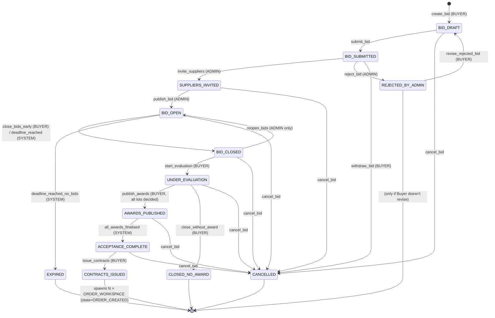

# DeMaxtore — CommodityBid State Machine Descriptor
**Workspace tipi:** `COMMODITYBID_WORKSPACE`
**Sprint:** Sprint 2 öncesi tasarım onayı (henüz kod değil)
**Onay sahibi:** Ürün sahibi → Mimari → Sprint 2 dev kickoff
**Kardeş belgeler:** `./rfq-state-machine.md`, `./order-state-machine.md` (yapılacak)

> Bu belge **kod öncesi tek doğruluk kaynağıdır**. Onaylandığında:
> 1. `packages/contracts/src/commoditybid.fsm.ts` içinde TypeScript descriptor olarak yer alır.
> 2. Backend permission middleware bu tablodan **derleme zamanında** türetilir.
> 3. Frontend Next-Action butonları aynı descriptor'dan render edilir.
> 4. Audit log event isimleri buradaki `audit_event` kolonundan birebir gelir.
> Tabloyu değiştirmek = state machine'i değiştirmek. Sprint 2 ortasında değişiklik yasaktır.

> **Önemli farkı:** RFQ "1 işlem = 1 supplier = 1 order". CommodityBid ise "1 ihale = N lot × N supplier = M order" (M ≤ N supplier; her kazanan supplier'a aggregate 1 order workspace doğar).

---

## 0. Decisions Log (Sprint 2 öncesi — onaylanan kararlar)

> RFQ belgesindeki 8 karardan **uyumlu olanlar** (rejected→revise non-terminal, reopen sadece ADMIN, deadline limit, spawned_from_id gerçek FK, RFQ.PO_ISSUED ↔ Order.ORDER_CREATED ayrımı) **CommodityBid için de aynen geçerlidir**. Burada yalnızca CommodityBid'e özgü kararlar listelenir.

| # | Karar konusu                                  | Karar                                                                                                                                                                                                              | Belgeye yansıması |
|---|-----------------------------------------------|--------------------------------------------------------------------------------------------------------------------------------------------------------------------------------------------------------------------|-------------------|
| 1 | Bid visibility modeli                         | **Sealed bid** (kapalı zarf). Hiçbir supplier diğer supplier'ların fiyatını / sıralamasını görmez. Open / hybrid Phase 2'ye bırakılır.                                                                              | §1 ilke #6        |
| 2 | Multi-round (best & final) bidding            | **Hayır.** Sprint 2'de tek tur. RFQ Decision #1 ile tutarlı.                                                                                                                                                       | State eklenmedi   |
| 3 | Per-lot award (lot bazlı kazanan)             | **Evet.** Bir ihale 3 lot içerebilir; her lot ayrı bir kazanana gidebilir (örn. Lot 1→Supplier A, Lot 2→Supplier A, Lot 3→Supplier B). **Lot içinde** split yok — bir lotun tek kazananı vardır.                | §11 BidAward tablosu + §3 satır #27 |
| 4 | Çoklu kazanan → Order workspace spawn'ı       | **Supplier başına 1 Order workspace** (lot'lar aggregate). Yukarıdaki örnekte 2 ORDER_WORKSPACE doğar: Supplier A için 2 lot'lu order, Supplier B için 1 lot'lu order. Her ikisi de `spawned_from_id`=bu workspace. | §12 spawn protokolü |
| 5 | Award acceptance SLA                          | **3 iş günü** (commodity hızlı oynar). Supplier kabul / red etmezse SYSTEM otomatik `decline` sayar; Buyer aynı lotu next-best supplier'a `re_award_lot` ile verebilir.                                              | §3 satır #33 (SYSTEM) |
| 6 | Anti-sniping (soft close)                     | **Hayır.** Sprint 2'de hard deadline. Phase 2'de "son 5dk içinde gelen bid varsa deadline +5dk" eklenebilir.                                                                                                       | Transition eklenmedi |
| 7 | Reserve price / minimum bid increment         | **Hayır.** Sprint 2 için yok. Phase 2'de Buyer'ın "minimum 1000 USD/MT'ye kadar düşmeyen tekliflere bakma" gibi filtreler eklenebilir.                                                                              | Field eklenmedi   |
| 8 | Bid revisions                                 | **Sınırsız** — supplier deadline'a kadar istediği kadar revize edebilir (UPDATE; tarihçesi `timeline_events` üzerinden audit'lenir).                                                                                | §3 satır #15      |
| 9 | Pre-bid clarifications (Q&A)                  | **Evet — public.** Bir supplier'ın sorduğu soru ve cevabı tüm davet edilen supplier'lar görür (level playing field). Soru/cevap mesajları timeline'da görünür.                                                     | §3 satır #17      |
|10 | Supplier eligibility                          | **Yalnızca davet** (private). Public marketplace gibi açık bid Sprint 2'de yok. Sadece ADMIN'in invite ettiği supplier'lar bid verebilir.                                                                          | §5 permission     |
|11 | Proforma adımı                                | **Yok.** Commodity trade'de tipik olarak doğrudan kontrat yazılır. RFQ akışındaki PROFORMA_REQUESTED/RECEIVED/APPROVED state'leri CommodityBid'te yer almaz. Acceptance sonrası doğrudan contract issue.            | Şema farkı        |
|12 | Withdraw award (Buyer geri al)                | **Evet** ama yalnızca supplier henüz `accept_award_lot` etmediyse. Kabul edilmiş award'ı geri alma yasak (sözleşmeye dönüştü).                                                                                      | §3 satır #32      |
||13 | **Currency policy (KİLİTLENDİ)**              | **Buyer ihale yaratırken currency seçer** (USD, EUR, GBP, …). Publish sonrası **immutable**. Tüm supplier bid'leri **aynı currency** zorunlu; mixed-currency bidding **YASAK**. Phase 2'de bile multi-currency yok. | §3 satır #6 + §11 schema |
||14 | **Supplier rating / penalty / ranking (KİLİTLENDİ)** | **TAMAMEN KALDIRILDI.** Hiçbir supplier puanı, sıralaması, geçmiş performans skoru, "penalty" konsepti yok. Phase 2'de bile uygulanmayacak. DeMaxtore stratejisi: üretici (manufacturer) çekmek — Alibaba tarzı supplier-ranking ekosistemi değil. | Schema'dan + UI'dan + audit event'lerden çıkarıldı |
||15 | **PostgreSQL Row-Level Security (RLS)**       | **Sprint 2.5'e bırakıldı** (Sprint 2 için blocker DEĞİL). Sprint 2'de sealed-bid invariant'ı middleware seviyesinde + unit-test ile garantilenir; **Sprint 2.5'te DB seviyesinde RLS policy eklenir** (`bids` tablosunda "SELECT yalnızca workspace owner veya bid sahibi supplier"). | §10 checklist + §11 sonu  |

> **RFQ ile tutarlı taşınan kararlar (tekrarlamak için):** rejected→revise non-terminal · reopen ADMIN-only · extend_deadline max 2×/+14 gün · spawned_from_id gerçek FK · WorkspaceState string + zod validate per workspace type.

---

## 1. Tasarım ilkeleri

1. **Workspace state ≠ lot/award state'i.** Workspace tek bir state machine üzerinde yürür (aşağıdaki 13 state). Her bidin / award'ın **kendi** mikro durumu (`bids.withdrawnAt`, `bid_awards.status ∈ {DRAFT, PUBLISHED, ACCEPTED, DECLINED, RE_AWARDED, EXPIRED}`) workspace state'inden bağımsızdır. State machine "workspace bir bütün olarak nerede" sorusunu cevaplar, "lot 3 nerede" değil.
2. **Append-only timeline** — RFQ ile aynı.
3. **Sealed bid invariant** — `GET /api/commoditybid/:id/bids` endpoint'i Sprint 2'de **yalnızca BUYER (OWNER) ve ADMIN'e** lot bazında tüm teklifleri döner. Supplier yalnızca kendi tekliflerini görür. Bu invariant unit-test ile garantilenir.
4. **Per-lot atomicity** — `award_lot`, `accept_award_lot`, `decline_award_lot` aksiyonları lot bazında çalışır; bir transaction'da yalnızca **bir** (workspace_id, lot_id, supplier_user_id) çiftine dokunur.
5. **Auto-transition by SYSTEM** — `AWARDS_PUBLISHED` state'inde tüm award'lar terminal duruma ulaştığında (`ACCEPTED` veya `DECLINED+RE_AWARDED ile devam`) SYSTEM workspace'i `ACCEPTANCE_COMPLETE`'e taşır. Bu, Buyer'a "tıkla, kontratlara geç" UX'i verir.
6. **Sealed bid + private invite** (Decision #1 + #10) — Sprint 2'de hem teklifler kapalı hem supplier listesi yalnızca davet bazlı. İki invariant ayrı.
7. **Lot-level audit** — `timeline_events.payload` her lot aksiyonunda `{ lotId, lotNumber }` taşır; UI Timeline panelinde "Lot 2 award'ı yayınlandı" gibi okunabilir kayıtlar üretilebilir.

---

## 2. State kataloğu

| # | State                  | Tanım | Giriş side-effect'i | Terminal? |
|---|------------------------|-------|---------------------|-----------|
| 1 | `BID_DRAFT`            | Buyer ihaleyi ve lot'larını düzenliyor; submit edilmedi | Workspace satırı + boş lot listesi | hayır |
| 2 | `BID_SUBMITTED`        | Buyer submit etti, admin triage kuyruğunda | Tüm `ADMIN`'lere `INFO` notification + `role:ADMIN` socket broadcast | hayır |
| 3 | `REJECTED_BY_ADMIN`    | Admin ihaleyi reddetti | Buyer'a `ERROR` notification + RFQ ile aynı yaklaşım: terminal değil, düzeltilip yeniden gönderilebilir | hayır (yeniden submit edilebilir) |
| 4 | `SUPPLIERS_INVITED`    | Admin 1+ supplier'ı invite etti, henüz publish değil | Davet edilen her supplier'a `INFO` ("ihaleye davet edildiniz, publish bekleniyor") + Buyer'a status update | hayır |
| 5 | `BID_OPEN`             | İhale açık; davet edilen supplier'lar her lot için teklif sunabilir | Tüm davet edilen supplier'lara `INFO` (deeplink dahil); deadline timer aktif | hayır |
| 6 | `BID_CLOSED`           | Deadline doldu **veya** Buyer manuel kapattı; yeni bid yok | Teklif veren supplier'lara `INFO`; Buyer'a `INFO` ("değerlendirme zamanı") | hayır |
| 7 | `UNDER_EVALUATION`     | Buyer her lotu inceliyor ve draft award'lar oluşturuyor | Buyer'a evaluation UI açılır; teklif veren supplier'lara "review başladı" `INFO` | hayır |
| 8 | `AWARDS_PUBLISHED`     | Her lot için karar verildi (award veya no_award) ve yayınlandı; supplier'lar accept/decline bekleniyor | Her kazanan supplier'a `SUCCESS`, lot'unda kaybeden teklifçilere `INFO`; **per-lot SLA timer'ı: 3 iş günü** (Decision #5) başlar | hayır |
| 9 | `ACCEPTANCE_COMPLETE`  | Tüm award'lar terminal duruma ulaştı (kabul edildi veya re-award'larla çözüldü). SYSTEM tarafından auto-transition. | Buyer'a `SUCCESS` notification ("Kontratları yayınlayabilirsiniz") | hayır |
| 10| `CONTRACTS_ISSUED`     | Buyer kontratları yayınladı; **her kazanan supplier için 1 `ORDER_WORKSPACE`** doğdu (state: `ORDER_CREATED`). | Kazanan supplier'lara `SUCCESS` (her birine kendi order workspace linki); admin'e `INFO`; CommodityBid workspace readonly. | **evet (CommodityBid tarafı)** |
| 11| `CANCELLED`            | Buyer veya admin ihaleyi manuel iptal etti | Tüm participants `WARNING` (reason zorunlu); açık bid'ler donduruldu | **evet** |
| 12| `EXPIRED`              | Deadline doldu ve hiçbir bid alınmadı | Buyer + admin `WARNING`; archive | **evet** |
| 13| `CLOSED_NO_AWARD`      | Buyer tüm lot'ları "no_award" işaretledi (kimseye gitmedi) | Tüm supplier'lara `INFO` (reason zorunlu); admin'e `INFO` | **evet** |

> **Not (RFQ ile fark):** `PROFORMA_REQUESTED`, `PROFORMA_RECEIVED`, `PROFORMA_APPROVED`, `SUPPLIER_SELECTED` state'leri CommodityBid'de **yoktur** (Decision #11). Commodity contract doğrudan acceptance → contract akışıyla yazılır.

---

## 3. Master Transition Tablosu (talep edilen ana çıktı)

| #  | Current State          | Allowed Role(s)             | Allowed Action               | Preconditions                                                                                                | Next State              | `audit_event`                          |
|----|------------------------|-----------------------------|------------------------------|--------------------------------------------------------------------------------------------------------------|-------------------------|----------------------------------------|
| 1  | `—` (creation)         | BUYER                       | `create_bid`                 | İhale başlığı + en az 1 lot taslağı                                                                          | `BID_DRAFT`             | `bid.created`                          |
| 2  | `BID_DRAFT`            | BUYER (OWNER)               | `edit_bid_draft`             | —                                                                                                            | `BID_DRAFT`             | `bid.draft.edited`                     |
| 3  | `BID_DRAFT`            | BUYER (OWNER)               | `add_lot`                    | Yeni lot için commodity + qty + uom + specs zorunlu                                                          | `BID_DRAFT`             | `bid.lot.added`                        |
| 4  | `BID_DRAFT`            | BUYER (OWNER)               | `edit_lot`                   | Lot bu workspace'e ait                                                                                       | `BID_DRAFT`             | `bid.lot.edited`                       |
| 5  | `BID_DRAFT`            | BUYER (OWNER)               | `remove_lot`                 | En az 1 lot daha kalmalı (sonuç ≥ 1)                                                                          | `BID_DRAFT`             | `bid.lot.removed`                      |
| 6  | `BID_DRAFT`            | BUYER (OWNER)               | `submit_bid`                 | ≥1 lot; tüm lot'lar geçerli (qty>0, commodity, uom, specs); bid deadline geleceğe                            | `BID_SUBMITTED`         | `bid.submitted`                        |
| 7  | `BID_DRAFT`            | BUYER (OWNER)               | `cancel_bid`                 | reason zorunlu                                                                                               | `CANCELLED`             | `bid.cancelled`                        |
| 8  | `BID_SUBMITTED`        | ADMIN                       | `invite_suppliers`           | ≥1 supplier; her biri aktif `User(role=SUPPLIER)`                                                            | `SUPPLIERS_INVITED`     | `bid.suppliers.invited`                |
| 9  | `BID_SUBMITTED`        | ADMIN                       | `reject_bid`                 | reason zorunlu                                                                                               | `REJECTED_BY_ADMIN`     | `bid.rejected_by_admin`                |
| 10 | `BID_SUBMITTED`        | BUYER (OWNER)               | `withdraw_bid`               | henüz admin triage etmediyse                                                                                  | `CANCELLED`             | `bid.cancelled`                        |
| 11 | `REJECTED_BY_ADMIN`    | BUYER (OWNER)               | `revise_rejected_bid`        | reddetme sonrası en az 1 alan/lot güncelleniyor                                                              | `BID_DRAFT`             | `bid.revised_from_rejection`           |
| 12 | `SUPPLIERS_INVITED`    | ADMIN                       | `add_supplier`               | yeni supplier daha önce eklenmemiş                                                                            | `SUPPLIERS_INVITED`     | `bid.suppliers.added`                  |
| 13 | `SUPPLIERS_INVITED`    | ADMIN                       | `remove_supplier`            | supplier henüz bid vermemiş                                                                                   | `SUPPLIERS_INVITED`     | `bid.suppliers.removed`                |
| 14 | `SUPPLIERS_INVITED`    | ADMIN                       | `publish_bid`                | ≥1 supplier davetli; bid deadline gelecekte                                                                  | `BID_OPEN`              | `bid.published`                        |
| 15 | `SUPPLIERS_INVITED`    | BUYER (OWNER) **veya** ADMIN| `cancel_bid`                 | reason zorunlu                                                                                               | `CANCELLED`             | `bid.cancelled`                        |
| 16 | `BID_OPEN`             | SUPPLIER (COUNTERPARTY)     | `submit_bid_lot`             | bu supplier'ın bu lotta aktif bid'i yok; lot bu workspace'e ait; **`bid.currency = workspace.currency` zorunlu** (Decision #13); (lot.delivery window vs. bid validity uyumlu) | `BID_OPEN`              | `bid.lot.bid_submitted`                |
| 17 | `BID_OPEN`             | SUPPLIER (COUNTERPARTY)     | `revise_bid_lot`             | aynı supplier-lot çiftinin aktif bid'i var; deadline geçmedi (Decision #8 — sınırsız revize)                  | `BID_OPEN`              | `bid.lot.bid_revised`                  |
| 18 | `BID_OPEN`             | SUPPLIER (COUNTERPARTY)     | `withdraw_bid_lot`           | aynı supplier-lot çiftinin aktif bid'i var; deadline geçmedi                                                  | `BID_OPEN`              | `bid.lot.bid_withdrawn`                |
| 19 | `BID_OPEN`             | BUYER (OWNER) / SUPPLIER / ADMIN | `post_clarification`     | clarification mesajı; **public** — tüm davet edilen supplier'lar görür (Decision #9)                          | `BID_OPEN`              | `bid.clarification.posted`             |
| 20 | `BID_OPEN`             | BUYER (OWNER) **veya** ADMIN| `extend_deadline`            | yeni deadline > mevcut; **toplam uzatma ≤ 2** + **toplam +süre ≤ 14 gün** (RFQ ile tutarlı)                  | `BID_OPEN`              | `bid.deadline.extended`                |
| 21 | `BID_OPEN`             | BUYER (OWNER)               | `close_bids_early`           | reason isteğe bağlı                                                                                          | `BID_CLOSED`            | `bid.bids.closed_manual`               |
| 22 | `BID_OPEN`             | SYSTEM                      | `deadline_reached`           | now ≥ deadline; **en az 1 lot'ta ≥ 1 bid** var                                                                | `BID_CLOSED`            | `bid.bids.closed_auto`                 |
| 23 | `BID_OPEN`             | SYSTEM                      | `deadline_reached_no_bids`   | now ≥ deadline; toplam aktif bid sayısı = 0                                                                  | `EXPIRED`               | `bid.expired`                          |
| 24 | `BID_OPEN`             | BUYER (OWNER) **veya** ADMIN| `cancel_bid`                 | reason zorunlu                                                                                               | `CANCELLED`             | `bid.cancelled`                        |
| 25 | `BID_CLOSED`           | BUYER (OWNER)               | `start_evaluation`           | —                                                                                                            | `UNDER_EVALUATION`      | `bid.evaluation.started`               |
| 26 | `BID_CLOSED`           | ADMIN                       | `reopen_bids`                | reason zorunlu; yeni deadline gerekli (Decision #4 ile tutarlı — sadece ADMIN)                                | `BID_OPEN`              | `bid.bids.reopened`                    |
| 27 | `BID_CLOSED`           | BUYER (OWNER) **veya** ADMIN| `cancel_bid`                 | reason zorunlu                                                                                               | `CANCELLED`             | `bid.cancelled`                        |
| 28 | `UNDER_EVALUATION`     | BUYER (OWNER)               | `draft_award_lot`            | lot bu workspace'e ait; aday bid `WITHDRAWN` değil; bid validity geçmedi (Decision #3 — per-lot tek kazanan) | `UNDER_EVALUATION`      | `bid.lot.award_drafted`                |
| 29 | `UNDER_EVALUATION`     | BUYER (OWNER)               | `mark_lot_no_award`          | reason zorunlu; bu lota draft award atanamayacak / hiçbir bid uygun değil                                    | `UNDER_EVALUATION`      | `bid.lot.no_award_marked`              |
| 30 | `UNDER_EVALUATION`     | BUYER (OWNER)               | `publish_awards`             | **Tüm lot'ların kararı verildi** (her lot ya draft award'a sahip ya da `mark_lot_no_award` işaretli)         | `AWARDS_PUBLISHED`      | `bid.awards.published`                 |
| 31 | `UNDER_EVALUATION`     | BUYER (OWNER)               | `close_without_award`        | reason zorunlu; **hiçbir** lotta kazanan yok                                                                  | `CLOSED_NO_AWARD`       | `bid.closed_no_award`                  |
| 32 | `UNDER_EVALUATION`     | BUYER (OWNER) **veya** ADMIN| `cancel_bid`                 | reason zorunlu                                                                                               | `CANCELLED`             | `bid.cancelled`                        |
| 33 | `AWARDS_PUBLISHED`     | SUPPLIER (COUNTERPARTY)     | `accept_award_lot`           | bu supplier'ın bu lotta `PUBLISHED` durumda award'ı var; henüz aksiyon almadı                                | `AWARDS_PUBLISHED`      | `bid.lot.award_accepted`               |
| 34 | `AWARDS_PUBLISHED`     | SUPPLIER (COUNTERPARTY)     | `decline_award_lot`          | aynı + reason zorunlu                                                                                        | `AWARDS_PUBLISHED`      | `bid.lot.award_declined`               |
| 35 | `AWARDS_PUBLISHED`     | BUYER (OWNER)               | `withdraw_award_lot`         | Decision #12 — yalnızca supplier henüz `accept_award_lot` etmediyse; reason zorunlu                          | `AWARDS_PUBLISHED`      | `bid.lot.award_withdrawn`              |
| 36 | `AWARDS_PUBLISHED`     | BUYER (OWNER)               | `re_award_lot`               | Bu lot için önceki award `DECLINED / WITHDRAWN / EXPIRED`; aday yeni supplier'ın geçerli bid'i var            | `AWARDS_PUBLISHED`      | `bid.lot.re_awarded`                   |
| 37 | `AWARDS_PUBLISHED`     | SYSTEM                      | `award_acceptance_sla_expired` | award yayınlanma anından **3 iş günü** dolmuş; supplier accept/decline etmedi (Decision #5)                | `AWARDS_PUBLISHED`      | `bid.lot.award_sla_expired`            |
| 38 | `AWARDS_PUBLISHED`     | SYSTEM                      | `all_awards_finalised`       | Tüm `PUBLISHED` award'lar terminal duruma ulaştı (`ACCEPTED` veya `DECLINED+no further re_award_eligible_supplier`) | `ACCEPTANCE_COMPLETE` | `bid.awards.finalised`                 |
| 39 | `AWARDS_PUBLISHED`     | BUYER (OWNER) **veya** ADMIN| `cancel_bid`                 | reason zorunlu                                                                                               | `CANCELLED`             | `bid.cancelled`                        |
| 40 | `ACCEPTANCE_COMPLETE`  | BUYER (OWNER)               | `issue_contracts`            | ≥1 lot `ACCEPTED` durumda; her kazanan supplier için contract numarası unique                                | `CONTRACTS_ISSUED`      | `bid.contracts.issued`                 |
| 41 | `ACCEPTANCE_COMPLETE`  | BUYER (OWNER) **veya** ADMIN| `cancel_bid`                 | reason zorunlu                                                                                               | `CANCELLED`             | `bid.cancelled`                        |
| 42 | herhangi bir state     | ADMIN                       | `add_observer`               | yeni participant `OBSERVER` rolüyle eklenir                                                                  | (aynı state)            | `workspace.participant.added`          |
| 43 | herhangi bir state     | ADMIN                       | `remove_observer`            | participant `OBSERVER` olmalı                                                                                | (aynı state)            | `workspace.participant.removed`        |

> **Toplam:** 43 transition. (RFQ: 40.)
> **Lot-level alt durumlar** (`bid_awards.status`) workspace state'inden ayrıdır ve §11 schema patch'inde tanımlıdır.

---

## 4. State diyagramı (Mermaid)



> **Self-loop'lar** (aynı state'e dönen 26 transition — `add_lot`, `submit_bid_lot`, `award_acceptance_sla_expired` vb.) sadeleştirme için diyagramda gösterilmedi; §3 tablosunda tam liste.

---

## 5. Permission matrisi (Role × Action)

✅ = izinli (preconditions ayrıca uygulanır) · ❌ = yasak · `*` = workspace participant rolü kontrolü gerekir (OWNER / COUNTERPARTY / OPERATOR / OBSERVER).

| Action                              | BUYER          | SUPPLIER          | ADMIN          | SYSTEM |
|-------------------------------------|----------------|-------------------|----------------|--------|
| `create_bid`                        | ✅              | ❌                 | ❌              | ❌      |
| `edit_bid_draft`                    | ✅ *(OWNER)*    | ❌                 | ❌              | ❌      |
| `add_lot` / `edit_lot` / `remove_lot` | ✅ *(OWNER)*  | ❌                 | ❌              | ❌      |
| `submit_bid`                        | ✅ *(OWNER)*    | ❌                 | ❌              | ❌      |
| `withdraw_bid`                      | ✅ *(OWNER)*    | ❌                 | ❌              | ❌      |
| `invite_suppliers`                  | ❌              | ❌                 | ✅              | ❌      |
| `add_supplier` / `remove_supplier`  | ❌              | ❌                 | ✅              | ❌      |
| `reject_bid`                        | ❌              | ❌                 | ✅              | ❌      |
| `publish_bid`                       | ❌              | ❌                 | ✅              | ❌      |
| `revise_rejected_bid`               | ✅ *(OWNER)*    | ❌                 | ❌              | ❌      |
| `submit_bid_lot`                    | ❌              | ✅ *(COUNTERPARTY)*| ❌              | ❌      |
| `revise_bid_lot`                    | ❌              | ✅ *(COUNTERPARTY)*| ❌              | ❌      |
| `withdraw_bid_lot`                  | ❌              | ✅ *(COUNTERPARTY)*| ❌              | ❌      |
| `post_clarification`                | ✅ *(OWNER)*    | ✅ *(COUNTERPARTY)*| ✅              | ❌      |
| `extend_deadline`                   | ✅ *(OWNER)*    | ❌                 | ✅              | ❌      |
| `close_bids_early`                  | ✅ *(OWNER)*    | ❌                 | ❌              | ❌      |
| `deadline_reached`                  | ❌              | ❌                 | ❌              | ✅      |
| `deadline_reached_no_bids`          | ❌              | ❌                 | ❌              | ✅      |
| `start_evaluation`                  | ✅ *(OWNER)*    | ❌                 | ❌              | ❌      |
| `reopen_bids`                       | ❌              | ❌                 | ✅              | ❌      |
| `draft_award_lot`                   | ✅ *(OWNER)*    | ❌                 | ❌              | ❌      |
| `mark_lot_no_award`                 | ✅ *(OWNER)*    | ❌                 | ❌              | ❌      |
| `publish_awards`                    | ✅ *(OWNER)*    | ❌                 | ❌              | ❌      |
| `close_without_award`               | ✅ *(OWNER)*    | ❌                 | ❌              | ❌      |
| `accept_award_lot`                  | ❌              | ✅ *(COUNTERPARTY)*| ❌              | ❌      |
| `decline_award_lot`                 | ❌              | ✅ *(COUNTERPARTY)*| ❌              | ❌      |
| `withdraw_award_lot`                | ✅ *(OWNER)*    | ❌                 | ❌              | ❌      |
| `re_award_lot`                      | ✅ *(OWNER)*    | ❌                 | ❌              | ❌      |
| `award_acceptance_sla_expired`      | ❌              | ❌                 | ❌              | ✅      |
| `all_awards_finalised`              | ❌              | ❌                 | ❌              | ✅      |
| `issue_contracts`                   | ✅ *(OWNER)*    | ❌                 | ❌              | ❌      |
| `cancel_bid`                        | ✅ *(OWNER)*    | ❌                 | ✅              | ❌      |
| `add_observer` / `remove_observer`  | ❌              | ❌                 | ✅              | ❌      |

> **Sealed bid invariant:** `GET /api/commoditybid/:id/bids` — BUYER (OWNER) + ADMIN: tüm bid'leri tüm lot'larda görür. SUPPLIER (COUNTERPARTY): yalnızca kendi `supplierUserId`'sine ait bid'leri görür. Diğer supplier'lar: 403.

---

## 6. Audit event taksonomisi

Tüm event'ler `timeline_events.event_type` kolonuna **birebir** bu isimlerle yazılır:

```
bid.created
bid.draft.edited
bid.lot.added
bid.lot.edited
bid.lot.removed
bid.submitted
bid.cancelled
bid.rejected_by_admin
bid.revised_from_rejection
bid.suppliers.invited
bid.suppliers.added
bid.suppliers.removed
bid.published
bid.lot.bid_submitted
bid.lot.bid_revised
bid.lot.bid_withdrawn
bid.clarification.posted
bid.deadline.extended
bid.bids.closed_manual
bid.bids.closed_auto
bid.bids.reopened
bid.expired
bid.evaluation.started
bid.lot.award_drafted
bid.lot.no_award_marked
bid.awards.published
bid.lot.award_accepted
bid.lot.award_declined
bid.lot.award_withdrawn
bid.lot.re_awarded
bid.lot.award_sla_expired
bid.awards.finalised
bid.closed_no_award
bid.contracts.issued
workspace.participant.added
workspace.participant.removed
```

`timeline_events.payload` (JSONB) her event için tipli bir şema izler — `packages/contracts/src/commoditybid.events.ts` içinde zod ile tanımlı.

Örnek payload:
```json
{
  "event_type": "bid.lot.award_accepted",
  "actor_user_id": "<supplier_user_id>",
  "payload": {
    "lot_id": "<uuid>",
    "lot_number": 2,
    "commodity": "Long Grain White Rice 5% Broken",
    "quantity": 200,
    "uom": "MT",
    "unit_price": 510.5,
    "currency": "USD"
  }
}
```

---

## 7. Notification trigger tablosu

| Transition (action)                | Kime                                                | Type    | Title örneği                                            |
|------------------------------------|-----------------------------------------------------|---------|---------------------------------------------------------|
| `submit_bid`                       | `role:ADMIN` broadcast                              | INFO    | "Yeni CommodityBid triage bekliyor: {externalRef}"      |
| `reject_bid`                       | BUYER (OWNER)                                       | ERROR   | "İhale reddedildi: {reason}"                            |
| `revise_rejected_bid`              | `role:ADMIN` broadcast                              | INFO    | "Reddedilmiş ihale düzeltildi: {externalRef}"           |
| `invite_suppliers`                 | her davet edilen SUPPLIER + BUYER (OWNER)            | INFO    | "İhaleye davet edildiniz" / "Tedarikçiler davet edildi" |
| `publish_bid`                      | davet edilen tüm SUPPLIER'lar                       | INFO    | "İhale açıldı, teklif verebilirsiniz"                   |
| `submit_bid_lot`                   | BUYER (OWNER)                                       | INFO    | "{Supplier} Lot {n}'e teklif verdi"                     |
| `revise_bid_lot`                   | BUYER (OWNER)                                       | INFO    | "{Supplier} Lot {n} teklifini güncelledi"               |
| `withdraw_bid_lot`                 | BUYER (OWNER)                                       | WARNING | "{Supplier} Lot {n} teklifini çekti"                    |
| `post_clarification`               | tüm davet edilen SUPPLIER'lar + BUYER (OWNER)        | INFO    | "Yeni soru/cevap: {externalRef}"                        |
| `extend_deadline`                  | tüm davet edilen SUPPLIER'lar                       | INFO    | "Son tarih uzatıldı: {newDeadline}"                     |
| `close_bids_early`                 | teklif veren SUPPLIER'lar                           | INFO    | "Teklif toplama erkenden kapatıldı"                     |
| `deadline_reached` (SYSTEM)        | BUYER (OWNER)                                       | INFO    | "Değerlendirme zamanı: {externalRef}"                   |
| `deadline_reached_no_bids` (SYSTEM)| BUYER (OWNER) + admin                               | WARNING | "İhale teklif almadan süresi doldu"                     |
| `reopen_bids`                      | davet edilen tüm SUPPLIER'lar + BUYER (OWNER)        | INFO    | "İhale yeniden açıldı: yeni deadline {date}"            |
| `start_evaluation`                 | teklif veren SUPPLIER'lar                           | INFO    | "Değerlendirme başladı"                                 |
| `publish_awards`                   | her kazanan SUPPLIER **SUCCESS**, kaybedenler **INFO**, admin **INFO** | mixed | "Tebrikler, Lot {n} kazandınız" / "Maalesef Lot {n} kazanamadınız" |
| `accept_award_lot`                 | BUYER (OWNER) + admin                               | SUCCESS | "{Supplier} Lot {n}'i kabul etti"                       |
| `decline_award_lot`                | BUYER (OWNER) + admin                               | WARNING | "{Supplier} Lot {n}'i reddetti: {reason}"               |
| `award_acceptance_sla_expired` (SYSTEM) | BUYER (OWNER) + admin + ilgili SUPPLIER         | WARNING | "Lot {n} kabul SLA'si doldu (3 iş günü)"                |
| `withdraw_award_lot`               | ilgili SUPPLIER                                     | WARNING | "Lot {n} award'unız Buyer tarafından geri çekildi: {reason}" |
| `re_award_lot`                     | yeni kazanan SUPPLIER (SUCCESS) + önceki SUPPLIER (INFO) + admin (INFO) | mixed | "Tebrikler, Lot {n} size yeniden tahsis edildi" |
| `all_awards_finalised` (SYSTEM)    | BUYER (OWNER)                                       | SUCCESS | "Tüm award'lar tamamlandı — kontratları yayınlayabilirsiniz" |
| `close_without_award`              | tüm SUPPLIER'lar + admin                            | INFO    | "İhale ödülsüz kapatıldı: {reason}"                     |
| `issue_contracts`                  | her kazanan SUPPLIER + admin                        | SUCCESS | "Kontrat yayınlandı → Order workspace açıldı (Lot {n,m,…})" |
| `cancel_bid`                       | tüm participants                                    | WARNING | "İhale iptal edildi: {reason}"                          |

Tüm bildirimler hem `notifications` tablosuna insert edilir hem **aynı transaction'ın commit-hook'unda** `io.to(room).emit("notification:new", n)` ile gerçek zamanlı broadcast edilir.

---

## 8. TypeScript descriptor şekli (kod öncesi sözleşme)

Sprint 2 başlangıcında `packages/contracts/src/commoditybid.fsm.ts` aşağıdaki şekilde olacak. RFQ descriptor'u ile **aynı tip** (`Transition<TState>`) kullanılır — yalnızca state ve action enum'ları farklıdır.

```ts
export type CommodityBidState =
  | "BID_DRAFT" | "BID_SUBMITTED" | "REJECTED_BY_ADMIN"
  | "SUPPLIERS_INVITED" | "BID_OPEN" | "BID_CLOSED"
  | "UNDER_EVALUATION" | "AWARDS_PUBLISHED" | "ACCEPTANCE_COMPLETE"
  | "CONTRACTS_ISSUED" | "CANCELLED" | "EXPIRED" | "CLOSED_NO_AWARD";

export type CommodityBidAction =
  | "create_bid" | "edit_bid_draft" | "add_lot" | "edit_lot" | "remove_lot"
  | "submit_bid" | "cancel_bid" | "withdraw_bid"
  | "invite_suppliers" | "add_supplier" | "remove_supplier" | "reject_bid"
  | "publish_bid" | "revise_rejected_bid"
  | "submit_bid_lot" | "revise_bid_lot" | "withdraw_bid_lot"
  | "post_clarification" | "extend_deadline"
  | "close_bids_early" | "deadline_reached" | "deadline_reached_no_bids"
  | "start_evaluation" | "reopen_bids"
  | "draft_award_lot" | "mark_lot_no_award" | "publish_awards" | "close_without_award"
  | "accept_award_lot" | "decline_award_lot" | "withdraw_award_lot" | "re_award_lot"
  | "award_acceptance_sla_expired" | "all_awards_finalised"
  | "issue_contracts" | "add_observer" | "remove_observer";

export const COMMODITYBID_TRANSITIONS: Transition<CommodityBidState>[] = [
  { from: "*", to: "BID_DRAFT", action: "create_bid",
    allowedRoles: ["BUYER"], auditEvent: "bid.created",
    notifyRecipients: [] },

  { from: "BID_DRAFT", to: "BID_SUBMITTED", action: "submit_bid",
    allowedRoles: ["BUYER"], requiredParticipant: "OWNER",
    auditEvent: "bid.submitted",
    notifyRecipients: [{ broadcast: "role", role: "ADMIN", type: "INFO" }] },

  // Decision #1 — sealed bid (visibility enforcement is in route handlers, not FSM)
  // Decision #3 — per-lot award
  { from: "AWARDS_PUBLISHED", to: "AWARDS_PUBLISHED", action: "accept_award_lot",
    allowedRoles: ["SUPPLIER"], requiredParticipant: "COUNTERPARTY",
    auditEvent: "bid.lot.award_accepted",
    notifyRecipients: [
      { target: "OWNER", type: "SUCCESS" },
      { broadcast: "role", role: "ADMIN", type: "INFO" }
    ] },

  // Decision #5 — 3 BD SLA timer
  { from: "AWARDS_PUBLISHED", to: "AWARDS_PUBLISHED", action: "award_acceptance_sla_expired",
    allowedRoles: ["SYSTEM"],
    auditEvent: "bid.lot.award_sla_expired",
    notifyRecipients: [
      { target: "OWNER", type: "WARNING" },
      { broadcast: "role", role: "ADMIN", type: "WARNING" }
    ] },

  // SYSTEM auto-rolls workspace to ACCEPTANCE_COMPLETE when all awards finalised
  { from: "AWARDS_PUBLISHED", to: "ACCEPTANCE_COMPLETE", action: "all_awards_finalised",
    allowedRoles: ["SYSTEM"],
    auditEvent: "bid.awards.finalised",
    notifyRecipients: [{ target: "OWNER", type: "SUCCESS" }] },

  // … (43 transition birebir Bölüm 3'teki tabloya karşılık gelir)
];
```

Backend `applyTransition(workspaceId, action, actor, payload)` fonksiyonu yalnızca bu listeden besleniyor — listeye eklenmemiş bir action = 400 `UNKNOWN_ACTION`. Frontend Next-Action butonları da aynı listeyi `current state + actor + per-lot bağlam` ile filtreler.

---

## 9. Açık sorular (Sprint 2 başlamadan önce ürün sahibinin karar vermesi gerekenler)

> Bu liste **yeni** sorulardır (RFQ'da çözülen 8 karar + bu belgenin §0'ındaki 15 karar bu belgede otomatik geçerli sayılıyor). Onaylandığında §0 Decisions Log'una taşınır.

| # | Soru                                                                                                                          | Önerim |
|---|-------------------------------------------------------------------------------------------------------------------------------|--------|
| A | Lot başına minimum supplier sayısı (Buyer 5 supplier davet etti ama yalnızca 1'i Lot 2'ye teklif verdi — bu lot evaluate edilebilir mi?) | **Edilir.** Hatta 1 bid yeterli — Buyer reject etmek isterse `mark_lot_no_award` kullanır                                            |
| B | Bid validity (`Bid.validUntil`) zorunlu mu? Supplier teklifini ne kadar süre bağlayıcı tutmalı?                                | **Zorunlu — varsayılan: deadline + 14 gün.** Buyer evaluation'ı bu süre içinde yapmazsa bid otomatik `EXPIRED` (acceptance aşamasında) |
| C | Kazanan supplier'a doğan Order workspace'inde `external_ref` formatı: `WS-ORD-{commoditybid_ref}-{supplier_short}` mı yoksa flat `WS-ORD-{seq}` mi? | Buyer raporlamasında parent referansı görünsün diye `WS-ORD-{commoditybid_ref}-{supplier_short}` daha iyi                          |
| D | Award SLA dolan supplier "aynı ihalede başka bir lotta da kazanmış" ise diğer kazançları etkilenir mi?                        | **Hayır — her lot bağımsız.** Lot A'da SLA kaçıran supplier Lot B'de hâlâ accept edebilir                                          |
| E | `mark_lot_no_award`'u publish'ten sonra geri alabilir miyiz? (Buyer Lot 3'ü "no_award" yaptı, sonra fikir değiştirdi)         | **Hayır.** Bir kez `publish_awards` yapıldıysa lot kararları sabit. Buyer cancel_bid + yeni ihale açar                              |

> **Kapatılan eski açık sorular** (artık §0 Decisions Log'unda):
> - ~~Currency policy~~ → Decision #13 (Buyer seçer, immutable after publish, mixed-currency yasak)
> - ~~Supplier rating / penalty~~ → Decision #14 (TAMAMEN kaldırıldı, Phase 2'de bile yok)
> - ~~RLS DB-level enforcement~~ → Decision #15 (Sprint 2.5'e bırakıldı)

> 5 açık soru kaldı. Lütfen Sprint 2 dev kickoff'undan **önce** karara bağlayın. Cevaplar §3 transition tablosuna doğrudan satır ekler/çıkarır.

---

## 10. Sprint 2 hazırlık checklist'i

- [ ] §9 açık sorular karara bağlandı ve §0 Decisions Log'una işlendi.
- [ ] `packages/contracts/src/commoditybid.fsm.ts` bu belgeden generate edildi.
- [ ] `packages/contracts/src/commoditybid.events.ts` payload zod şemaları yazıldı.
- [ ] Backend `apps/backend/src/modules/commoditybid/commoditybid.service.ts` içinde tek public method `applyTransition()` — başka yerden state mutate edilmiyor.
- [ ] **Sealed-bid invariant testi:** Supplier A, Supplier B'nin bid'lerini hiçbir endpoint üzerinden göremez. Vitest + supertest ile 3 negatif test case.
- [ ] Per-lot SLA scheduler kurulu: her dakika `AWARDS_PUBLISHED` workspace'lerindeki `bid_awards` satırlarını tarayıp 3 iş günü dolanları `award_acceptance_sla_expired` ile geçiriyor.
- [ ] `all_awards_finalised` SYSTEM transition'ı her award status değişiminden sonra check ediliyor (event-driven, polling değil).
- [ ] Frontend `<NextActions />` bileşeni `COMMODITYBID_TRANSITIONS` + lot bağlamı üzerinden render; hard-coded buton yok.
- [ ] Audit log replay testi: `timeline_events`'ten state machine'i baştan oynatınca aynı final state'e ulaşılıyor.
- [ ] CommodityBid → Order spawn protokolü (§12) entegrasyon testi: 3 lot × 2 supplier senaryosunda doğru sayıda Order workspace doğuyor.
- [ ] **Currency immutability testi** (Decision #13): `publish_bid` sonrası `PATCH /api/commoditybid/:id { currency }` çağrısı 409 döner.
- [ ] **No-rating invariant testi** (Decision #14): codebase'de `rating`, `score`, `ranking`, `penalty`, `reputation` keyword araması → supplier context'inde **0 sonuç**.
- [ ] **RLS hazırlığı** (Decision #15 — Sprint 2.5 prereq): migration dosyaları `bids` tablosunda RLS policy şablonunu **yorum satırı** olarak içeriyor; Sprint 2.5'te yorumdan çıkarılıp aktive edilecek.

---

## 11. Sprint 2 Schema Patch'i (CommodityBid özel tablolar)

Sprint 1 Prisma schema'sına aşağıdaki tablolar eklenir (Sprint 2 migration adı: `sprint2_commoditybid_workflow`). Genel workspace patch'leri RFQ belgesinin §11'inde tanımlı — onlar burada tekrarlanmıyor.

```prisma
model CommodityBidLot {
  id              String   @id @default(uuid()) @db.Uuid
  workspaceId     String   @map("workspace_id") @db.Uuid
  lotNumber       Int      @map("lot_number")        // 1, 2, 3, …
  commodity       String                              // e.g. "Long Grain White Rice 5% Broken"
  quantity        Decimal  @db.Decimal(18, 4)
  uom             String                              // e.g. "MT"
  specs           Json     @default("{}")             // origin, packaging, certifications, …
  incoterms       String?                             // "FOB", "CIF", …
  deliveryWindow  String?  @map("delivery_window")    // free text veya dateRange JSON
  notes           String?
  noAwardReason   String?  @map("no_award_reason")    // mark_lot_no_award sonrası
  createdAt       DateTime @default(now())
  updatedAt       DateTime @updatedAt

  workspace       Workspace @relation(fields: [workspaceId], references: [id], onDelete: Cascade)
  bids            Bid[]
  awards          BidAward[]

  @@unique([workspaceId, lotNumber])
  @@index([workspaceId])
  @@map("commoditybid_lots")
}

model Bid {
  id              String    @id @default(uuid()) @db.Uuid
  workspaceId     String    @map("workspace_id") @db.Uuid
  lotId           String    @map("lot_id") @db.Uuid
  supplierUserId  String    @map("supplier_user_id") @db.Uuid
  unitPrice       Decimal   @db.Decimal(18, 4) @map("unit_price")
  currency        String                                          // ISO 4217
  validUntil      DateTime  @map("valid_until")                   // §9 soru C
  notes           String?
  withdrawnAt     DateTime? @map("withdrawn_at")
  createdAt       DateTime  @default(now())
  updatedAt       DateTime  @updatedAt

  workspace       Workspace        @relation(fields: [workspaceId], references: [id], onDelete: Cascade)
  lot             CommodityBidLot  @relation(fields: [lotId],       references: [id], onDelete: Cascade)
  awards          BidAward[]

  @@unique([lotId, supplierUserId])  // bir supplier'ın bir lotta tek aktif bid'i olur; revize UPDATE
  @@index([workspaceId])
  @@index([lotId])
  @@map("bids")
}

// Award status enum (DB string olarak; @dmx/contracts'ta zod ile validate)
// DRAFT → PUBLISHED → ACCEPTED | DECLINED | RE_AWARDED | EXPIRED | WITHDRAWN
model BidAward {
  id              String    @id @default(uuid()) @db.Uuid
  workspaceId     String    @map("workspace_id") @db.Uuid
  lotId           String    @map("lot_id") @db.Uuid
  supplierUserId  String    @map("supplier_user_id") @db.Uuid
  bidId           String    @map("bid_id") @db.Uuid
  status          String                              // bkz. yukarı
  awardedAt       DateTime? @map("awarded_at")        // publish_awards anı
  acceptedAt      DateTime? @map("accepted_at")
  declinedAt      DateTime? @map("declined_at")
  declineReason   String?   @map("decline_reason")
  withdrawnAt     DateTime? @map("withdrawn_at")
  withdrawReason  String?   @map("withdraw_reason")
  slaDeadlineAt   DateTime? @map("sla_deadline_at")   // awardedAt + 3 BD
  createdAt       DateTime  @default(now())
  updatedAt       DateTime  @updatedAt

  workspace       Workspace        @relation(fields: [workspaceId], references: [id], onDelete: Cascade)
  lot             CommodityBidLot  @relation(fields: [lotId],       references: [id], onDelete: Cascade)
  bid             Bid              @relation(fields: [bidId],       references: [id])

  @@index([workspaceId])
  @@index([lotId])
  @@index([status, slaDeadlineAt])      // SLA scheduler index'i
  @@map("bid_awards")
}
```

**Partial unique index** (Prisma şu an raw SQL gerektiriyor) — bir (lot, supplier) çifti için aynı anda yalnızca bir **aktif** award:
```sql
CREATE UNIQUE INDEX bid_awards_active_unique
  ON bid_awards (lot_id, supplier_user_id)
  WHERE status IN ('DRAFT', 'PUBLISHED', 'ACCEPTED');
```

**Currency policy (Decision #13) DB karşılığı:**
`Workspace` tablosuna (Sprint 2 patch) ek kolon:

```prisma
model Workspace {
  // … (mevcut alanlar) …
  currency        String?    // ISO 4217 — RFQ ve CommodityBid için zorunlu, publish sonrası IMMUTABLE
  // CHECK constraint (SQL migration):
  //   bid currency = workspace.currency  (uygulama katmanında zod ile validate edilir;
  //   ekstra emniyet için trigger ile DB seviyesinde de denetlenebilir — Sprint 2.5 ile)
}
```

**Immutability invariant:** `publish_bid` aksiyonundan sonra `workspaces.currency`'i UPDATE eden tüm sorgular middleware'de bloke edilir + bir Vitest test case bunu doğrular.

**Decision #14 (no supplier rating / penalty) DB karşılığı:** Hiçbir tablo, hiçbir kolon, hiçbir trigger supplier reputation veriyi tutmaz. Audit log'da `supplier.rated`, `supplier.penalised`, vb. event'ler **yok** (§6 audit listesi taranıp temiz).

**Decision #15 (RLS Sprint 2.5):** Aşağıdaki RLS policy şablonu Sprint 2.5'te uygulanır — Sprint 2'de yorum satırı olarak migration dosyasında yer alır:

```sql
-- Sprint 2.5 — Apply RLS for sealed-bid invariant (DB-level enforcement)
ALTER TABLE bids ENABLE ROW LEVEL SECURITY;

CREATE POLICY bids_owner_can_read ON bids FOR SELECT
  USING (
    EXISTS (
      SELECT 1 FROM workspace_participants wp
      WHERE wp.workspace_id = bids.workspace_id
        AND wp.user_id = current_setting('app.current_user_id')::uuid
        AND wp.participant_role IN ('OWNER', 'OPERATOR')
    )
  );

CREATE POLICY bids_supplier_can_read_own ON bids FOR SELECT
  USING ( bids.supplier_user_id = current_setting('app.current_user_id')::uuid );

-- Insert/Update/Delete policies similar; app sets `SET LOCAL app.current_user_id = '<uuid>'`
-- per request inside Prisma transaction.
```

Workspace ek kolonları (RFQ §11'deki `deadline_extension_count` vb. zaten geçerli) — CommodityBid'e özel ek alan **yok** (currency hariç).

---

## 12. CommodityBid → N × ORDER_WORKSPACE Spawn Protokolü (Decision #4 detayı)

Bu Sprint 2'nin **en karmaşık** transition'ı. RFQ'da 1 spawn olurken CommodityBid'de N spawn olur. Tek transaction içinde:

```
applyTransition(commodityBidWorkspaceId, "issue_contracts", buyerUser, { contractRefs })
  ├─ 1. CommodityBid workspace'i lock'la (SELECT … FOR UPDATE)
  ├─ 2. State guard: mevcut state ACCEPTANCE_COMPLETE mı?
  ├─ 3. CommodityBid.state = "CONTRACTS_ISSUED"
  │    timeline_events += { event_type: "bid.contracts.issued", payload: { contractRefs } }
  │
  ├─ 4. Tüm ACCEPTED award'ları çek:
  │      SELECT * FROM bid_awards WHERE workspace_id = ? AND status = 'ACCEPTED'
  │    Supplier'a göre grupla → Map<supplierUserId, BidAward[]>
  │
  ├─ 5. HER supplier grubu için (N tane):
  │     a. Yeni external_ref üret: "WS-ORD-{bidExtRef}-{supplierShortCode}"
  │        (Decision §9-D — şu an önerilen format)
  │     b. INSERT INTO workspaces (
  │          type: "ORDER_WORKSPACE",
  │          state: "ORDER_CREATED",                  ← Decision #8 (RFQ)
  │          external_ref: ↑,
  │          spawned_from_id: <commoditybid_workspace_id>,
  │          created_by_id: buyerUser.id
  │        ) → newOrderWorkspaceId
  │     c. INSERT workspace_participants:
  │          - Buyer  → OWNER
  │          - Bu Supplier → COUNTERPARTY
  │          - Admin → OPERATOR
  │          - Önceki CommodityBid'deki OBSERVER'lar → OBSERVER (carry-over)
  │     d. INSERT timeline_events (Order workspace'i için):
  │          {
  │            event_type: "order.created_from_commoditybid",
  │            payload: {
  │              commoditybid_workspace_id: <…>,
  │              commoditybid_external_ref: <…>,
  │              award_ids: [<…>],            // bu supplier'a giden tüm award id'leri
  │              lot_numbers: [2, 5],         // human-readable
  │              total_quantity_by_uom: { "MT": 400 },
  │              currency: "USD",
  │              total_value: 204200
  │            }
  │          }
  │     e. (Sprint 3+) order_contract_lines satellite tablosuna her award için 1 satır insert
  │
  ├─ 6. Notifications (her supplier için ayrı):
  │      - Supplier'a SUCCESS: "Kontrat yayınlandı: {lotList} → Order workspace açıldı"
  │          link: /workspace/order/<newOrderWorkspaceId>
  │      - Buyer'a SUCCESS özet: "{N} kontrat yayınlandı"
  │      - Admin'e INFO
  │
  ├─ 7. Socket emit (her spawn için):
  │      io.to(`user:${supplierUserId}`).emit("workspace.spawned", { from, to })
  │      io.to(`user:${buyerUserId}`).emit("workspace.spawned", { from, to })
  │      io.to(`role:ADMIN`).emit("workspace.spawned", { from, to })
  │
  └─ COMMIT
```

**Hata senaryoları:**
- 5b'de unique constraint çakışması → tüm transaction rollback; CommodityBid `ACCEPTANCE_COMPLETE`'de kalır; hiçbir Order workspace yaratılmaz; hiçbir notification gönderilmez.
- Idempotency: `applyTransition` `idempotencyKey` parametresi alır. Aynı key ile ikinci çağrı → mevcut Order workspace id'leri (Map<supplierUserId, orderWorkspaceId>) döner, 200 ile.

**N=0 senaryosu:** ACCEPTANCE_COMPLETE'e SYSTEM yalnızca **en az 1 ACCEPTED award** varken transition yapar; aksi hâlde `close_without_award` gerekir. Yani `issue_contracts` çağrısı her zaman ≥1 Order workspace doğurur.

**Order tarafının state'i:** `ORDER_CREATED` (RFQ tarafının `PO_ISSUED`'ı **DEĞİL**, RFQ Decision #8 ile tutarlı).

---

## 13. RFQ State Machine ile yan-yana özet

| Boyut                          | RFQ                                       | CommodityBid                                          |
|--------------------------------|-------------------------------------------|-------------------------------------------------------|
| State sayısı                   | 15                                        | 13                                                    |
| Transition sayısı              | 40                                        | 43                                                    |
| Aday seçim modeli              | Tek supplier seçilir                       | Her lot ayrı kazanana gidebilir                       |
| Lot kavramı                    | Tek line-item topluluğu                    | Birinci-sınıf entity (`commoditybid_lots` tablosu)    |
| Proforma adımı                 | Var (3 state)                              | Yok                                                   |
| Acceptance SLA                 | Proforma: 5 BD                             | Award: 3 BD (lot başına)                              |
| Bid visibility                 | N/A (tek tek quotation)                    | Sealed (Decision #1)                                  |
| Spawn sonucu                   | 1 ORDER_WORKSPACE                          | N ORDER_WORKSPACE (winning supplier başına 1)         |
| Anti-sniping                   | N/A                                        | Phase 2'ye bırakıldı (Decision #6)                    |
| Multi-round                    | Phase 2 (RFQ Decision #1)                 | Phase 2 (CommodityBid Decision #2)                    |
| Common kararlar                | rejected→revise non-terminal, reopen=ADMIN, deadline limit, spawned_from_id FK, ORDER_CREATED |

---

*Belgenin sahibi: Ürün + Mimari · Son inceleme tarihi: Sprint 2 kickoff'tan önce · Decisions onayı: §0'daki 12 karar onaylanmış varsayılır; §9'daki 7 yeni soru bekliyor.*
