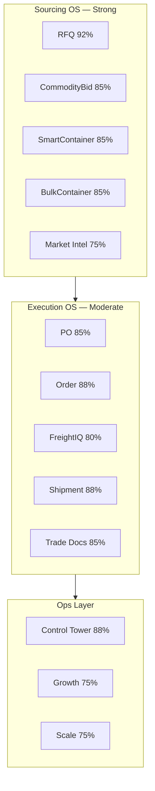
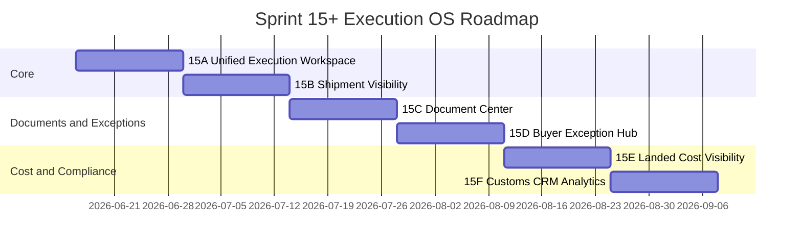

# Sprint 15 Preparation — DeMaxtore vs Flexport Gap Analysis

**Version:** 1.0  
**Document date:** 2026-06-15  
**Source baseline:** [`docs/system-inventory.md`](system-inventory.md)  
**Positioning:** DeMaxtore = **Alibaba RFQ + Flexport Execution + Market Intelligence**, focused on global food sourcing and execution.

---

## 1. Executive Summary

DeMaxtore has built a **workspace-centric trade operating system** with strong foundations in sourcing (RFQ, CommodityBid, Mixed/Bulk Container) and a credible execution chain (PO → Order → FreightIQ → Shipment). The platform already implements FSM-driven workspaces, append-only timelines, participant ACL, trade document checklists, maritime tracking hooks, Control Tower alerting, and role-specific command centers — all architectural patterns that Flexport also relies on for digital execution.

**Where DeMaxtore leads Flexport-style platforms (for its niche):**

- Multi-path sourcing (direct RFQ, reverse auction, smart mixed container, bulk commodity container)
- Procurement strategy (RFQ → CommodityBid spawn)
- Admin ops intelligence (Control Tower, Growth Engine, Market Intelligence, Scale Readiness)
- Food-trade-specific container programs (MC/BC catalog, packing standardization, allocation)

**Where DeMaxtore trails Flexport's digital execution experience:**

- **No unified execution view** — Flexport presents one shipment-centric workspace with PO, milestones, docs, costs, and messages in a single pane. DeMaxtore splits these across Order, PO, Shipment, FreightIQ, and Trade Documents workspaces with separate routes.
- **Shipment visibility depth** — Flexport offers live map-based tracking, predictive ETAs, and carrier-integrated milestones. DeMaxtore has tracking infrastructure (`ShipmentTrackingSnapshot`, scheduler, manual + optional maritime API) but lacks production-grade AIS/map UX and buyer-facing portfolio visibility.
- **Document Center** — Flexport centralizes all trade documents with version history and compliance status. DeMaxtore has per-workspace document checklists and a portfolio list, but no unified Document Center hub.
- **Cost visibility** — Flexport shows landed cost breakdown (product, freight, duties, fees). DeMaxtore tracks freight commercial data in FreightIQ (margin, revenue ledger) but has no buyer-facing total landed cost rollup across Order + Freight + duties.
- **Customs & compliance workflow** — Flexport has structured customs filing and compliance milestones. DeMaxtore has trade document approve/reject and shipment FSM states but no dedicated customs filing workflow or broker coordination portal.
- **Exception management UX** — Control Tower + `ShipmentException` provide admin-side alerting; Flexport surfaces exceptions proactively to buyers with remediation workflows in the execution workspace.
- **Sales CRM** — Flexport integrates sales pipeline with execution. DeMaxtore has `AccountOwnership` in Scale Readiness (sales/ops assignment) but no CRM module.

**Overall assessment:** DeMaxtore is approximately **55–65%** of Flexport's digital execution experience today, but **85–92%** of Flexport's *sourcing* experience for B2B food trade. The Sprint 15+ focus should shift from sourcing expansion to **Execution OS unification and visibility** — closing the gap where buyers experience post-award trade execution.

**Estimated sprints to reach 80–90% Flexport execution parity:** **5–6 sprints** (Sprint 15A through 15F), assuming no net-new product families and focus on unification, visibility, and buyer UX rather than re-architecture.

---

## 2. DeMaxtore Current Capability Map

Summarized from [`docs/system-inventory.md`](system-inventory.md). Completion % reflects module-level estimates in that document.

| Capability Area | Status | Key Modules / Infrastructure | Completion % | Notes |
|-----------------|--------|------------------------------|:------------:|-------|
| **Sales CRM** | Partial / foundation only | Scale Readiness (`AccountOwnership`, org portfolio), Onboarding admin dashboard | **20%** | Sales/ops account assignment exists; no pipeline, leads, opportunities, or CRM UI |
| **RFQ** | Built | RFQ workspace, Quotations, Attachments, Supplier Activity, Procurement Strategy | **92%** | Reference FSM; mature buyer/supplier/admin flows |
| **CommodityBid** | Built | CommodityBid workspace, auction engine, scheduler, SSO embed | **85%** | Strong in-app workspace; creation relies on external iframe |
| **SmartContainer** | Built | Mixed Container, MC Catalog, Packing Types, allocation, execution bridge | **85%** | Full buyer + admin flow; execution bridge empty states when orders not spawned |
| **BulkContainer** | Built | Bulk Container, BC Catalog, spec templates, allocation, execution bridge | **85%** | Mirrors MC for MT-based commodities |
| **FreightIQ** | Built | FreightRequest/Offer/Selection, forwarder/shipper directories, commercial analytics | **80%** | Admin-native mature; buyer/supplier iframe-dependent |
| **PO Management** | Built | PurchaseOrder FSM, amendments, acknowledgements, PDF export, portfolio list | **85%** | No admin PO list route; linked from Order/RFQ |
| **Order Management** | Built | OrderWorkspace FSM (~18 actions), status updates, docs, spawned shipments | **88%** | Production/inspection/freight handoff; no unified cost view |
| **Shipment** | Built | ShipmentWorkspace FSM (~14 actions), exceptions, documents, journey map UI | **88%** | Tracking service at 75%; maritime API optional |
| **Control Tower** | Built | Alert engine, SLA scans, supplier/buyer performance, shipment tracking ops | **88%** | Admin-only; no buyer-facing exception hub |
| **Document / File Storage** | Built | Trade Documents module, Order/Shipment/RFQ attachments, local FS (`STORAGE_DIR`) | **80%** | Per-workspace checklists; no unified Document Center; no S3 |
| **Workspace ACL** | Built | `workspace.policy.ts`, participant roles, Socket.io subscribe ACL | **90%** | Tested; covers RFQ, CB, Order, Shipment, MC, BC |
| **Schedulers** | Built | RFQ, CommodityBid, Control Tower, Tracking, SLA email workers, job reconciler | **85%** | Postgres advisory locks; registered in job registry |
| **Analytics** | Partial | Growth Engine, Scale Readiness, Telemetry (capture only), Dashboard command centers | **70%** | Admin table/KPI-heavy; telemetry has no dashboard |
| **Market Intelligence** | Built | Market trends, categories, routes, supply gaps, opportunities | **75%** | Admin-only; rule-based aggregates |



---

## 3. Flexport Digital Capability Map

Flexport's digital platform (buyer-facing execution experience) is analyzed as a reference model — not a feature-for-feature clone target, but the benchmark for **post-award trade execution UX**.

| Flexport Capability | Description | Buyer Value |
|---------------------|-------------|-------------|
| **Order Workspace** | Single pane showing order status, linked PO, production, and handoff to logistics | One place to understand "where is my trade?" |
| **PO Management** | PO visibility, amendments, supplier acknowledgment, document attachment | Contract certainty before production |
| **Shipment Visibility** | Live container/vessel tracking, map, ETA, milestone auto-updates from carriers | Reduces "where is my container?" support tickets |
| **Document Center** | All trade documents (CI, PL, B/L, COO, customs) in one searchable hub with status | Compliance and audit readiness |
| **Milestone Timeline** | Chronological event stream across sourcing → production → freight → delivery | Trust and predictability |
| **Exception Management** | Proactive delay/issue detection, categorized exceptions, remediation tasks | Ops efficiency; buyer confidence |
| **Collaboration Hub** | In-context messaging with forwarders, suppliers, customs brokers on the shipment | Reduces email fragmentation |
| **Cost Visibility** | Landed cost breakdown: product, freight, duties, insurance, fees | Budget control and margin analysis |
| **Customs & Compliance Workflow** | Structured filing steps, broker handoff, duty calculation, hold/release | Regulatory compliance automation |
| **Buyer Dashboard** | Active shipments, exceptions, upcoming milestones, spend summary | Executive and operator situational awareness |
| **Supplier / Partner Coordination** | Supplier portals, forwarder integrations, broker task assignment | Multi-party orchestration |
| **Analytics & Reporting** | Spend, lane performance, on-time delivery, supplier scorecards | Continuous improvement |

---

## 4. Gap Analysis Table

Status key: **Built** = production-ready foundation | **Partial** = exists but incomplete vs Flexport | **Missing** = no meaningful foundation

| Flexport Capability | DeMaxtore Current Status | Existing Related Modules | Completion % | Gap | Priority | Recommended Sprint |
|---------------------|--------------------------|--------------------------|:------------:|-----|:--------:|-------------------|
| **Order Workspace** | Partial | Order, PO, Shipment, FreightIQ, Trade Documents, Workspace Communication, Timeline | **65%** | Workspaces exist but are fragmented across 5+ routes; no unified execution pane linking PO + order + freight + shipment + docs + costs | **P0** | 15A |
| **PO Management** | Built | Purchase Order module, RFQ issue_po sync, portfolio list, PO workspace, jspdf export | **85%** | Missing admin PO search, ERP sync, digital signature; not embedded in unified execution view | **P2** | 15A (embed), 15E (ERP later) |
| **Shipment Visibility** | Partial | Shipment workspace, Tracking service, `ShipmentTrackingSnapshot/Event`, `ShipmentJourneyMap`, Control Tower shipment panel | **70%** | Manual tracking works; no production maritime API; no buyer map portfolio; ETA prediction absent | **P0** | 15B |
| **Document Center** | Partial | Trade Documents, Order/Shipment/RFQ attachments, portfolio trade-docs list, file-storage | **60%** | Per-workspace checklists exist; no unified searchable Document Center; no OCR; local FS only | **P1** | 15C |
| **Milestone Timeline** | Built | `TimelineEvent` (append-only), workspace timeline UI across RFQ/Order/Shipment/CB | **85%** | Timelines are per-workspace; no cross-workspace unified timeline on a single trade journey | **P1** | 15A |
| **Exception Management** | Partial | Control Tower alert engine, `ShipmentException`, SLA workers, notifications | **65%** | Admin-side alerts strong; buyers lack proactive exception inbox; no remediation task workflow | **P0** | 15D |
| **Collaboration Hub** | Built | Workspace Communication (threads, mentions, read receipts, attachments), Messages list, Notifications | **80%** | Per-workspace only; no trade-level thread spanning order+shipment; admin cannot monitor cross-workspace | **P2** | 15D |
| **Cost Visibility** | Partial | FreightIQ commercial (margin, revenue ledger, forwarder scorecard), MC/BC payment coordination | **45%** | Freight cost tracked for admin; no buyer landed-cost rollup (product + freight + duties + fees) | **P1** | 15E |
| **Customs & Compliance Workflow** | Partial | Trade Documents (request/upload/review/approve/reject/expire), Shipment FSM customs states | **40%** | Document checklist exists; no customs filing workflow, broker portal, duty calculation, or hold/release automation | **P1** | 15F |
| **Buyer Dashboard** | Built | Buyer Command Center (KPIs, action inbox, active trades, shipments, docs, comms) | **75%** | Strong command center; lacks Flexport-style shipment map, landed cost summary, exception-first layout | **P1** | 15B, 15D |
| **Supplier / Partner Coordination** | Partial | Supplier workspaces (RFQ quote, order execution), FreightIQ forwarder directory, supplier activity nudges | **70%** | Supplier execution exists; no forwarder/broker task portal; MC/BC suppliers receive spawned orders only | **P2** | 15F |
| **Analytics & Reporting** | Partial | Growth Engine, Market Intelligence, Scale Readiness, Control Tower performance, CSV exports | **70%** | Admin analytics strong; buyer-facing spend/lane/OTD reporting absent; telemetry dashboard missing | **P2** | 15F |

---

## 5. What Already Exists (Foundation Credit)

The following Flexport capabilities are **not missing** — DeMaxtore has related foundations that Sprint 15 should extend, not rebuild:

| Flexport Area | DeMaxtore Foundation Already Built | Do Not Rebuild |
|---------------|--------------------------------------|----------------|
| Exception Management | `ControlTowerAlert`, `alert-engine.ts`, scheduler scans, `ShipmentException` model + FSM actions, SLA email worker | New alert engine |
| PO Management | Full PO FSM (`issue_po`, `acknowledge_po`, amendments), `PurchaseOrderRevision`, PDF export, RFQ sync | PO lifecycle from scratch |
| Order Workspace | `OrderWorkspace` FSM (17 states, ~18 actions), `OrderStatusUpdate`, spawned shipments, next-actions engine | Order FSM |
| Shipment Visibility | `ShipmentTrackingSnapshot`, `ShipmentTrackingEvent`, tracking scheduler, link/sync API, `ShipmentJourneyMap` component | Tracking data model |
| Document Center | `TradeDocument`, `DocumentRequirement`, `DocumentReview`, upload via file-storage, portfolio `/trade-documents` list | Document upload pipeline |
| Milestone Timeline | `TimelineEvent` append-only, timeline UI in all workspaces, SQL state-guard triggers | Timeline storage |
| Collaboration Hub | `WorkspaceConversation`, mentions, read receipts, `WorkspaceCommunicationPanel` embedded in workspaces | Messaging infrastructure |
| Cost Visibility (partial) | `FreightRevenueLedger`, `FreightCommercialSnapshot`, `FreightMarginPolicy`, MC/BC `McPaymentRecord`/`BcPaymentRecord` | Freight commercial backend |
| Buyer Dashboard | Buyer Command Center with 34 components, action inbox, realtime Socket.io | Dashboard shell |
| Analytics | Growth funnel, Market Intel, Scale executive dashboard, Control Tower KPIs | Analytics aggregation layer |
| Workspace ACL | Unified `canAccessWorkspace()`, participant policies per module, Socket.io ACL | Auth/participant model |
| Schedulers | RFQ deadline, CB auction, Control Tower scan, tracking sync, SLA worker | Background job infrastructure |

---

## 6. Sprint 15+ Roadmap

### Sprint 15A — Unified Trade Execution Workspace

| Field | Detail |
|-------|--------|
| **Objective** | Create a Flexport-style unified execution view that links PO, Order, Freight, Shipment, Documents, Timeline, and Comms for a single trade journey |
| **Modules affected** | Order, Purchase Order, Shipment, FreightIQ, Trade Documents, Workspace Communication, Portfolio |
| **Backend work** | Trade journey aggregator API (`GET /api/trades/:rootWorkspaceId/journey`); cross-workspace timeline merge; spawn-chain resolver (`spawned_from_id` walk) |
| **Frontend work** | New `/workspace/trade/:id` unified execution page; tabbed sub-panels (PO, Order, Freight, Shipment, Docs, Messages); enhance Order workspace with linked-entity sidebar |
| **Database changes** | Optional `TradeJourney` view/materialized query; no new FSM states |
| **Control Tower changes** | Link alerts to trade journey root ID for drill-down |
| **Playwright tests** | `trade-execution-workspace.spec.ts` — navigate spawn chain RFQ→Order→Shipment; verify unified timeline |
| **Expected product readiness answer** | "Buyers can see their full post-award trade in one workspace without jumping across 5 routes." |

---

### Sprint 15B — Shipment Visibility & Buyer Portfolio

| Field | Detail |
|-------|--------|
| **Objective** | Close the Flexport shipment visibility gap with production tracking, buyer shipment portfolio, and map-based journey UX |
| **Modules affected** | Shipment, Tracking, Portfolio, Dashboard, Control Tower |
| **Backend work** | Production `maritime_api` tracking provider; enhanced sync scheduler; buyer shipment portfolio API with ETA/filter; tracking delay → exception auto-create |
| **Frontend work** | Buyer shipment portfolio page (`/buyer/shipment-portfolio`); enhanced `ShipmentJourneyMap` with vessel position; ETA badges on command center; shipment status filters |
| **Database changes** | Extend `ShipmentTrackingSnapshot` with `latitude`, `longitude`, `vesselName`; index on ETA |
| **Control Tower changes** | Shipment tracking panel gets map preview; delay alert thresholds configurable |
| **Playwright tests** | `shipment-visibility.spec.ts` — link tracking, sync, verify map and ETA on portfolio |
| **Expected product readiness answer** | "Buyers have Flexport-style visibility into where their containers are and when they will arrive." |

---

### Sprint 15C — Document Center

| Field | Detail |
|-------|--------|
| **Objective** | Unified Document Center hub — searchable, filterable, cross-workspace trade document registry |
| **Modules affected** | Trade Documents, Attachments, Portfolio, Order, Shipment, RFQ |
| **Backend work** | `GET /api/document-center` with filters (workspace type, status, trade journey, date); document expiry scheduler; optional S3 storage adapter behind `STORAGE_PROVIDER` env |
| **Frontend work** | `/buyer/document-center`, `/supplier/document-center`; status badges (pending, approved, expired); bulk download; link to source workspace |
| **Database changes** | Add `DocumentCenterIndex` view or denormalized `document_center_entries` table for fast cross-workspace search |
| **Control Tower changes** | Expired/missing document alerts link to Document Center filtered view |
| **Playwright tests** | `document-center.spec.ts` — upload in order workspace, find in document center, approve, verify status |
| **Expected product readiness answer** | "All trade documents are accessible in one Flexport-style Document Center, not scattered across workspaces." |

---

### Sprint 15D — Buyer Exception Hub & Proactive Ops

| Field | Detail |
|-------|--------|
| **Objective** | Surface exceptions to buyers proactively; bridge Control Tower alerts to buyer-facing remediation |
| **Modules affected** | Control Tower, Shipment, Order, Notifications, Dashboard |
| **Backend work** | Buyer-scoped exception API (`GET /api/exceptions`); alert fan-out rules (which alerts visible to buyer vs admin); `ExceptionRemediation` task model; auto-nudge supplier on SLA breach |
| **Frontend work** | Buyer exception inbox on dashboard + `/buyer/exceptions`; exception detail with remediation steps; link to unified trade workspace (15A) |
| **Database changes** | `BuyerException` or extend `ControlTowerAlert` with `visibleToBuyer`, `remediationStatus` |
| **Control Tower changes** | Alert classification (buyer-visible vs internal); remediation workflow states; auto-resolve on milestone completion |
| **Playwright tests** | `buyer-exceptions.spec.ts` — trigger delay alert, verify buyer sees exception, resolve via action |
| **Expected product readiness answer** | "Buyers learn about delays and issues proactively, like Flexport, instead of discovering them manually." |

---

### Sprint 15E — Landed Cost Visibility

| Field | Detail |
|-------|--------|
| **Objective** | Buyer-facing total landed cost rollup: product + freight + estimated duties + fees |
| **Modules affected** | FreightIQ, Order, Purchase Order, Mixed Container, Bulk Container |
| **Backend work** | `LandedCostSnapshot` model; aggregation service pulling PO lines, freight selection, MC/BC payment records; duty estimate rules (country + HS code placeholder); `GET /api/trades/:id/landed-cost` |
| **Frontend work** | Landed cost breakdown card on unified trade workspace and buyer dashboard; cost comparison across suppliers (RFQ evaluation enhancement) |
| **Database changes** | `LandedCostSnapshot`, `LandedCostLine` tables; link to Order/Shipment workspace |
| **Control Tower changes** | Margin/cost anomaly alerts for admin (freight vs product ratio) |
| **Playwright tests** | `landed-cost.spec.ts` — verify cost rollup after freight selection on an order |
| **Expected product readiness answer** | "Buyers see total landed cost in one view, matching Flexport's cost transparency for execution decisions." |

---

### Sprint 15F — Customs Compliance, CRM Foundation & Analytics Polish

| Field | Detail |
|-------|--------|
| **Objective** | Structured customs/compliance workflow; light Sales CRM foundation; buyer analytics; close remaining Flexport parity gaps |
| **Modules affected** | Trade Documents, Shipment, Scale Readiness, Growth Engine, Telemetry, Integrations |
| **Backend work** | Customs filing FSM extension on Shipment (broker handoff, hold/release); `SalesPipeline` lightweight model on `AccountOwnership`; telemetry dashboard API; buyer spend/OTD report API |
| **Frontend work** | Customs compliance panel on shipment workspace; admin CRM pipeline view (leads → RFQ → execution); Growth/Market chart visualizations; buyer spend summary on dashboard |
| **Database changes** | `CustomsFiling`, `CustomsBrokerAssignment`; optional `SalesOpportunity` linked to Organisation |
| **Control Tower changes** | Customs hold alerts; CRM pipeline health KPIs on executive dashboard |
| **Playwright tests** | `customs-compliance.spec.ts`, `buyer-analytics.spec.ts`, `crm-pipeline.spec.ts` |
| **Expected product readiness answer** | "DeMaxtore covers the full execution loop including customs, sales pipeline visibility, and buyer analytics — approximately 80–90% Flexport execution parity." |

---

### Roadmap Timeline Overview



---

## 7. Maturity Scores

Scores reflect current state (pre-Sprint 15), measured against Flexport digital execution benchmark (100 = full parity for global freight execution UX).

| Area | Score | Rationale |
|------|:-----:|-----------|
| **Sales OS** | **25** | `AccountOwnership` and Scale Readiness provide account assignment; no pipeline, leads, or CRM UI |
| **Sourcing OS** | **88** | RFQ, CommodityBid, MC, BC, Market Intel — mature and differentiated vs Flexport |
| **Execution OS** | **72** | Order, PO, FreightIQ chain works but fragmented UX; no unified trade workspace |
| **Shipment Visibility** | **58** | FSM + tracking infrastructure exists; manual mode default; no buyer map portfolio |
| **Document Management** | **62** | Per-workspace checklists strong; no Document Center hub; local FS limits scale |
| **Exception Management** | **60** | Control Tower admin alerts + `ShipmentException`; buyers not proactively notified |
| **Collaboration** | **78** | Workspace messaging mature; lacks trade-level unified thread |
| **Analytics** | **68** | Admin Growth/Market/Scale strong; buyer spend/OTD reporting and telemetry dashboard absent |
| **Flexport Digital Experience Readiness** | **63** | Weighted average; strong spine, weak unification and buyer-facing execution polish |

**Projected scores after Sprint 15F (estimated):**

| Area | Current | After 15F |
|------|:-------:|:---------:|
| Sales OS | 25 | 45 |
| Sourcing OS | 88 | 88 |
| Execution OS | 72 | 85 |
| Shipment Visibility | 58 | 82 |
| Document Management | 62 | 80 |
| Exception Management | 60 | 78 |
| Collaboration | 78 | 82 |
| Analytics | 68 | 80 |
| **Flexport Digital Experience Readiness** | **63** | **82** |

---

## 8. Final Recommendation

### How many additional sprints for 80–90% Flexport execution parity?

**Answer: 6 sprints (15A through 15F)**, approximately **12–14 weeks** at one sprint per two-week cycle.

| Sprint | Primary Flexport Gap Closed | Cumulative Readiness |
|--------|----------------------------|:--------------------:|
| 15A | Unified Order/Trade Workspace | ~68% |
| 15B | Shipment Visibility | ~73% |
| 15C | Document Center | ~76% |
| 15D | Exception Management (buyer-facing) | ~79% |
| 15E | Cost Visibility | ~81% |
| 15F | Customs, CRM foundation, Analytics | ~82–85% |

DeMaxtore will likely **exceed** Flexport in sourcing and market intelligence while reaching **near-parity** on execution UX. Full parity (90%+) on customs automation and ERP integration would require Sprint 16+ (ERP hub, broker API integrations, payment gateway).

**Prerequisite before Sprint 15A coding:**

1. Confirm Sprint 15 scope prioritizes **Execution OS unification** over new sourcing features (MC/BC catalog expansion, new auction features).
2. Decide storage strategy for Document Center (local FS sufficient for pilot vs S3 for production).
3. Select maritime tracking provider for 15B (`TRACKING_PROVIDER=maritime_api` vendor choice).
4. Activate production email (Resend/SMTP) — operational debt that affects exception notifications in 15D.

---

## Final Answer

### Is DeMaxtore technically ready to start Sprint 15 Execution OS development?

## YES

**Rationale:**

- The workspace spine (FSM, timeline, spawn chain, participant ACL, Control Tower, trade documents, tracking hooks) is production-ready per Sprint 9B verdict and [`docs/system-inventory.md`](system-inventory.md).
- 37 Playwright E2E specs and CI pipeline provide regression safety for cross-module changes.
- No architectural blockers — Sprint 15A is additive (aggregator API + unified UI) over existing modules, not a rewrite.
- Gaps are UX unification and buyer-facing visibility, not missing backend foundations.

### Recommended first Sprint 15 prompt

```
Sprint 15A — Unified Trade Execution Workspace

Objective: Build a Flexport-style unified execution view for DeMaxtore buyers and suppliers.

Use docs/system-inventory.md and docs/flexport-gap-analysis.md as baseline.

Requirements:
1. Backend: Create GET /api/trades/:rootWorkspaceId/journey that walks spawned_from_id 
   chains and returns linked PO, Order, FreightRequest, Shipment, TradeDocuments summary, 
   merged TimelineEvents, and WorkspaceCommunication thread IDs.
2. Frontend: Create /workspace/trade/:id page with tabbed panels (Overview, PO, Order, 
   Freight, Shipment, Documents, Messages) reusing existing workspace sub-components.
3. Add linked-trade sidebar to existing Order workspace pointing to unified view.
4. Control Tower: Include tradeJourneyRootId on alerts for unified drill-down.
5. Playwright: trade-execution-workspace.spec.ts covering RFQ → Order → Shipment chain.

Do not modify existing FSM transitions. Extend only. Follow @dmx/contracts patterns.
```

---

## References

| Document | Path |
|----------|------|
| System inventory | [`docs/system-inventory.md`](system-inventory.md) |
| Navigation role matrix | [`docs/navigation-role-matrix.md`](navigation-role-matrix.md) |
| Accepted operational debt | [`docs/accepted-operational-debt.md`](accepted-operational-debt.md) |
| Operations IA | [`docs/operations-information-architecture.md`](operations-information-architecture.md) |
| Sprint 9B production readiness | [`docs/sprint-9b-production-readiness-verdict.md`](sprint-9b-production-readiness-verdict.md) |
