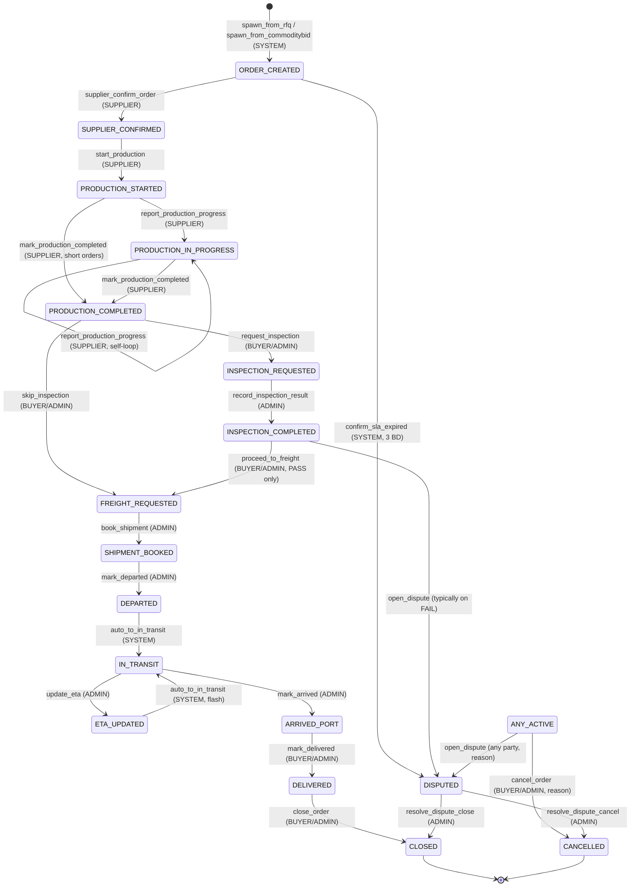

# DeMaxtore — Order Workspace State Machine Descriptor
**Workspace tipi:** `ORDER_WORKSPACE`
**Sprint:** Sprint 2 öncesi tasarım onayı (henüz kod değil)
**Onay sahibi:** Ürün sahibi → Mimari → Sprint 2 dev kickoff
**Kardeş belgeler:** `./rfq-state-machine.md`, `./commoditybid-state-machine.md`

> Bu belge **kod öncesi tek doğruluk kaynağıdır**. Onaylandığında:
> 1. `packages/contracts/src/order.fsm.ts` içinde TypeScript descriptor olarak yer alır.
> 2. Backend permission middleware bu tablodan **derleme zamanında** türetilir.
> 3. Frontend Next-Action butonları aynı descriptor'dan render edilir.
> 4. Audit log event isimleri buradaki `audit_event` kolonundan birebir gelir.
> Tabloyu değiştirmek = state machine'i değiştirmek. Sprint 2 ortasında değişiklik yasaktır.

> **Order workspace'in doğuşu:** Her Order workspace'in `spawned_from_id` alanı **non-null**'dur. Bir RFQ workspace'i (`po.issued` ile) veya CommodityBid workspace'i (`bid.contracts.issued` ile) spawn etmiş olur. Standalone Order yaratma **Sprint 2'de yok** — gelecek sprintte "manual order" akışı eklenebilir.

---

## 0. Decisions Log (Sprint 2 öncesi — onaylanan kararlar)

| # | Karar konusu                                  | Karar                                                                                                                                                                                          | Belgeye yansıması |
|---|-----------------------------------------------|------------------------------------------------------------------------------------------------------------------------------------------------------------------------------------------------|-------------------|
| 1 | **Operasyon modeli**                          | **Port-to-port.** EXPORT_CUSTOMS, IMPORT_CUSTOMS, LAST_MILE, TRUCK_PICKUP **EKLENMEYECEK**. Door-to-door karmaşıklığı kapsam dışı.                                                                  | §2 state listesi  |
| 2 | **İlk state**                                 | **`ORDER_CREATED`.** RFQ tarafının `PO_ISSUED`'ı veya CommodityBid'in `CONTRACTS_ISSUED`'ı ile karıştırılmaz (parent workspace o terminal state'tedir; child Order yeni doğmuştur).                | §2 + §12 spawn protokolü |
| 3 | **Standalone Order yaratma**                  | **Yok.** Sprint 2'de her Order yalnızca RFQ veya CommodityBid spawn'ı ile doğar.                                                                                                                | `create_order` transition'ı yok |
| 4 | **Inspection adımı**                          | **Opsiyonel.** Buyer/Admin `PRODUCTION_COMPLETED` state'inden ya `INSPECTION_REQUESTED`'a ya doğrudan `FREIGHT_REQUESTED`'a geçebilir. Bazı kontratlar 3rd party inspection gerektirmez.            | §3 satır #11–#12  |
| 5 | **Inspection sonuç sahibi**                   | **ADMIN.** Inspection raporu DeMaxtore admin (operatör) tarafından sisteme girilir; 3rd party (SGS, Bureau Veritas, vb.) raporları admin yükler.                                                  | §3 satır #14      |
| 6 | **Freight booking sahibi**                    | **ADMIN** (Sprint 2). Phase 2'de FreightIQ entegrasyonu otomatikleştirir. Incoterms'ten bağımsız olarak DeMaxtore ops sürecini yürütür.                                                          | §3 satır #19      |
| 7 | **`ETA_UPDATED` durumu (mandatory state olduğu için)** | **Flash state.** IN_TRANSIT → ETA_UPDATED transition'ı ADMIN'in `update_eta` aksiyonuyla, ETA_UPDATED → IN_TRANSIT geri dönüşü ise SYSTEM tarafından **aynı transaction'da** otomatik yapılır. Audit log'da hem state geçişi hem yeni ETA payload'ı kayıtlı. | §3 satır #25–#26 |
| 8 | **`DEPARTED` → `IN_TRANSIT`**                 | **SYSTEM auto-transition.** Admin `mark_departed` çağırınca state önce `DEPARTED` olur (timeline'da "vapur ayrıldı" event'i için), aynı transaction'da SYSTEM `IN_TRANSIT`'e geçirir.            | §3 satır #23–#24  |
| 9 | **Dispute akışı**                             | **`DISPUTED` ayrı state**, neredeyse her aktif state'ten girilebilir. ADMIN resolution ile `CLOSED` veya `CANCELLED`'a çıkar. Resolution **state geri yükleme yapmaz** (kararı netleştirir). | §3 satır #28, #34–#35 |
|10 | **`CLOSED` terminal**                         | **Evet — terminal.** Settle olduktan sonra workspace readonly. "Re-open" yok; gerekirse yeni Order workspace açılır (manual order Phase 2'de gelirse).                                            | §2 terminal kolonu |
|11 | **Currency**                                  | **Parent workspace'ten miras alınır** (RFQ.currency veya CommodityBid.currency). Order workspace'inde immutable.                                                                                  | §11 `OrderDetails.currency` |
|12 | **Supplier rating / penalty**                 | **YOK.** CommodityBid Decision #14 ile tutarlı — DeMaxtore stratejik kararı.                                                                                                                    | Hiçbir tabloda / event'te |

> **Üst-belgelerden taşınan kararlar:** spawned_from_id gerçek FK · WorkspaceState string + zod validate per workspace type · audit append-only · idempotency-key her transition'da.

---

## 1. Tasarım ilkeleri

1. **Linear flow + iki kaçış kapısı.** Ana akış (`ORDER_CREATED → … → CLOSED`) lineer; her aktif state'ten `DISPUTED` ve `CANCELLED`'a çıkış var. Geri sarma yok (dispute → resolve sonrası ileri gidilir).
2. **Workspace state ≠ milestone detayı.** Workspace tek state machine üzerinde yürür. Production milestone'ları (`production_milestones` tablosu) ve ETA tarihçesi (`order_eta_updates` tablosu) **workspace state'inden bağımsızdır** — append-only kayıtlar.
3. **Port-to-port atomicity.** Order tek bir origin port'tan tek bir destination port'a vapur/uçak yolculuğunu modeler. Multi-leg (transshipment) Sprint 2'de yok; gerekirse "extended-eta" event'i ile timeline'a yansır.
4. **Append-only timeline + dual time fields.** State değişimi `timeline_events` satırı + ilgili `OrderDetails` tarih kolonu (`departedAt`, `arrivedAt`, vb.). Tek doğruluk kaynağı: `OrderDetails.<field>At`; timeline event reporting amaçlı.
5. **Inspection optional, freight mandatory.** Inspection skip edilebilir; freight booking edilmeden DEPARTED'a geçilemez.
6. **Spawn participants carry-over.** Parent workspace'in OBSERVER'ları Order workspace'ine OBSERVER olarak otomatik taşınır (RFQ ve CommodityBid spawn protokollerinde tanımlı).

---

## 2. State kataloğu

| # | State                       | Tanım                                                              | Giriş side-effect'i | Terminal? |
|---|-----------------------------|---------------------------------------------------------------------|---------------------|-----------|
| 1 | `ORDER_CREATED`             | Parent workspace tarafından spawn edildi; supplier confirm bekleniyor | Supplier'a `INFO` ("Yeni order'ınız var, onaylayın"); Buyer'a `INFO`; admin'e `INFO`. SLA timer: **3 iş günü** supplier confirm. | hayır |
| 2 | `SUPPLIER_CONFIRMED`        | Supplier order'ı onayladı; production başlamadı                     | Buyer + admin'e `SUCCESS`; `OrderDetails.supplierConfirmedAt = now` | hayır |
| 3 | `PRODUCTION_STARTED`        | Supplier production'a başladığını bildirdi                          | Buyer + admin'e `INFO`; `OrderDetails.productionStartedAt = now` | hayır |
| 4 | `PRODUCTION_IN_PROGRESS`    | İlk milestone raporu geldi; production aktif                        | Self-loop ile çoklu milestone raporu (`report_production_progress`) burada birikir | hayır |
| 5 | `PRODUCTION_COMPLETED`      | Supplier production'ı tamamladığını bildirdi                        | Buyer + admin'e `SUCCESS`; `OrderDetails.productionCompletedAt = now` | hayır |
| 6 | `INSPECTION_REQUESTED`      | Buyer/Admin 3rd party inspection talep etti                         | Admin'e `WARNING` ("inspection raporu yükleyin"); `OrderDetails.inspectionRequestedAt = now` | hayır |
| 7 | `INSPECTION_COMPLETED`      | Inspection sonucu kaydedildi (PASS veya FAIL)                       | PASS → Buyer + supplier'a `SUCCESS`. FAIL → Buyer + supplier'a `ERROR` + auto-dispute önerisi (admin sonraki adımı seçer). `OrderDetails.inspectionResult ∈ {PASS, FAIL}` | hayır |
| 8 | `FREIGHT_REQUESTED`         | Buyer/Admin freight booking sürecini başlattı                       | Admin'e `WARNING` ("vessel/carrier booking yap") | hayır |
| 9 | `SHIPMENT_BOOKED`           | Carrier booking onaylandı; vessel + B/L + planlanan tarih           | Buyer + supplier'a `INFO`; `OrderDetails.vesselName`, `billOfLading`, `expectedDeparture` doldurulur | hayır |
|10 | `DEPARTED`                  | Vapur origin port'tan ayrıldı                                       | Tüm participants'a `INFO`; `OrderDetails.departedAt = now`. **SYSTEM aynı transaction'da `IN_TRANSIT`'e geçirir** (Decision #8). | hayır (flash) |
|11 | `IN_TRANSIT`                | Vapur yolda; aktif transit                                          | Buyer + supplier'a `INFO`; `OrderDetails.currentEta` doldurulur (booking'den geliyorsa) | hayır |
|12 | `ETA_UPDATED`               | ETA değişti (admin update etti veya carrier API'dan geldi)          | Tüm participants'a `INFO` (yeni ETA + reason); `order_eta_updates` satırı insert; `OrderDetails.currentEta` güncellenir. **SYSTEM aynı transaction'da `IN_TRANSIT`'e geri döndürür** (Decision #7). | hayır (flash) |
|13 | `ARRIVED_PORT`              | Vapur destination port'a ulaştı                                     | Tüm participants'a `SUCCESS`; `OrderDetails.arrivedAt = now` | hayır |
|14 | `DELIVERED`                 | Buyer port'ta malları teslim aldığını onayladı                      | Tüm participants'a `SUCCESS`; `OrderDetails.deliveredAt = now`. Settlement bekleniyor. | hayır |
|15 | `CLOSED`                    | Order kapatıldı (settlement tamam, workspace readonly)               | Tüm participants'a `SUCCESS`; `OrderDetails.closedAt = now` | **evet** |
|16 | `DISPUTED`                  | Bir taraf dispute açtı (kalite, gecikme, hasar, dokuman, vb.)       | Tüm participants'a `ERROR` (reason zorunlu); admin'e öncelikli triage `WARNING`; `OrderDetails.disputeOpenedAt`, `disputeReason` doldurulur | hayır (resolve edilebilir) |
|17 | `CANCELLED`                 | Order manuel iptal edildi                                            | Tüm participants'a `WARNING` (reason zorunlu)                                                              | **evet** |

> **TOPLAM 17 STATE.** User'ın talep ettiği 15 ana state + 2 zorunlu kaçış state'i (`DISPUTED`, `CANCELLED`).
> **Yasaklı state'ler** (Decision #1): `EXPORT_CUSTOMS`, `IMPORT_CUSTOMS`, `LAST_MILE`, `TRUCK_PICKUP` — port-to-port modelde gerek yok.

---

## 3. Master Transition Tablosu (talep edilen ana çıktı)

> **Notation:** `ANY_ACTIVE` = `{ORDER_CREATED, SUPPLIER_CONFIRMED, PRODUCTION_STARTED, PRODUCTION_IN_PROGRESS, PRODUCTION_COMPLETED, INSPECTION_REQUESTED, INSPECTION_COMPLETED, FREIGHT_REQUESTED, SHIPMENT_BOOKED, DEPARTED, IN_TRANSIT, ETA_UPDATED, ARRIVED_PORT, DELIVERED}` — yani `CLOSED / CANCELLED / DISPUTED` dışındaki tüm state'ler.

| #  | Current State                  | Allowed Role(s)               | Allowed Action                  | Preconditions                                                                                                | Next State                | `audit_event`                       |
|----|--------------------------------|-------------------------------|---------------------------------|--------------------------------------------------------------------------------------------------------------|---------------------------|-------------------------------------|
| 1  | `—` (spawn)                    | SYSTEM                        | `spawn_from_rfq`                | Parent RFQ workspace state = `PO_ISSUED`                                                                     | `ORDER_CREATED`           | `order.created_from_rfq`            |
| 2  | `—` (spawn)                    | SYSTEM                        | `spawn_from_commoditybid`       | Parent CommodityBid state = `CONTRACTS_ISSUED`; bu supplier en az 1 ACCEPTED award'a sahip                    | `ORDER_CREATED`           | `order.created_from_commoditybid`   |
| 3  | `ORDER_CREATED`                | SUPPLIER (COUNTERPARTY)       | `supplier_confirm_order`        | payload: `plannedCompletionDate` (opsiyonel)                                                                  | `SUPPLIER_CONFIRMED`      | `order.supplier_confirmed`          |
| 4  | `ORDER_CREATED`                | SYSTEM                        | `confirm_sla_expired`           | spawn anından **3 iş günü** dolmuş; supplier henüz confirm etmedi                                            | `DISPUTED`                | `order.confirm_sla_expired`         |
| 5  | `SUPPLIER_CONFIRMED`           | SUPPLIER (COUNTERPARTY)       | `start_production`              | payload: `plannedCompletionDate` (zorunlu)                                                                    | `PRODUCTION_STARTED`      | `order.production.started`          |
| 6  | `PRODUCTION_STARTED`           | SUPPLIER (COUNTERPARTY)       | `report_production_progress`    | payload: `label` (zorunlu), `percentage` (0–100, opsiyonel); milestone `production_milestones` tablosuna yazılır | `PRODUCTION_IN_PROGRESS`  | `order.production.progress_reported`|
| 7  | `PRODUCTION_IN_PROGRESS`       | SUPPLIER (COUNTERPARTY)       | `report_production_progress`    | aynı; çoklu milestone'lar burada birikir (self-loop)                                                          | `PRODUCTION_IN_PROGRESS`  | `order.production.progress_reported`|
| 8  | `PRODUCTION_IN_PROGRESS`       | SUPPLIER (COUNTERPARTY)       | `mark_production_completed`     | tüm planlanan miktar üretildi                                                                                | `PRODUCTION_COMPLETED`    | `order.production.completed`        |
| 9  | `PRODUCTION_STARTED`           | SUPPLIER (COUNTERPARTY)       | `mark_production_completed`     | (kısa siparişlerde milestone atlanabilir)                                                                    | `PRODUCTION_COMPLETED`    | `order.production.completed`        |
| 10 | `PRODUCTION_COMPLETED`         | BUYER (OWNER) **veya** ADMIN  | `request_inspection`            | payload: `inspectorName` (opsiyonel)                                                                          | `INSPECTION_REQUESTED`    | `order.inspection.requested`        |
| 11 | `PRODUCTION_COMPLETED`         | BUYER (OWNER) **veya** ADMIN  | `skip_inspection`               | Decision #4 — opsiyonel skip; reason opsiyonel                                                                | `FREIGHT_REQUESTED`       | `order.inspection.skipped`          |
| 12 | `INSPECTION_REQUESTED`         | ADMIN                         | `record_inspection_result`      | Decision #5 — payload: `result ∈ {PASS, FAIL}`, `reportUrl` zorunlu, `inspectorName` zorunlu                  | `INSPECTION_COMPLETED`    | `order.inspection.completed`        |
| 13 | `INSPECTION_COMPLETED`         | BUYER (OWNER) **veya** ADMIN  | `proceed_to_freight`            | `OrderDetails.inspectionResult == 'PASS'`                                                                    | `FREIGHT_REQUESTED`       | `order.inspection.proceed_to_freight`|
| 14 | `INSPECTION_COMPLETED`         | BUYER (OWNER) **veya** ADMIN  | `open_dispute`                  | tipik olarak `inspectionResult == 'FAIL'` durumunda; reason zorunlu                                          | `DISPUTED`                | `order.dispute.opened`              |
| 15 | `FREIGHT_REQUESTED`            | ADMIN                         | `book_shipment`                 | Decision #6 — payload: `freightForwarder`, `vesselName`, `billOfLading`, `expectedDeparture` zorunlu          | `SHIPMENT_BOOKED`         | `order.shipment.booked`             |
| 16 | `SHIPMENT_BOOKED`              | ADMIN                         | `mark_departed`                 | payload: `actualDepartureDate` zorunlu                                                                       | `DEPARTED`                | `order.shipment.departed`           |
| 17 | `DEPARTED`                     | SYSTEM                        | `auto_to_in_transit`            | Decision #8 — `mark_departed` ile aynı transaction'da otomatik                                                | `IN_TRANSIT`              | `order.shipment.in_transit`         |
| 18 | `IN_TRANSIT`                   | ADMIN                         | `update_eta`                    | Decision #7 — payload: `newEta` (gelecek tarih), `reason` opsiyonel                                          | `ETA_UPDATED`             | `order.shipment.eta_updated`        |
| 19 | `ETA_UPDATED`                  | SYSTEM                        | `auto_to_in_transit`            | Decision #7 — `update_eta` ile aynı transaction'da otomatik                                                  | `IN_TRANSIT`              | `order.shipment.eta_settled`        |
| 20 | `IN_TRANSIT`                   | ADMIN                         | `mark_arrived`                  | payload: `actualArrivalDate` zorunlu                                                                         | `ARRIVED_PORT`            | `order.shipment.arrived`            |
| 21 | `ARRIVED_PORT`                 | BUYER (OWNER)                 | `mark_delivered`                | port-to-port handoff onayı; payload: `deliveryConfirmationRef` opsiyonel                                     | `DELIVERED`               | `order.delivered`                   |
| 22 | `ARRIVED_PORT`                 | ADMIN                         | `mark_delivered`                | Buyer 5 iş günü içinde aksiyon almazsa admin görev sahibi (Sprint 2'de manuel; Phase 2'de SLA)               | `DELIVERED`               | `order.delivered`                   |
| 23 | `DELIVERED`                    | BUYER (OWNER) **veya** ADMIN  | `close_order`                   | payload: `finalInvoiceRef` opsiyonel, `settlementConfirmation` zorunlu                                       | `CLOSED`                  | `order.closed`                      |
| 24 | `ANY_ACTIVE`                   | BUYER (OWNER) / SUPPLIER (COUNTERPARTY) / ADMIN | `open_dispute`     | reason zorunlu; `OrderDetails.disputeReason` + `disputeOpenedAt` doldurulur                                  | `DISPUTED`                | `order.dispute.opened`              |
| 25 | `ANY_ACTIVE`                   | BUYER (OWNER) **veya** ADMIN  | `cancel_order`                  | reason zorunlu                                                                                               | `CANCELLED`               | `order.cancelled`                   |
| 26 | `DISPUTED`                     | ADMIN                         | `resolve_dispute_close`         | payload: `resolution` zorunlu, `settlementImpact` opsiyonel                                                  | `CLOSED`                  | `order.dispute.resolved_closed`     |
| 27 | `DISPUTED`                     | ADMIN                         | `resolve_dispute_cancel`        | payload: `resolution` zorunlu, `refundDirective` opsiyonel                                                   | `CANCELLED`               | `order.dispute.resolved_cancelled`  |
| 28 | `ANY_ACTIVE`                   | BUYER (OWNER) / SUPPLIER (COUNTERPARTY) / ADMIN | `post_clarification` | mesaj; tüm participants görür                                                                                | (aynı state)              | `order.clarification.posted`        |
| 29 | `ANY_ACTIVE`                   | BUYER (OWNER) / SUPPLIER (COUNTERPARTY) / ADMIN | `upload_document`  | payload: `documentType`, `fileUrl`, `version`; `documents` tablosuna yazılır (Sprint 3+ schema)              | (aynı state)              | `order.document.uploaded`           |
| 30 | herhangi bir state             | ADMIN                         | `add_observer`                  | yeni participant `OBSERVER` rolüyle eklenir                                                                  | (aynı state)              | `workspace.participant.added`       |
| 31 | herhangi bir state             | ADMIN                         | `remove_observer`               | participant `OBSERVER` olmalı                                                                                | (aynı state)              | `workspace.participant.removed`     |

> **Toplam:** 31 transition. (RFQ: 40 · CommodityBid: 43.)
> **Yasaklı transition'lar** (Decision #1): customs / last_mile / truck pickup ile ilgili HİÇ BİR transition yok.

---

## 4. State diyagramı (Mermaid)



> Diyagram okunabilirlik için sadeleştirildi; `post_clarification`, `upload_document`, `add_observer`, `remove_observer` self-loop'ları gösterilmedi. §3 tablosu tam liste.

---

## 5. Permission matrisi (Role × Action)

✅ = izinli (preconditions ayrıca uygulanır) · ❌ = yasak · `*` = workspace participant rolü kontrolü gerekir (OWNER / COUNTERPARTY / OPERATOR / OBSERVER).

| Action                          | BUYER          | SUPPLIER          | ADMIN          | SYSTEM |
|---------------------------------|----------------|-------------------|----------------|--------|
| `spawn_from_rfq` / `spawn_from_commoditybid` | ❌    | ❌                 | ❌              | ✅     |
| `supplier_confirm_order`        | ❌              | ✅ *(COUNTERPARTY)*| ❌              | ❌     |
| `confirm_sla_expired`           | ❌              | ❌                 | ❌              | ✅     |
| `start_production`              | ❌              | ✅ *(COUNTERPARTY)*| ❌              | ❌     |
| `report_production_progress`    | ❌              | ✅ *(COUNTERPARTY)*| ❌              | ❌     |
| `mark_production_completed`     | ❌              | ✅ *(COUNTERPARTY)*| ❌              | ❌     |
| `request_inspection`            | ✅ *(OWNER)*    | ❌                 | ✅              | ❌     |
| `skip_inspection`               | ✅ *(OWNER)*    | ❌                 | ✅              | ❌     |
| `record_inspection_result`      | ❌              | ❌                 | ✅              | ❌     |
| `proceed_to_freight`            | ✅ *(OWNER)*    | ❌                 | ✅              | ❌     |
| `book_shipment`                 | ❌              | ❌                 | ✅              | ❌     |
| `mark_departed`                 | ❌              | ❌                 | ✅              | ❌     |
| `auto_to_in_transit`            | ❌              | ❌                 | ❌              | ✅     |
| `update_eta`                    | ❌              | ❌                 | ✅              | ❌     |
| `mark_arrived`                  | ❌              | ❌                 | ✅              | ❌     |
| `mark_delivered`                | ✅ *(OWNER)*    | ❌                 | ✅              | ❌     |
| `close_order`                   | ✅ *(OWNER)*    | ❌                 | ✅              | ❌     |
| `open_dispute`                  | ✅ *(OWNER)*    | ✅ *(COUNTERPARTY)*| ✅              | ❌     |
| `resolve_dispute_close` / `resolve_dispute_cancel` | ❌ | ❌            | ✅              | ❌     |
| `cancel_order`                  | ✅ *(OWNER)*    | ❌                 | ✅              | ❌     |
| `post_clarification`            | ✅ *(OWNER)*    | ✅ *(COUNTERPARTY)*| ✅              | ❌     |
| `upload_document`               | ✅ *(OWNER)*    | ✅ *(COUNTERPARTY)*| ✅              | ❌     |
| `add_observer` / `remove_observer` | ❌           | ❌                 | ✅              | ❌     |

> **Görünürlük (read):** Tüm participants (OWNER, COUNTERPARTY, OPERATOR, OBSERVER) order workspace'ini ve timeline'ı **eksiksiz** görür. CommodityBid'teki sealed-bid invariant'ı Order workspace'te **uygulanmaz** — order tek bir supplier ile yapılır, gizlenecek bir rakip bilgi yok.

---

## 6. Audit event taksonomisi

Tüm event'ler `timeline_events.event_type` kolonuna **birebir** bu isimlerle yazılır:

```
order.created_from_rfq
order.created_from_commoditybid
order.supplier_confirmed
order.confirm_sla_expired
order.production.started
order.production.progress_reported
order.production.completed
order.inspection.requested
order.inspection.skipped
order.inspection.completed
order.inspection.proceed_to_freight
order.shipment.booked
order.shipment.departed
order.shipment.in_transit
order.shipment.eta_updated
order.shipment.eta_settled
order.shipment.arrived
order.delivered
order.closed
order.dispute.opened
order.dispute.resolved_closed
order.dispute.resolved_cancelled
order.cancelled
order.clarification.posted
order.document.uploaded
workspace.participant.added
workspace.participant.removed
```

`timeline_events.payload` (JSONB) her event için tipli bir şema izler — `packages/contracts/src/order.events.ts` içinde zod ile tanımlı.

Örnek payload (`order.shipment.eta_updated`):
```json
{
  "event_type": "order.shipment.eta_updated",
  "actor_user_id": "<admin_user_id>",
  "payload": {
    "previous_eta": "2026-03-14T08:00:00Z",
    "new_eta": "2026-03-17T08:00:00Z",
    "delta_days": 3,
    "reason": "Carrier reported port congestion at origin"
  }
}
```

---

## 7. Notification trigger tablosu

| Transition (action)             | Kime                                  | Type    | Title örneği                                          |
|---------------------------------|---------------------------------------|---------|-------------------------------------------------------|
| `spawn_from_rfq` / `spawn_from_commoditybid` | BUYER + SUPPLIER + admin  | SUCCESS | "Order workspace açıldı: {externalRef}"               |
| `supplier_confirm_order`        | BUYER + admin                         | SUCCESS | "{Supplier} order'ı onayladı"                         |
| `confirm_sla_expired` (SYSTEM)  | BUYER + admin + SUPPLIER              | WARNING | "Supplier confirm SLA'si doldu (3 iş günü)"           |
| `start_production`              | BUYER + admin                         | INFO    | "{Supplier} üretime başladı (planned: {date})"        |
| `report_production_progress`    | BUYER                                 | INFO    | "Üretim ilerleme raporu: {label} {percentage}%"       |
| `mark_production_completed`     | BUYER + admin                         | SUCCESS | "Üretim tamamlandı: {externalRef}"                    |
| `request_inspection`            | admin                                 | WARNING | "Inspection talep edildi — rapor yükleyin"            |
| `skip_inspection`               | BUYER + admin + SUPPLIER              | INFO    | "Inspection adımı atlandı"                            |
| `record_inspection_result` (PASS)| BUYER + SUPPLIER                     | SUCCESS | "Inspection PASS"                                     |
| `record_inspection_result` (FAIL)| BUYER + SUPPLIER + admin             | ERROR   | "Inspection FAIL: {reportUrl}"                        |
| `proceed_to_freight`            | admin                                 | WARNING | "Freight booking başlat"                              |
| `book_shipment`                 | BUYER + SUPPLIER                      | INFO    | "Shipment booked: {vesselName} / {billOfLading}"      |
| `mark_departed`                 | tüm participants                       | INFO    | "Vapur ayrıldı: {originPort} ({actualDate})"          |
| `update_eta`                    | tüm participants                       | INFO    | "ETA güncellendi: {newEta} ({reason})"                |
| `mark_arrived`                  | tüm participants                       | SUCCESS | "Destination port'a varıldı: {destinationPort}"       |
| `mark_delivered`                | tüm participants                       | SUCCESS | "Teslim onaylandı"                                    |
| `close_order`                   | tüm participants                       | SUCCESS | "Order kapatıldı: {externalRef}"                      |
| `open_dispute`                  | tüm participants + role:ADMIN broadcast| ERROR   | "Dispute açıldı: {reason}"                            |
| `resolve_dispute_close` / `resolve_dispute_cancel` | tüm participants| INFO    | "Dispute çözüldü: {resolution}"                       |
| `cancel_order`                  | tüm participants                       | WARNING | "Order iptal edildi: {reason}"                        |

`auto_to_in_transit` (SYSTEM) ve `confirm_sla_expired` dışındaki SYSTEM transition'ları sessiz; flash-state geçişleri yalnızca timeline'a yazılır, notification spam'i yapılmaz.

---

## 8. TypeScript descriptor şekli (kod öncesi sözleşme)

```ts
export type OrderState =
  | "ORDER_CREATED" | "SUPPLIER_CONFIRMED"
  | "PRODUCTION_STARTED" | "PRODUCTION_IN_PROGRESS" | "PRODUCTION_COMPLETED"
  | "INSPECTION_REQUESTED" | "INSPECTION_COMPLETED"
  | "FREIGHT_REQUESTED" | "SHIPMENT_BOOKED"
  | "DEPARTED" | "IN_TRANSIT" | "ETA_UPDATED" | "ARRIVED_PORT"
  | "DELIVERED" | "CLOSED"
  | "DISPUTED" | "CANCELLED";

export type OrderAction =
  | "spawn_from_rfq" | "spawn_from_commoditybid"
  | "supplier_confirm_order" | "confirm_sla_expired"
  | "start_production" | "report_production_progress" | "mark_production_completed"
  | "request_inspection" | "skip_inspection" | "record_inspection_result"
  | "proceed_to_freight" | "book_shipment"
  | "mark_departed" | "auto_to_in_transit"
  | "update_eta" | "mark_arrived" | "mark_delivered" | "close_order"
  | "open_dispute" | "resolve_dispute_close" | "resolve_dispute_cancel"
  | "cancel_order" | "post_clarification" | "upload_document"
  | "add_observer" | "remove_observer";

export const ORDER_ACTIVE_STATES = [
  "ORDER_CREATED", "SUPPLIER_CONFIRMED",
  "PRODUCTION_STARTED", "PRODUCTION_IN_PROGRESS", "PRODUCTION_COMPLETED",
  "INSPECTION_REQUESTED", "INSPECTION_COMPLETED",
  "FREIGHT_REQUESTED", "SHIPMENT_BOOKED",
  "DEPARTED", "IN_TRANSIT", "ETA_UPDATED", "ARRIVED_PORT", "DELIVERED",
] as const satisfies OrderState[];

export const ORDER_TRANSITIONS: Transition<OrderState>[] = [
  // Spawn (SYSTEM)
  { from: "*", to: "ORDER_CREATED", action: "spawn_from_rfq",
    allowedRoles: ["SYSTEM"], auditEvent: "order.created_from_rfq",
    notifyRecipients: [/* OWNER, COUNTERPARTY, OPERATOR — SUCCESS */] },
  { from: "*", to: "ORDER_CREATED", action: "spawn_from_commoditybid",
    allowedRoles: ["SYSTEM"], auditEvent: "order.created_from_commoditybid",
    notifyRecipients: [/* same */] },

  // Decision #7 — ETA_UPDATED flash state
  { from: "IN_TRANSIT", to: "ETA_UPDATED", action: "update_eta",
    allowedRoles: ["ADMIN"], requiresReason: false,
    auditEvent: "order.shipment.eta_updated",
    notifyRecipients: [/* all participants — INFO */],
    sideEffects: ["insert order_eta_updates row", "update OrderDetails.currentEta"] },
  { from: "ETA_UPDATED", to: "IN_TRANSIT", action: "auto_to_in_transit",
    allowedRoles: ["SYSTEM"], auditEvent: "order.shipment.eta_settled",
    notifyRecipients: [],
    inSameTransactionAs: "update_eta" },

  // Decision #8 — DEPARTED flash state
  { from: "SHIPMENT_BOOKED", to: "DEPARTED", action: "mark_departed",
    allowedRoles: ["ADMIN"], auditEvent: "order.shipment.departed",
    notifyRecipients: [/* all participants — INFO */] },
  { from: "DEPARTED", to: "IN_TRANSIT", action: "auto_to_in_transit",
    allowedRoles: ["SYSTEM"], auditEvent: "order.shipment.in_transit",
    notifyRecipients: [],
    inSameTransactionAs: "mark_departed" },

  // … (31 transition birebir Bölüm 3'teki tabloya karşılık gelir)
];
```

Backend `applyTransition(workspaceId, action, actor, payload)` fonksiyonu yalnızca bu listeden besleniyor — listeye eklenmemiş bir action = 400 `UNKNOWN_ACTION`.

`inSameTransactionAs` meta-field: aynı API çağrısı içinde **iki transition** ardışık tetiklenir. Caller'dan tek action gelir; FSM tek transaction'da iki state geçişi yazar (ETA_UPDATED → IN_TRANSIT, DEPARTED → IN_TRANSIT).

---

## 9. Açık sorular (Sprint 2 başlamadan önce ürün sahibinin karar vermesi gerekenler)

> Onaylandığında §0 Decisions Log'una taşınır.

| # | Soru                                                                                                                          | Önerim |
|---|-------------------------------------------------------------------------------------------------------------------------------|--------|
| A | **Production SLA'sı:** `SUPPLIER_CONFIRMED` → `PRODUCTION_COMPLETED` arası bir maksimum süre tanımlansın mı? Aşılırsa otomatik `DISPUTED`? | **Hayır — Sprint 2'de yok.** `plannedCompletionDate` payload'da saklanır; UI bunu badge olarak gösterir. SLA auto-dispute Phase 2'de eklenir. |
| B | **`mark_delivered` SLA**: ARRIVED_PORT'a vardıktan sonra Buyer kaç gün içinde teslim onayı vermeli? Süre dolarsa admin auto-confirm yapsın mı? | **5 iş günü.** Süre dolarsa admin manuel `mark_delivered` yapar (zaten satır #22'de var). Auto-confirm Phase 2'de.                       |
| C | **`upload_document` Sprint 2'ye dahil mi yoksa Sprint 3'e mi?** Documents tablosu Sprint 1 patch'inde yok.                    | **Sprint 3.** Sprint 2'de upload yerine free-text URL referansı (`OrderDetails.inspectionReportUrl` gibi) yeterli; tam document modülü Sprint 3.   |
| D | **Inspection FAIL sonrası otomatik dispute mü, manuel mü?** Şu an `INSPECTION_COMPLETED` state'inde kalır; buyer `open_dispute` çağırır. Otomatik `DISPUTED`'a geçilsin mi? | **Manuel kalsın.** Bazen FAIL hafiftir (örn. paketleme), buyer dispute açmak yerine `proceed_to_freight + indirim notu` ile devam etmek isteyebilir. |
| E | **ETA değişikliği ne kadar büyükse Buyer'a `WARNING` (ne kadar küçükse `INFO`) seviyesinde bildirim göndermeli?**             | **Threshold: 3 gün.** ≤3 gün → INFO; >3 gün → WARNING.                                                                                  |
| F | **`open_dispute` payload'unda kategori alanı** (`QUALITY`, `DELAY`, `DAMAGE`, `DOCUMENT`, `PAYMENT`, `OTHER`) zorunlu mu?     | **Evet — zorunlu.** Admin triyaj UI'sını besler. Phase 2 analytics için referans.                                                       |
| G | **Multiple shipments per order?** Bir order birden fazla vapurla (split shipment) sevk edilebilir mi?                          | **Hayır — Sprint 2'de yok.** Bir Order = bir vapur = bir B/L. Split shipment Phase 2'ye bırakılır.                                       |

> 7 açık soru. Lütfen Sprint 2 dev kickoff'undan **önce** karara bağlayın.

---

## 10. Sprint 2 hazırlık checklist'i

- [ ] §9 açık sorular karara bağlandı ve §0 Decisions Log'una işlendi.
- [ ] `packages/contracts/src/order.fsm.ts` bu belgeden generate edildi.
- [ ] `packages/contracts/src/order.events.ts` payload zod şemaları yazıldı.
- [ ] Backend `apps/backend/src/modules/order/order.service.ts` içinde tek public method `applyTransition()` — başka yerden state mutate edilmiyor.
- [ ] Spawn protokol entegrasyon testi: RFQ.PO_ISSUED → Order.ORDER_CREATED ve CommodityBid.CONTRACTS_ISSUED → N×Order.ORDER_CREATED akışları çalışıyor.
- [ ] **Flash state invariant testi:** `update_eta` ve `mark_departed` çağrısı **tek HTTP request** ile her zaman `IN_TRANSIT`'te bitiriyor (DEPARTED veya ETA_UPDATED state'inde takılmıyor).
- [ ] Supplier confirm SLA scheduler kurulu: her dakika `ORDER_CREATED` state'inde 3 iş günü dolanları `confirm_sla_expired` ile geçiriyor.
- [ ] Frontend `<NextActions />` bileşeni `ORDER_TRANSITIONS` üzerinden render ediliyor; hard-coded buton yok.
- [ ] Audit log replay testi: `timeline_events`'ten state machine'i baştan oynatınca aynı final state'e ulaşılıyor.
- [ ] **Yasaklı state regression testi:** Codebase'de `EXPORT_CUSTOMS`, `IMPORT_CUSTOMS`, `LAST_MILE`, `TRUCK_PICKUP` string araması → **0 sonuç** (Decision #1).
- [ ] **No-rating invariant testi** (Decision #12): `rating`, `score`, `ranking`, `penalty`, `reputation` araması supplier context'inde **0 sonuç**.

---

## 11. Sprint 2 Schema Patch'i (Order özel tablolar)

Sprint 1 Prisma schema'sına aşağıdaki tablolar eklenir (Sprint 2 migration adı: `sprint2_order_workflow`). Genel workspace patch'leri RFQ §11'de tanımlı — burada tekrarlanmıyor.

```prisma
model OrderDetails {
  id              String   @id @default(uuid()) @db.Uuid
  workspaceId     String   @unique @map("workspace_id") @db.Uuid
  contractRef     String   @unique @map("contract_ref")            // PO number veya contract number
  currency        String                                            // ISO 4217 — parent'tan miras
  totalValue      Decimal  @db.Decimal(18, 4) @map("total_value")
  incoterms       String                                            // FOB / CIF / CFR
  originPort      String   @map("origin_port")                      // UN/LOCODE veya free text
  destinationPort String   @map("destination_port")

  // Confirmation
  supplierConfirmedAt    DateTime? @map("supplier_confirmed_at")
  confirmSlaDeadlineAt   DateTime? @map("confirm_sla_deadline_at")  // spawn + 3 BD

  // Production
  productionStartedAt    DateTime? @map("production_started_at")
  productionCompletedAt  DateTime? @map("production_completed_at")
  productionPlannedAt    DateTime? @map("production_planned_at")    // payload'dan

  // Inspection
  inspectionRequestedAt  DateTime? @map("inspection_requested_at")
  inspectionCompletedAt  DateTime? @map("inspection_completed_at")
  inspectionResult       String?   @map("inspection_result")        // 'PASS' | 'FAIL' | null
  inspectionReportUrl    String?   @map("inspection_report_url")
  inspectorName          String?   @map("inspector_name")

  // Freight & Shipment
  freightForwarder       String?   @map("freight_forwarder")
  vesselName             String?   @map("vessel_name")
  billOfLading           String?   @map("bill_of_lading")
  expectedDeparture      DateTime? @map("expected_departure")

  // Transit milestones
  departedAt             DateTime? @map("departed_at")
  currentEta             DateTime? @map("current_eta")
  arrivedAt              DateTime? @map("arrived_at")
  deliveredAt            DateTime? @map("delivered_at")
  closedAt               DateTime? @map("closed_at")

  // Dispute
  disputeOpenedAt        DateTime? @map("dispute_opened_at")
  disputeReason          String?   @map("dispute_reason")
  disputeCategory        String?   @map("dispute_category")          // §9-F: QUALITY|DELAY|DAMAGE|DOCUMENT|PAYMENT|OTHER
  disputeResolvedAt      DateTime? @map("dispute_resolved_at")
  disputeResolution      String?   @map("dispute_resolution")
  disputeResolutionType  String?   @map("dispute_resolution_type")   // 'CLOSED' | 'CANCELLED'

  createdAt   DateTime @default(now())
  updatedAt   DateTime @updatedAt

  workspace   Workspace @relation(fields: [workspaceId], references: [id], onDelete: Cascade)
  etaUpdates           OrderEtaUpdate[]
  productionMilestones ProductionMilestone[]

  @@index([contractRef])
  @@map("order_details")
}

model OrderEtaUpdate {
  id           String   @id @default(uuid()) @db.Uuid
  workspaceId  String   @map("workspace_id") @db.Uuid
  previousEta  DateTime? @map("previous_eta")
  newEta       DateTime  @map("new_eta")
  deltaDays    Int      @map("delta_days")            // hesaplanmış kolaylık
  reason       String?
  reportedBy   String   @map("reported_by") @db.Uuid
  createdAt    DateTime @default(now())

  workspace    Workspace @relation(fields: [workspaceId], references: [id], onDelete: Cascade)

  @@index([workspaceId, createdAt])
  @@map("order_eta_updates")
}

model ProductionMilestone {
  id            String   @id @default(uuid()) @db.Uuid
  workspaceId   String   @map("workspace_id") @db.Uuid
  label         String                                            // "Cutting started" / "Sewing 50%" / "QC done"
  percentage    Int?                                              // 0-100, opsiyonel
  notes         String?
  reportedBy    String   @map("reported_by") @db.Uuid
  reportedAt    DateTime @default(now()) @map("reported_at")

  workspace     Workspace @relation(fields: [workspaceId], references: [id], onDelete: Cascade)

  @@index([workspaceId, reportedAt])
  @@map("production_milestones")
}
```

**No-rating invariant (Decision #12) DB karşılığı:** Hiçbir tablo, hiçbir kolon, hiçbir trigger supplier reputation veriyi tutmaz. `supplier_user_id` yalnızca `workspace_participants` üzerinden referans alınır; başka bir performans skoru tablosu yok.

**Yasaklı kolon adları (Decision #1):** `customs_*`, `last_mile_*`, `truck_pickup_*` — Sprint 2 schema review'da PR engellenmesi için commit-hook script önerisi.

---

## 12. Spawn → ORDER_CREATED Detayı

Order workspace yalnızca SYSTEM tarafından, parent workspace'in transaction'ı içinde yaratılır. Bu protokol RFQ §12 ve CommodityBid §12'de zaten tanımlandı; burada **Order tarafının** alacağı side-effect'ler listelenir:

```
SYSTEM, parent transaction içinde:
  1. INSERT INTO workspaces (
       type: "ORDER_WORKSPACE",
       state: "ORDER_CREATED",
       external_ref: <spawn protokolünden gelen ref>,
       spawned_from_id: <parent_workspace_id>,
       created_by_id: <buyer_user_id>
     )
  2. INSERT INTO order_details (
       workspace_id: <new>,
       contract_ref: <PO veya contract number>,
       currency: <parent.currency>,        ← Decision #11
       total_value, incoterms, origin_port, destination_port: parent'tan
       confirm_sla_deadline_at: now + 3 BD
     )
  3. INSERT workspace_participants (carry-over):
       Buyer → OWNER ; Supplier → COUNTERPARTY ; Admin → OPERATOR ;
       (önceki OBSERVER'lar) → OBSERVER
  4. INSERT timeline_events:
       { event_type: "order.created_from_rfq" | "order.created_from_commoditybid",
         payload: { parent_workspace_id, parent_external_ref, … } }
  5. Notification (her participant):
       SUCCESS "Order workspace açıldı: {externalRef}"
  6. Socket emit:
       io.to(`user:${userId}`).emit("workspace.spawned", { from: parentId, to: orderId })
```

Spawn idempotency: parent workspace'in `issue_po` veya `issue_contracts` action'ı `idempotencyKey` taşır; aynı key ile ikinci çağrı yeni Order workspace yaratmaz, mevcut id(ler)'i döner.

---

## 13. Üç state machine'in birleşik özeti (RFQ + CommodityBid + Order)

| Boyut                          | RFQ                              | CommodityBid                                | Order                                       |
|--------------------------------|----------------------------------|---------------------------------------------|---------------------------------------------|
| State sayısı                   | 15                               | 13                                          | **17** (15 ana + DISPUTED + CANCELLED)      |
| Transition sayısı              | 40                               | 43                                          | **31**                                       |
| Workspace doğuş şekli          | Buyer `create_rfq`               | Buyer `create_bid`                          | **Yalnızca SYSTEM spawn** (parent transaction'ı içinde) |
| Spawn yönü                     | → 1× Order                       | → N× Order                                  | (kaynak: RFQ veya CommodityBid)             |
| Currency                       | Buyer seçer, immutable post-publish | Buyer seçer, immutable post-publish         | Parent'tan miras, immutable                 |
| Supplier rating / penalty      | YOK                              | YOK (Decision #14)                          | YOK (Decision #12)                          |
| Operasyon kapsamı              | Pre-order (sourcing)             | Pre-order (commodity tender)                | **Port-to-port** lojistik + üretim          |
| Yasaklı modüller               | Email delivery (Sprint 2)        | Multi-currency, reputation, anti-sniping    | **Customs / last_mile / truck pickup**      |
| SYSTEM transition sayısı       | 3                                | 3                                           | **4** (spawn, confirm_sla, 2× flash state)  |
| Flash state'ler                | yok                              | yok                                         | **DEPARTED, ETA_UPDATED**                   |
| Dispute mekanizması            | yok (sourcing iptali yeterli)    | yok                                         | **var** — neredeyse her active state'ten girilebilir |
| RLS (Sprint 2.5)               | gerek yok                        | **gerek var** (sealed-bid)                  | gerek yok (single supplier)                 |
| Audit event sayısı             | 29                               | 36                                          | 27                                          |

**Toplam state machine yüzeyi:** 45 state + 114 transition + 92 audit event. `@dmx/contracts` paketinde tek `Transition<TState>` jenerik tipinden besleniyor; üç FSM aynı `applyTransition` runtime'ı kullanır.

---

*Belgenin sahibi: Ürün + Mimari · Son inceleme tarihi: Sprint 2 kickoff'tan önce · Decisions onayı: §0'daki 12 karar onaylanmış varsayılır; §9'daki 7 yeni soru bekliyor.*
