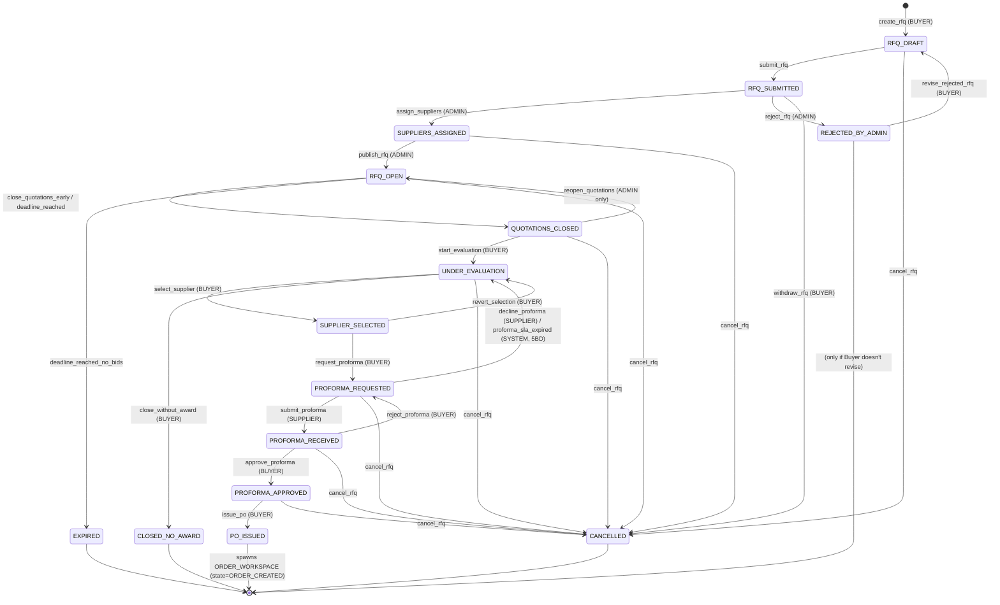

# DeMaxtore — RFQ State Machine Descriptor
**Workspace tipi:** `STANDARD_RFQ_WORKSPACE`
**Sprint:** Sprint 2 öncesi tasarım onayı (henüz kod değil)
**Onay sahibi:** Ürün sahibi → Mimari → Sprint 2 dev kickoff

> Bu belge **kod öncesi tek doğruluk kaynağıdır**. Onaylandığında:
> 1. `packages/contracts/src/rfq.fsm.ts` içinde TypeScript descriptor olarak yer alır.
> 2. Backend permission middleware bu tablodan **derleme zamanında** türetilir.
> 3. Frontend Next-Action butonları aynı descriptor'dan render edilir.
> 4. Audit log event isimleri buradaki `audit_event` kolonundan birebir gelir.
> Tabloyu değiştirmek = state machine'i değiştirmek. Sprint 2 ortasında değişiklik yasaktır.

---

## 0. Decisions Log (Sprint 2 öncesi — onaylanan kararlar)

> Bu kararlar §3 transition tablosuna, §5 permission matrisine ve §8 TypeScript descriptor'una **işlenmiştir**.
> Değiştirilmesi için yeni bir Decisions Log girişi gereklidir.

| # | Karar konusu                          | Karar                                                                                                | Belgeye yansıması |
|---|---------------------------------------|------------------------------------------------------------------------------------------------------|-------------------|
| 1 | Multi-round bidding                   | **Hayır.** Phase 2'ye bırakıldı. Sprint 2'de yok.                                                     | Yeni state/transition eklenmedi |
| 2 | Split award (1 RFQ → N supplier)      | **Hayır.** Sprint 2: **1 RFQ → 1 supplier → 1 order**.                                               | `select_supplier` tekil kaldı |
| 3 | Proforma SLA                          | **5 iş günü.** SLA dolarsa state otomatik `UNDER_EVALUATION`'a döner; Buyer + Admin'e `WARNING`.       | §3 yeni satır #38 (`proforma_sla_expired`, SYSTEM) |
| 4 | Reopen quotations yetkisi             | **Yalnızca ADMIN.** Buyer tek başına reopen yapamaz; admin'den notification yoluyla ister.            | §3 satır #22 güncellendi (BUYER kaldırıldı) |
| 5 | Extend deadline limiti                | **Maksimum 2 defa, toplam +14 gün.**                                                                  | §3 satır #16 preconditions güncellendi |
| 6 | `REJECTED_BY_ADMIN` terminal mi?      | **Hayır — terminal değil.** Buyer düzeltip yeniden gönderebilir: `revise_rejected_rfq` → `RFQ_DRAFT`.| §2 terminal kolonu güncellendi + §3 yeni satır #37 |
| 7 | RFQ ↔ Order ilişkisi (`spawned_from`) | **Gerçek FK kolonu.** JSONB içine gömülmeyecek.                                                       | §11 schema patch'i eklendi |
| 8 | PO_ISSUED ↔ ORDER_CREATED ayrımı      | **Net ayrım.** RFQ tarafında final state `PO_ISSUED`; doğan child `ORDER_WORKSPACE` ise `ORDER_CREATED` state'inde başlar (RFQ state'i ile çakışmasın). | §2 PO_ISSUED girişi + §11 spawn protokolü |

---

## 1. Tasarım ilkeleri

1. **Tek state machine** — bir RFQ workspace'in her an yalnızca **bir** state'i vardır (`workspaces.state`). Substate yok; "quotation sayısı > 0" gibi sinyaller **state değil**, derived field.
2. **Append-only timeline** — her transition `timeline_events` tablosuna bir satır olarak yazılır; state geriye sarılmaz, "düzeltme" yeni bir transition'dır (örn. `reject_proforma` → `PROFORMA_REQUESTED`'a geri döner ama event kaydı kalır).
3. **Terminal state'lerden çıkış yok** — `CANCELLED / EXPIRED / REJECTED_BY_ADMIN / CLOSED_NO_AWARD / PO_ISSUED`. PO_ISSUED hariç hepsi mutlak terminal; PO_ISSUED ise **yeni bir `ORDER_WORKSPACE` workspace'i doğurur** (parent/child ilişkisi `workspaces.spawned_from_id` ile — Sprint 2 schema patch'i).
4. **Rol tabanlı + workspace-katılımcı tabanlı yetki** — her action için (a) rol kümesi ve (b) hangi `ParticipantRole`'de olunması gerektiği ayrı ayrı denetlenir.
5. **Sistem aksiyonları (`SYSTEM`)** — zaman tabanlı (deadline aşımı vs.) transition'ları temsil eder; cron / scheduled job tarafından tetiklenir.
6. **Idempotency** — her action `(workspaceId, actionName, idempotencyKey)` üçlüsünde unique'tir; aynı çift kez gelirse aynı sonucu döner, ikinci kez transition yapmaz.

---

## 2. State kataloğu

| # | State                   | Tanım | Giriş side-effect'i | Terminal? |
|---|-------------------------|-------|---------------------|-----------|
| 1 | `RFQ_DRAFT`             | Buyer henüz submit etmedi, alanları düzenliyor | Workspace satırı oluşturulur; admin'e gösterilmez | hayır |
| 2 | `RFQ_SUBMITTED`         | Buyer submit etti, admin triage kuyruğunda | Tüm `ADMIN`'lere `INFO` notification + `role:ADMIN` socket broadcast | hayır |
| 3 | `REJECTED_BY_ADMIN`     | Admin RFQ'yu reddetti (eksik bilgi / uygun değil) | Buyer'a `ERROR` notification + RFQ readonly (ama düzeltilip yeniden gönderilebilir, bkz. transition #37) | hayır (yeniden submit edilebilir) |
| 4 | `SUPPLIERS_ASSIGNED`    | Admin 1+ supplier'ı invite etti, henüz publish değil | Atanan her supplier'a `INFO` ("davet hazır, publish bekleniyor"); buyer'a status update | hayır |
| 5 | `RFQ_OPEN`              | RFQ tedarikçilere açık; quotation kabul ediliyor | Atanan tüm supplier'lara `INFO` + workspace deadline timer aktif | hayır |
| 6 | `QUOTATIONS_CLOSED`     | Deadline doldu **veya** buyer manuel kapattı; yeni quotation yok | Quotation veren tüm supplier'lara `INFO`; buyer'a `INFO` ("değerlendirme zamanı") | hayır |
| 7 | `UNDER_EVALUATION`      | Buyer karşılaştırmayı aktif olarak yürütüyor | Buyer'a evaluation UI açılır; supplier'lara "review başladı" `INFO` | hayır |
| 8 | `SUPPLIER_SELECTED`     | Buyer kazanan supplier'ı seçti (bağlayıcı değil; proforma adımı zorunlu) | Kazanan supplier'a `SUCCESS`, kaybedenlere `INFO`, admin'e `INFO` | hayır |
| 9 | `PROFORMA_REQUESTED`    | Buyer kazanandan proforma fatura talep etti | Kazanan supplier'a `WARNING` + **SLA timer: 5 iş günü** (Decision #3). Süre dolarsa SYSTEM otomatik `UNDER_EVALUATION`'a döndürür ve Buyer+Admin'e `WARNING` notification gönderir. | hayır |
| 10| `PROFORMA_RECEIVED`     | Supplier proformayı yükledi | Buyer'a `INFO`; admin'e `INFO` | hayır |
| 11| `PROFORMA_APPROVED`     | Buyer proformayı onayladı (PO öncesi son onay) | Supplier'a `SUCCESS`; admin'e `INFO` | hayır |
| 12| `PO_ISSUED`             | PO yayınlandı; child `ORDER_WORKSPACE` doğdu | **Yeni `ORDER_WORKSPACE` workspace'i `ORDER_CREATED` state'inde** oluşturulur (Decision #8 — order tarafının state adı RFQ tarafından farklı tutulur). `workspaces.spawned_from_id = <rfq_workspace_id>` (Decision #7). Tüm participants order workspace'ine yönlendirilir; RFQ readonly olur. | **evet (RFQ tarafı)** |
| 13| `CANCELLED`             | Buyer veya admin RFQ'yu manuel iptal etti | Tüm participants `WARNING` notification; reason zorunlu | **evet** |
| 14| `EXPIRED`               | Deadline doldu ve hiçbir aksiyon alınmadı | Buyer + admin `WARNING`; archive | **evet** |
| 15| `CLOSED_NO_AWARD`       | Buyer değerlendirmeyi bitirdi ama kimseyi seçmedi | Tüm supplier'lara `INFO`; admin'e `INFO`; reason zorunlu | **evet** |

> **Not:** "Quotation alındı" ayrı bir state DEĞİL — `RFQ_OPEN` state'i içinde `quotations.count(workspaceId) > 0` derived field olarak kullanılır. Bu kararı şimdiden almak, Sprint 2'de yarış koşullarını (iki supplier aynı saniyede teklif verirse hangi state?) ortadan kaldırır.

---

## 3. Master Transition Tablosu (talep edilen ana çıktı)

| #  | Current State          | Allowed Role(s)             | Allowed Action               | Preconditions                                            | Next State              | `audit_event`                     |
|----|------------------------|-----------------------------|------------------------------|----------------------------------------------------------|-------------------------|-----------------------------------|
| 1  | `—` (creation)         | BUYER                       | `create_rfq`                 | RFQ alanları minimum geçerli                              | `RFQ_DRAFT`             | `rfq.created`                     |
| 2  | `RFQ_DRAFT`            | BUYER (OWNER)               | `edit_rfq_draft`             | —                                                        | `RFQ_DRAFT`             | `rfq.draft.edited`                |
| 3  | `RFQ_DRAFT`            | BUYER (OWNER)               | `submit_rfq`                 | Tüm zorunlu alanlar dolu; en az 1 line-item              | `RFQ_SUBMITTED`         | `rfq.submitted`                   |
| 4  | `RFQ_DRAFT`            | BUYER (OWNER)               | `cancel_rfq`                 | reason zorunlu                                           | `CANCELLED`             | `rfq.cancelled`                   |
| 5  | `RFQ_SUBMITTED`        | ADMIN                       | `assign_suppliers`           | ≥1 supplier seçili; her biri aktif `User(role=SUPPLIER)` | `SUPPLIERS_ASSIGNED`    | `rfq.suppliers.assigned`          |
| 6  | `RFQ_SUBMITTED`        | ADMIN                       | `reject_rfq`                 | reason zorunlu                                           | `REJECTED_BY_ADMIN`     | `rfq.rejected_by_admin`           |
| 7  | `RFQ_SUBMITTED`        | BUYER (OWNER)               | `withdraw_rfq`               | henüz admin triage etmediyse                              | `CANCELLED`             | `rfq.cancelled`                   |
| 8  | `SUPPLIERS_ASSIGNED`   | ADMIN                       | `add_more_suppliers`         | yeni supplier'lar daha önce eklenmemiş                    | `SUPPLIERS_ASSIGNED`    | `rfq.suppliers.added`             |
| 9  | `SUPPLIERS_ASSIGNED`   | ADMIN                       | `remove_supplier`            | supplier henüz quotation vermemiş                         | `SUPPLIERS_ASSIGNED`    | `rfq.suppliers.removed`           |
| 10 | `SUPPLIERS_ASSIGNED`   | ADMIN                       | `publish_rfq`                | en az 1 supplier atanmış; deadline geçerli (geleceğe)     | `RFQ_OPEN`              | `rfq.published`                   |
| 11 | `SUPPLIERS_ASSIGNED`   | BUYER (OWNER) **veya** ADMIN| `cancel_rfq`                 | reason zorunlu                                           | `CANCELLED`             | `rfq.cancelled`                   |
| 12 | `RFQ_OPEN`             | SUPPLIER (COUNTERPARTY)     | `submit_quotation`           | bu supplier'dan henüz quotation yok (revize için ayrı action) | `RFQ_OPEN`         | `quotation.submitted`             |
| 13 | `RFQ_OPEN`             | SUPPLIER (COUNTERPARTY)     | `revise_quotation`           | aynı supplier'ın önceki quotation'ı var; deadline geçmedi | `RFQ_OPEN`              | `quotation.revised`               |
| 14 | `RFQ_OPEN`             | SUPPLIER (COUNTERPARTY)     | `withdraw_quotation`         | aynı supplier'ın quotation'ı var; deadline geçmedi        | `RFQ_OPEN`              | `quotation.withdrawn`             |
| 15 | `RFQ_OPEN`             | BUYER (OWNER) / SUPPLIER    | `post_clarification`         | clarification thread içinde mesaj                         | `RFQ_OPEN`              | `rfq.clarification.posted`        |
| 16 | `RFQ_OPEN`             | BUYER (OWNER) **veya** ADMIN| `extend_deadline`            | yeni deadline > mevcut deadline; **toplam uzatma sayısı ≤ 2**; **toplam eklenen süre ≤ 14 gün** (Decision #5) | `RFQ_OPEN`              | `rfq.deadline.extended`           |
| 17 | `RFQ_OPEN`             | BUYER (OWNER)               | `close_quotations_early`     | reason isteğe bağlı                                       | `QUOTATIONS_CLOSED`     | `rfq.quotations.closed_manual`    |
| 18 | `RFQ_OPEN`             | SYSTEM                      | `deadline_reached`           | now ≥ deadline; en az 1 quotation var                     | `QUOTATIONS_CLOSED`     | `rfq.quotations.closed_auto`      |
| 19 | `RFQ_OPEN`             | SYSTEM                      | `deadline_reached_no_bids`   | now ≥ deadline; quotation sayısı = 0                      | `EXPIRED`               | `rfq.expired`                     |
| 20 | `RFQ_OPEN`             | BUYER (OWNER) **veya** ADMIN| `cancel_rfq`                 | reason zorunlu                                           | `CANCELLED`             | `rfq.cancelled`                   |
| 21 | `QUOTATIONS_CLOSED`    | BUYER (OWNER)               | `start_evaluation`           | —                                                        | `UNDER_EVALUATION`      | `rfq.evaluation.started`          |
| 22 | `QUOTATIONS_CLOSED`    | ADMIN                       | `reopen_quotations`          | reason zorunlu; yeni deadline gerekli (Decision #4 — yalnızca ADMIN; Buyer talebini notification/clarification üzerinden iletir) | `RFQ_OPEN`         | `rfq.quotations.reopened`         |
| 23 | `QUOTATIONS_CLOSED`    | BUYER (OWNER) **veya** ADMIN| `cancel_rfq`                 | reason zorunlu                                           | `CANCELLED`             | `rfq.cancelled`                   |
| 24 | `UNDER_EVALUATION`     | BUYER (OWNER)               | `select_supplier`            | seçilen supplier'ın geçerli, çekilmemiş quotation'ı var   | `SUPPLIER_SELECTED`     | `rfq.supplier.selected`           |
| 25 | `UNDER_EVALUATION`     | BUYER (OWNER)               | `close_without_award`        | reason zorunlu                                           | `CLOSED_NO_AWARD`       | `rfq.closed_no_award`             |
| 26 | `UNDER_EVALUATION`     | BUYER (OWNER) **veya** ADMIN| `cancel_rfq`                 | reason zorunlu                                           | `CANCELLED`             | `rfq.cancelled`                   |
| 27 | `SUPPLIER_SELECTED`    | BUYER (OWNER)               | `request_proforma`           | —                                                        | `PROFORMA_REQUESTED`    | `proforma.requested`              |
| 28 | `SUPPLIER_SELECTED`    | BUYER (OWNER)               | `revert_selection`           | reason zorunlu; proforma talep edilmediyse                | `UNDER_EVALUATION`      | `rfq.selection.reverted`          |
| 29 | `PROFORMA_REQUESTED`   | SUPPLIER (seçilen)          | `submit_proforma`            | proforma dosyası yüklü; geçerli                           | `PROFORMA_RECEIVED`     | `proforma.submitted`              |
| 30 | `PROFORMA_REQUESTED`   | SUPPLIER (seçilen)          | `decline_proforma`           | reason zorunlu                                           | `UNDER_EVALUATION`      | `proforma.declined_by_supplier`   |
| 31 | `PROFORMA_REQUESTED`   | BUYER (OWNER) **veya** ADMIN| `cancel_rfq`                 | reason zorunlu                                           | `CANCELLED`             | `rfq.cancelled`                   |
| 32 | `PROFORMA_RECEIVED`    | BUYER (OWNER)               | `approve_proforma`           | —                                                        | `PROFORMA_APPROVED`     | `proforma.approved`               |
| 33 | `PROFORMA_RECEIVED`    | BUYER (OWNER)               | `reject_proforma`            | reason zorunlu                                           | `PROFORMA_REQUESTED`    | `proforma.rejected`               |
| 34 | `PROFORMA_RECEIVED`    | BUYER (OWNER) **veya** ADMIN| `cancel_rfq`                 | reason zorunlu                                           | `CANCELLED`             | `rfq.cancelled`                   |
| 35 | `PROFORMA_APPROVED`    | BUYER (OWNER)               | `issue_po`                   | PO numarası unique; satın alma onayı (Sprint 3+ ile)      | `PO_ISSUED`             | `po.issued`                       |
| 36 | `PROFORMA_APPROVED`    | BUYER (OWNER) **veya** ADMIN| `cancel_rfq`                 | reason zorunlu                                           | `CANCELLED`             | `rfq.cancelled`                   |
| 37 | `REJECTED_BY_ADMIN`    | BUYER (OWNER)               | `revise_rejected_rfq`        | reddedilme sonrası en az 1 alan güncelleniyor; admin'in reddetme reason'ı görüldü (Decision #6) | `RFQ_DRAFT`             | `rfq.revised_from_rejection`      |
| 38 | `PROFORMA_REQUESTED`   | SYSTEM                      | `proforma_sla_expired`       | request_proforma anından itibaren **5 iş günü** dolmuş; supplier henüz submit/decline etmemiş (Decision #3) | `UNDER_EVALUATION`      | `proforma.sla_expired`            |
| 39 | herhangi bir state     | ADMIN                       | `add_observer`               | yeni participant `OBSERVER` rolüyle eklenir               | (aynı state)            | `workspace.participant.added`     |
| 40 | herhangi bir state     | ADMIN                       | `remove_observer`            | participant `OBSERVER` olmalı                             | (aynı state)            | `workspace.participant.removed`   |

> **Toplam:** 40 transition. Sprint 2'de bu sayı arttıkça (örn. multi-round bid — Phase 2, supplier counter-offer) yeni satır eklenecek; eski satır asla silinmez — yalnızca `deprecated_at` ile işaretlenir.

---

## 4. State diyagramı (Mermaid)



---

## 5. Permission matrisi (Role × Action)

✅ = izinli (preconditions ayrıca uygulanır) · ❌ = yasak · `*` = ayrıca workspace participant rolü kontrolü gerekir (OWNER / COUNTERPARTY / OPERATOR / OBSERVER).

| Action                       | BUYER          | SUPPLIER          | ADMIN          | SYSTEM |
|------------------------------|----------------|-------------------|----------------|--------|
| `create_rfq`                 | ✅              | ❌                 | ❌              | ❌      |
| `edit_rfq_draft`             | ✅ *(OWNER)*    | ❌                 | ❌              | ❌      |
| `submit_rfq`                 | ✅ *(OWNER)*    | ❌                 | ❌              | ❌      |
| `withdraw_rfq`               | ✅ *(OWNER)*    | ❌                 | ❌              | ❌      |
| `assign_suppliers`           | ❌              | ❌                 | ✅              | ❌      |
| `add_more_suppliers`         | ❌              | ❌                 | ✅              | ❌      |
| `remove_supplier`            | ❌              | ❌                 | ✅              | ❌      |
| `reject_rfq`                 | ❌              | ❌                 | ✅              | ❌      |
| `publish_rfq`                | ❌              | ❌                 | ✅              | ❌      |
| `submit_quotation`           | ❌              | ✅ *(COUNTERPARTY)*| ❌              | ❌      |
| `revise_quotation`           | ❌              | ✅ *(COUNTERPARTY)*| ❌              | ❌      |
| `withdraw_quotation`         | ❌              | ✅ *(COUNTERPARTY)*| ❌              | ❌      |
| `post_clarification`         | ✅ *(OWNER)*    | ✅ *(COUNTERPARTY)*| ✅              | ❌      |
| `extend_deadline`            | ✅ *(OWNER)*    | ❌                 | ✅              | ❌      |
| `close_quotations_early`     | ✅ *(OWNER)*    | ❌                 | ❌              | ❌      |
| `deadline_reached`           | ❌              | ❌                 | ❌              | ✅      |
| `deadline_reached_no_bids`   | ❌              | ❌                 | ❌              | ✅      |
| `start_evaluation`           | ✅ *(OWNER)*    | ❌                 | ❌              | ❌      |
| `reopen_quotations`          | ❌              | ❌                 | ✅              | ❌      |
| `revise_rejected_rfq`        | ✅ *(OWNER)*    | ❌                 | ❌              | ❌      |
| `proforma_sla_expired`       | ❌              | ❌                 | ❌              | ✅      |
| `select_supplier`            | ✅ *(OWNER)*    | ❌                 | ❌              | ❌      |
| `close_without_award`        | ✅ *(OWNER)*    | ❌                 | ❌              | ❌      |
| `revert_selection`           | ✅ *(OWNER)*    | ❌                 | ❌              | ❌      |
| `request_proforma`           | ✅ *(OWNER)*    | ❌                 | ❌              | ❌      |
| `submit_proforma`            | ❌              | ✅ *(seçilen COUNTERPARTY)*| ❌      | ❌      |
| `decline_proforma`           | ❌              | ✅ *(seçilen COUNTERPARTY)*| ❌      | ❌      |
| `approve_proforma`           | ✅ *(OWNER)*    | ❌                 | ❌              | ❌      |
| `reject_proforma`            | ✅ *(OWNER)*    | ❌                 | ❌              | ❌      |
| `issue_po`                   | ✅ *(OWNER)*    | ❌                 | ❌              | ❌      |
| `cancel_rfq`                 | ✅ *(OWNER)*    | ❌                 | ✅              | ❌      |
| `add_observer` / `remove_observer` | ❌        | ❌                 | ✅              | ❌      |

> **Görünürlük (read) ≠ aksiyon (write):** Yukarıdaki tablo yalnızca yazma izinlerini gösterir. Okuma kuralı: `ADMIN` → her RFQ; `BUYER` / `SUPPLIER` → yalnızca `workspace_participants`'ta olduğu RFQ'lar.

---

## 6. Audit event taksonomisi

Tüm event'ler `timeline_events.event_type` kolonuna **birebir** bu isimlerle yazılır:

```
rfq.created
rfq.draft.edited
rfq.submitted
rfq.cancelled
rfq.rejected_by_admin
rfq.suppliers.assigned
rfq.suppliers.added
rfq.suppliers.removed
rfq.published
rfq.deadline.extended
rfq.quotations.closed_manual
rfq.quotations.closed_auto
rfq.quotations.reopened
rfq.expired
rfq.clarification.posted
rfq.evaluation.started
rfq.supplier.selected
rfq.selection.reverted
rfq.closed_no_award
rfq.revised_from_rejection
quotation.submitted
quotation.revised
quotation.withdrawn
proforma.requested
proforma.submitted
proforma.declined_by_supplier
proforma.sla_expired
proforma.approved
proforma.rejected
po.issued
workspace.participant.added
workspace.participant.removed
```

`timeline_events.payload` (JSONB) her event için tipli bir şema izler — `packages/contracts/src/rfq.events.ts` içinde zod ile tanımlı.

Örnek payload:
```json
{
  "event_type": "rfq.supplier.selected",
  "actor_user_id": "…",
  "payload": {
    "selected_supplier_user_id": "…",
    "selected_quotation_id": "…",
    "rationale": "Best total landed cost (USD 312.4k vs 318.2k median)"
  }
}
```

---

## 7. Notification trigger tablosu

| Transition (action)            | Kime                                    | Type    | Title örneği                                       |
|--------------------------------|------------------------------------------|---------|---------------------------------------------------|
| `submit_rfq`                   | `role:ADMIN` broadcast                  | INFO    | "Yeni RFQ triage bekliyor: {externalRef}"          |
| `reject_rfq`                   | BUYER (OWNER)                            | ERROR   | "RFQ reddedildi: {reason}"                         |
| `assign_suppliers`             | her atanan SUPPLIER + BUYER (OWNER)      | INFO    | "RFQ'a atandınız: {externalRef}" / "Tedarikçiler atandı" |
| `publish_rfq`                  | atanan tüm SUPPLIER'lar                  | INFO    | "RFQ açıldı, teklif verebilirsiniz"                |
| `submit_quotation`             | BUYER (OWNER)                            | INFO    | "{Supplier} teklif sundu"                          |
| `revise_quotation`             | BUYER (OWNER)                            | INFO    | "{Supplier} teklifini güncelledi"                  |
| `withdraw_quotation`           | BUYER (OWNER)                            | WARNING | "{Supplier} teklifini çekti"                       |
| `post_clarification`           | thread'in karşı tarafı                   | INFO    | "Yeni soru/cevap: {externalRef}"                   |
| `extend_deadline`              | tüm SUPPLIER'lar                         | INFO    | "Son tarih uzatıldı: {newDeadline}"                |
| `close_quotations_early`       | quotation veren SUPPLIER'lar             | INFO    | "Teklif toplama erkenden kapatıldı"                |
| `deadline_reached` (SYSTEM)    | BUYER (OWNER)                            | INFO    | "Değerlendirme zamanı: {externalRef}"              |
| `deadline_reached_no_bids`     | BUYER (OWNER) + admin                    | WARNING | "RFQ teklif almadan süresi doldu"                  |
| `start_evaluation`             | quotation veren SUPPLIER'lar             | INFO    | "Değerlendirme başladı"                            |
| `select_supplier`              | kazanan SUCCESS, kaybedenler INFO, admin INFO | mixed | "Tebrikler, kazandınız" / "Maalesef kazanamadınız" |
| `close_without_award`          | tüm SUPPLIER'lar + admin                 | INFO    | "RFQ ödülsüz kapatıldı: {reason}"                  |
| `request_proforma`             | kazanan SUPPLIER                          | WARNING | "Proforma fatura talep edildi — SLA: 5 iş günü"   |
| `submit_proforma`              | BUYER (OWNER) + admin                    | INFO    | "Proforma yüklendi"                                |
| `decline_proforma`             | BUYER (OWNER) + admin                    | WARNING | "{Supplier} proformayı reddetti"                   |
| `proforma_sla_expired` (SYSTEM)| BUYER (OWNER) + admin                    | WARNING | "Proforma SLA doldu — değerlendirmeye dönüldü"     |
| `approve_proforma`             | kazanan SUPPLIER + admin                 | SUCCESS | "Proforma onaylandı, PO bekleniyor"                |
| `reject_proforma`              | kazanan SUPPLIER                          | WARNING | "Proforma düzeltme istendi: {reason}"              |
| `issue_po`                     | kazanan SUPPLIER + admin                 | SUCCESS | "PO yayınlandı: {poNumber} → Order workspace açıldı" |
| `revise_rejected_rfq`          | `role:ADMIN` broadcast                   | INFO    | "Reddedilmiş RFQ düzeltildi: {externalRef}"        |
| `cancel_rfq`                   | tüm participants                          | WARNING | "RFQ iptal edildi: {reason}"                       |

Tüm bildirimler hem `notifications` tablosuna insert edilir hem **aynı transaction'ın commit-hook'unda** `io.to(room).emit("notification:new", n)` ile gerçek zamanlı broadcast edilir.

---

## 8. TypeScript descriptor şekli (kod öncesi sözleşme)

Sprint 2 başlangıcında `packages/contracts/src/rfq.fsm.ts` aşağıdaki şekilde olacak. Tek doğruluk kaynağı: bu belge.

```ts
export type RfqState =
  | "RFQ_DRAFT" | "RFQ_SUBMITTED" | "REJECTED_BY_ADMIN"
  | "SUPPLIERS_ASSIGNED" | "RFQ_OPEN" | "QUOTATIONS_CLOSED"
  | "UNDER_EVALUATION" | "SUPPLIER_SELECTED"
  | "PROFORMA_REQUESTED" | "PROFORMA_RECEIVED" | "PROFORMA_APPROVED"
  | "PO_ISSUED" | "CANCELLED" | "EXPIRED" | "CLOSED_NO_AWARD";

export type Actor = "BUYER" | "SUPPLIER" | "ADMIN" | "SYSTEM";
export type ParticipantConstraint = "OWNER" | "COUNTERPARTY" | "OPERATOR" | "OBSERVER" | "ANY";

export interface RfqTransition {
  from: RfqState | "*";
  to: RfqState;
  action: string;                       // e.g. "submit_rfq"
  allowedRoles: Actor[];
  requiredParticipant?: ParticipantConstraint;
  requiresReason?: boolean;
  auditEvent: string;                   // e.g. "rfq.submitted"
  notifyRecipients: NotifySpec[];
  preconditions?: string[];             // human-readable; impl'de pure fn
}

export const RFQ_TRANSITIONS: RfqTransition[] = [
  { from: "*", to: "RFQ_DRAFT", action: "create_rfq",
    allowedRoles: ["BUYER"], auditEvent: "rfq.created",
    notifyRecipients: [] },
  { from: "RFQ_DRAFT", to: "RFQ_SUBMITTED", action: "submit_rfq",
    allowedRoles: ["BUYER"], requiredParticipant: "OWNER",
    auditEvent: "rfq.submitted",
    notifyRecipients: [{ broadcast: "role", role: "ADMIN", type: "INFO" }] },

  // Decision #6 — REJECTED_BY_ADMIN is NOT terminal; buyer can revise.
  { from: "REJECTED_BY_ADMIN", to: "RFQ_DRAFT", action: "revise_rejected_rfq",
    allowedRoles: ["BUYER"], requiredParticipant: "OWNER",
    auditEvent: "rfq.revised_from_rejection",
    notifyRecipients: [{ broadcast: "role", role: "ADMIN", type: "INFO" }] },

  // Decision #3 — system-driven SLA timeout, 5 business days.
  { from: "PROFORMA_REQUESTED", to: "UNDER_EVALUATION", action: "proforma_sla_expired",
    allowedRoles: ["SYSTEM"],
    auditEvent: "proforma.sla_expired",
    notifyRecipients: [
      { target: "OWNER", type: "WARNING" },
      { broadcast: "role", role: "ADMIN", type: "WARNING" }
    ] },

  // Decision #4 — only ADMIN can reopen quotations.
  { from: "QUOTATIONS_CLOSED", to: "RFQ_OPEN", action: "reopen_quotations",
    allowedRoles: ["ADMIN"], requiresReason: true,
    auditEvent: "rfq.quotations.reopened",
    notifyRecipients: [/* all assigned suppliers + OWNER */] },

  // … (40 transition birebir Bölüm 3'teki tabloya karşılık gelir)
];
```

Backend `applyTransition(workspaceId, action, actor, payload)` fonksiyonu yalnızca bu listeden besleniyor — listeye eklenmemiş bir action = 400 `UNKNOWN_ACTION`. Frontend Next-Action butonları da aynı listeyi `current state + actor` ile filtreler.

---

## 9. Açık sorular — ÇÖZÜMLENDİ (Resolution Log)

**Bu bölümdeki 7 sorunun cevapları onaylanmış ve §0 Decisions Log'una işlenmiştir.** Aşağıdaki tablo iz kaydı amaçlıdır; değişiklik için yeni karar gereklidir.

| # | Soru                          | Çözüm                                                                                                 | Belge etkisi                                |
|---|-------------------------------|-------------------------------------------------------------------------------------------------------|--------------------------------------------|
| 1 | Multi-round bidding           | **Hayır** (Phase 2)                                                                                   | State/transition eklenmedi                  |
| 2 | Split award                   | **Hayır** — 1 RFQ → 1 supplier → 1 order                                                              | Tekil seçim modeli korundu                  |
| 3 | Proforma SLA                  | **5 iş günü** → süre dolarsa `UNDER_EVALUATION` + Buyer/Admin WARNING                                 | Transition #38 eklendi (`proforma_sla_expired`, SYSTEM) |
| 4 | Reopen quotations             | **Yalnızca ADMIN**                                                                                    | Transition #22 BUYER yetkisi kaldırıldı     |
| 5 | Extend deadline limiti        | **Max 2 defa, toplam +14 gün**                                                                        | Transition #16 preconditions güncellendi    |
| 6 | `REJECTED_BY_ADMIN` terminal? | **Hayır** — `revise_rejected_rfq` ile `RFQ_DRAFT`'a geri dönülebilir                                   | Transition #37 eklendi; state §2 terminal=hayır |
| 7 | `spawned_from_id`             | **Gerçek FK kolon** (JSONB değil)                                                                     | §11 schema patch eklendi                    |
| 8 | PO_ISSUED vs ORDER_CREATED    | **Net ayrım** — RFQ.PO_ISSUED ≠ Order.ORDER_CREATED                                                   | §2 PO_ISSUED girişi + §11 spawn protokolü   |

---

## 10. Sprint 2 hazırlık checklist'i

- [x] Açık sorular (§9) karara bağlandı ve §0 Decisions Log'una işlendi.
- [ ] `packages/contracts/src/rfq.fsm.ts` bu belgeden generate edildi.
- [ ] Backend `apps/backend/src/modules/rfq/rfq.service.ts` içinde tek public method `applyTransition()` — başka yerden state mutate edilmiyor.
- [ ] Frontend `<NextActions />` bileşeni `RFQ_TRANSITIONS` üzerinden render ediliyor; hard-coded buton yok.
- [ ] Her transition için en az 1 Vitest test case (positive + negative).
- [ ] Notification trigger'ları transaction commit-hook'unda; rollback olursa bildirim de iptal.
- [ ] Audit log replay testi: timeline_events'ten state machine'i baştan oynatınca aynı final state'e ulaşılıyor.
- [ ] Proforma SLA scheduler kurulu (cron / BullMQ): her dakika `PROFORMA_REQUESTED` workspace'lerini tarayıp 5 iş günü dolanları `proforma_sla_expired` ile geçiriyor.
- [ ] Extend-deadline limiti DB'de enforce ediliyor: `workspaces.deadline_extension_count`, `workspaces.deadline_extension_total_days` kolonları (Sprint 2 schema patch'ine eklenecek).

---

## 11. Sprint 2 Schema Patch'i (kararların DB karşılığı)

Sprint 1 Prisma schema'sına aşağıdaki **eklemeler** yapılacak (Sprint 2 migration adı: `sprint2_rfq_workflow`):

```prisma
// Decision #7 — gerçek FK kolonu
model Workspace {
  // … (mevcut alanlar) …
  spawnedFromId  String?    @map("spawned_from_id") @db.Uuid
  spawnedFrom    Workspace? @relation("WorkspaceSpawn", fields: [spawnedFromId], references: [id])
  spawnedChildren Workspace[] @relation("WorkspaceSpawn")

  // Decision #5 — extend-deadline limit enforcement
  deadlineAt                 DateTime? @map("deadline_at")
  deadlineExtensionCount     Int       @default(0) @map("deadline_extension_count")
  deadlineExtensionTotalDays Int       @default(0) @map("deadline_extension_total_days")

  // Decision #3 — proforma SLA tracking
  proformaRequestedAt        DateTime? @map("proforma_requested_at")
  proformaSlaDeadlineAt      DateTime? @map("proforma_sla_deadline_at")

  @@index([spawnedFromId])
}
```

`WorkspaceState` enum'u Sprint 2'de **iki ayrı state ailesi** olarak genişler — RFQ tarafında ve Order tarafında ortak `WorkspaceState` enum'u **kullanılmaz**; bunun yerine workspace.type'a göre validate edilen string. Bu, Decision #8'in DB karşılığı:

```prisma
// Sprint 2 — WorkspaceState enum kaldırılır; state string tutulur.
// Validation `packages/contracts` zod şemalarında type'a göre yapılır:
//   if (type === STANDARD_RFQ_WORKSPACE)  → state ∈ RfqState
//   if (type === ORDER_WORKSPACE)         → state ∈ OrderState  (e.g. ORDER_CREATED, …)
//   if (type === COMMODITYBID_WORKSPACE)  → state ∈ CommodityBidState
model Workspace {
  state String   // validated in app layer per workspace type
}
```

> Migration sırası: önce `state` enum'unu nullable string'e çevir → eski enum verisini string'e kopyala → enum'u drop et → constraint olarak app-layer validation kullan.

---

## 12. RFQ → Order Spawn Protokolü (Decision #8 detayı)

Bu Sprint 2'nin **en kritik** transition'ı. Aynı işlem (transaction) içinde olur:

```
applyTransition(rfqWorkspaceId, "issue_po", buyerUser, { poNumber, totals, … })
  ├─ 1. RFQ workspace'i lock'la (SELECT … FOR UPDATE)
  ├─ 2. State guard: mevcut state PROFORMA_APPROVED mı?
  ├─ 3. RFQ.state = "PO_ISSUED"  +  RFQ.timeline_events += { event_type:"po.issued", payload:{ poNumber } }
  ├─ 4. INSERT INTO workspaces (
  │      type: "ORDER_WORKSPACE",
  │      state: "ORDER_CREATED",          // ← Decision #8: PO_ISSUED DEĞİL
  │      external_ref: "WS-ORD-…",
  │      spawned_from_id: <rfq_workspace_id>,
  │      created_by_id: buyerUser.id
  │    )
  ├─ 5. INSERT workspace_participants (Order workspace'i için):
  │      - Buyer  → OWNER
  │      - Kazanan Supplier → COUNTERPARTY
  │      - Admin → OPERATOR
  │      - Önceki RFQ'daki OBSERVER'lar → OBSERVER (carry-over)
  ├─ 6. Order workspace'i için ilk timeline_event:
  │      { event_type: "order.created_from_rfq", payload: { rfqWorkspaceId, poNumber } }
  ├─ 7. Notifications:
  │      - Buyer/Supplier/Admin SUCCESS: "PO yayınlandı: {poNumber} → Order workspace açıldı"
  │      - Link: /workspace/order/<new_workspace_id>
  ├─ 8. Socket emit: io.to(room).emit("workspace.spawned", { from: rfqId, to: orderId })
  └─ COMMIT
```

**Hata senaryosu:** 4. adımda unique constraint çakışırsa (örn. duplicate `external_ref` veya `po.po_number`), tüm transaction rollback olur — RFQ `PROFORMA_APPROVED` state'inde kalır, hiçbir notification gönderilmez. Idempotency için `applyTransition` `idempotencyKey` parametresi alır; aynı key ile ikinci çağrıda mevcut order workspace'in id'si döner.

**Order tarafında state'in adı:**
- `ORDER_CREATED` ← spawn sonrası başlangıç state'i (RFQ tarafının `PO_ISSUED`'ı **DEĞİL**).
- Order state machine'i `order-state-machine.md` belgesinde ayrıca tanımlanacak (Sprint 2 öncesi prerequisite).

---

*Belgenin sahibi: Ürün + Mimari · Son inceleme tarihi: Sprint 2 kickoff'tan önce · Decisions onayı: Tamamlandı.*
