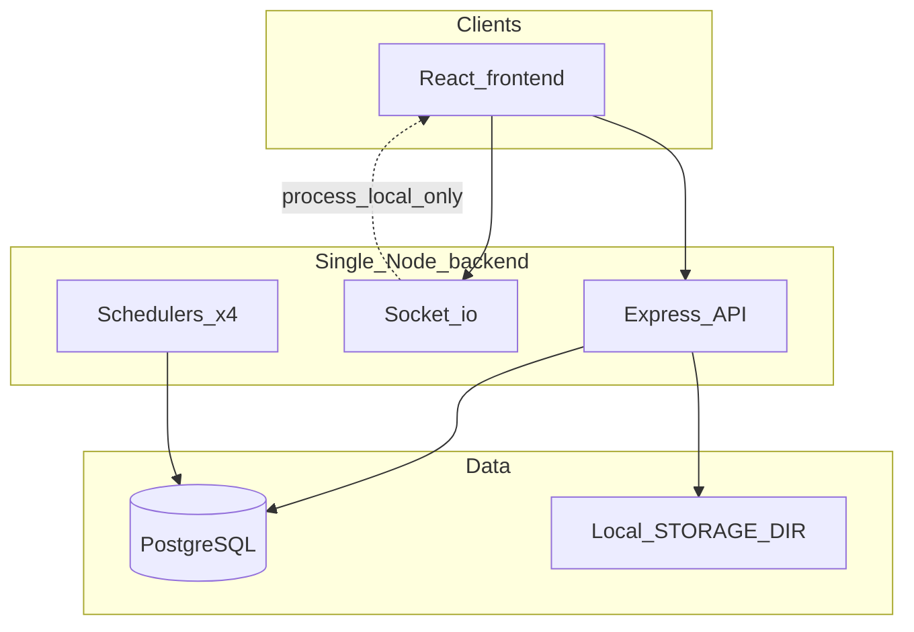

# DeMaxtore Post-Sprint-9 Technical Audit

**Date:** 2026-06-04  
**Scope:** Full codebase review after Sprint 9 Enterprise Validation  
**Mode:** Audit-only — no code, FSM, or workflow changes were made for this document.

**Evidence sources:**

- Application code: `apps/backend`, `apps/frontend`, `packages/contracts`
- Schema: `apps/backend/prisma/schema.prisma`, migrations under `apps/backend/prisma/migrations/`
- Sprint 9 harness: `tools/enterprise-validation/` and `tools/enterprise-validation/results/latest.json` (generated 2026-06-04T09:57:35Z)
- Prior audits: `docs/performance-audit.md`, `docs/security-audit.md`, `docs/operations-audit.md`, `docs/sprint-8a-enterprise-readiness-audit.md`

---

## Executive summary (English)

DeMaxtore’s **workspace-centric FSM core** (RFQ, CommodityBid, Order, Shipment) is well structured: `applyTransition`, row locks, Postgres state guards, and audit/timeline side effects are production-grade for a **pilot** deployment. Sprint 9 measured **1,000 RFQs** in-database with read-path API p95 under ~15 ms and quick-mode concurrency **PASS** at 50–100 virtual users.

**Horizontal scale and strict enterprise SLA are not yet proven.** Critical blockers include process-local Socket.io, scheduler work executed inside advisory-lock transactions, in-memory rate limiting, local file storage, and burst failures above ~250 concurrent connections (Sprint 9 full run). Operations rely on manual backup runbooks without a recorded restore drill.

**Overall system score: 68/100** — **Production Ready** for a controlled pilot; **not Enterprise Scale Ready** without infrastructure and hardening work listed in Section 12.

### Özet (Türkçe)

Sprint 9 sonrası denetim, iş akışı FSM’lerinin sağlam olduğunu ancak **çoklu sunucu**, **yüksek eşzamanlılık (500+)** ve **kurumsal DR** için altyapı boşlukları olduğunu gösteriyor. Pilot üretim için uygun; büyük özellik sprint’inden önce operasyonel sertleştirme (yedekleme, job reconciler, indeksler, rate limit) önerilir.

---

## Finding format

Each finding includes: **Severity**, **Impact**, **Recommended action**, **Estimated effort**, **Files**.

---

## 1. Scalability

| ID | Severity | Finding | Impact | Recommended action | Effort | Files |
|----|----------|---------|--------|-------------------|--------|-------|
| S-01 | **Critical** | Socket.io emits are process-local via singleton `io` and `socketBus.emitToRole` | Multi-replica deployments: realtime events (workspace updates, CT alerts, notifications) only reach clients connected to the instance that emitted | Adopt `@socket.io/redis-adapter` (or equivalent) + sticky sessions at load balancer; document room subscription rules | 3–5 eng-days | `apps/backend/src/realtime/socket-bus.ts`, `apps/backend/src/realtime/socket.ts` |
| S-02 | **Critical** | `withSchedulerLock` runs the entire job callback inside the Prisma transaction that holds `pg_try_advisory_lock` | Long Control Tower / tracking ticks hold a DB connection for full scan duration; increases pool exhaustion under API load | Refactor: acquire lock in short tx, run `executeRecordedJob` outside lock, release lock immediately after try | 2–3 eng-days | `apps/backend/src/db/scheduler-lock.ts`, `apps/backend/src/modules/control-tower/control-tower.scheduler.ts`, `apps/backend/src/modules/tracking/tracking.scheduler.ts`, `apps/backend/src/modules/messaging/sla-worker.ts`, `apps/backend/src/modules/commoditybid/commoditybid.scheduler.ts` |
| S-03 | **High** | Single Node process runs HTTP + four `setInterval` schedulers | No independent scaling of API vs background work; CPU spikes from scans affect API latency | Split worker process or external queue consumer for schedulers | 5–8 eng-days | `apps/backend/src/server.ts` (L33–36) |
| S-04 | **High** | Rate limits and brute-force protection use in-memory `Map` | Per-instance counters; ineffective and uneven under load balancer | Redis-backed sliding windows for login, refresh, and optional global API throttle | 2 eng-days | `apps/backend/src/middleware/rate-limit.ts`, `apps/backend/src/modules/auth/bruteforce.ts` |
| S-05 | **High** | Uploads stored on local `STORAGE_DIR` | Horizontal pod scaling breaks attachment download unless shared volume or object store | S3-compatible object storage + signed URLs; migrate `file-storage.ts` | 3–5 eng-days | `apps/backend/src/lib/file-storage.ts`, `apps/backend/src/modules/jobs/storage-health.service.ts` |
| S-06 | **High** | Sprint 9 **full** concurrency run: 500 users → 78 errors (`fetch failed`); 1000 users → 424 errors; p95 421–560 ms | Burst traffic exhausts single-node connection handling before business logic limits | Reverse proxy connection limits, tune Node/Postgres pool, load test after infra; target PASS at 500 sustained | 2–4 eng-days ops + eng | `tools/enterprise-validation/phases/concurrency-test.mjs`; full-run artifact (2026-06-04T09:55, superseded for reports by quick run) |
| S-07 | **Medium** | `AlertEngine.runFullScan` dynamically imports market, growth, scale scanners that instantiate full analytics services each tick | DB and CPU amplification every 15 min (default `SLA_WORKER_INTERVAL_MS`) | Cache aggregates with TTL; move heavy analytics to on-demand admin refresh | 2–4 eng-days | `apps/backend/src/modules/control-tower/alert-engine.ts`, `market-intelligence/market-alerts.ts`, `growth-engine/growth-alerts.ts`, `scale-readiness/scale-alerts.ts` |
| S-08 | **Medium** | RFQ/CB/order/shipment scans use `take: 50` plus per-row `count` in loops | Alert lag grows linearly with workspace volume | Batch SQL aggregates; raise caps with indexed filters | 2 eng-days | `apps/backend/src/modules/control-tower/alert-engine.ts` |
| S-09 | **Medium** | `getSupplierPerformance` runs ~6 `count()` queries per supplier × up to 100 suppliers | Admin Control Tower page becomes slow as supplier base grows | Single grouped SQL or materialized view | 1–2 eng-days | `apps/backend/src/modules/control-tower/control-tower.service.ts` (L202–227) |
| S-10 | **Medium** | `communication.service` loads all messages then filters in memory | Memory and latency grow with thread length | Cursor pagination + `take` on DB query | 2 eng-days | `apps/backend/src/modules/workspace-communication/communication.service.ts` |
| S-11 | **Low** | No external job queue (Bull, SQS, etc.) | Retry and backpressure are coarse (next scheduler tick only) | Optional queue for long scans post-pilot | 5+ eng-days | `apps/backend/src/modules/jobs/job.registry.ts` |

**Single points of failure:** PostgreSQL (expected); application tier cannot scale out safely until S-01, S-04, S-05 are addressed.

---

## 2. Reliability

| ID | Severity | Finding | Impact | Recommended action | Effort | Files |
|----|----------|---------|--------|-------------------|--------|-------|
| R-01 | **High** | `executeRecordedJob` sets `RUNNING` then never updates row if process crashes mid-`fn()` | Permanent `RUNNING` rows; misleading system health; Sprint 9 observed 39 stale rows after hot-reload | Add reconciler: mark `RUNNING` older than N minutes as `FAILED`; surface in `/api/system/jobs` | 1–2 eng-days | `apps/backend/src/modules/jobs/job.runner.ts`, `apps/backend/src/modules/jobs/job.service.ts`, `apps/backend/src/modules/jobs/system-health.service.ts` |
| R-02 | **High** | `conditionStillActive` in `alert-engine.ts` `default: return true` for unhandled alert keys | PO, freight, growth, market, scale, comms alerts never auto-resolve via `autoResolveStale` | Implement `switch` cases per `AlertKey` or default `false` for unknown keys | 1–2 eng-days | `apps/backend/src/modules/control-tower/alert-engine.ts` |
| R-03 | **High** | Order `mark_departed` / `update_eta` invoke second `runOneTransition` outside first transaction | Partial success: first transition commits, second may fail → inconsistent order/shipment state | Chain transitions in single transaction or pass shared idempotency key | 1–2 eng-days | `apps/backend/src/modules/order/order.service.ts` |
| R-04 | **Medium** | Idempotency key lookup occurs before FSM transaction (RFQ, CB, Order, Shipment) | Concurrent duplicate keys can both commit | Move check inside transaction or use unique constraint on audit payload | 1 eng-day | `apps/backend/src/modules/rfq/rfq.service.ts`, `commoditybid/commoditybid.service.ts`, `order/order.service.ts`, `shipment/shipment.service.ts` |
| R-05 | **Medium** | RFQ FSM quotation preconditions are stubs (`assertNoQuotations`, etc.) | Direct API bypass of FSM if alternate code paths added; contract drift vs `quotations.service` | Implement preconditions or remove from transition table | 1–2 eng-days | `apps/backend/src/modules/rfq/rfq.preconditions.ts` |
| R-06 | **Medium** | `freightiq-alerts.ts` sets `freightOffer.status = EXPIRED` during read scan | Side effects from “read-only” scan; race under multi-instance | Move expiry to dedicated job or FSM transition | 1 eng-day | `apps/backend/src/modules/freightiq/freightiq-alerts.ts` |
| R-07 | **Medium** | Graceful shutdown closes HTTP without awaiting schedulers or in-flight jobs | Mid-scan corruption risk; more orphan `RUNNING` rows | `clearInterval` + await in-flight job barrier on SIGTERM | 1 eng-day | `apps/backend/src/server.ts` (L42–48) |
| R-08 | **Medium** | Tracking `syncAllLinked` processes sequentially with `take: 100` | Maritime sync backlog under fleet growth | Parallel batch with concurrency limit; metrics on backlog | 2 eng-days | `apps/backend/src/modules/tracking/tracking.service.ts` |
| R-09 | **Low** | Retry mechanism is “next scheduler interval” only; no DLQ | Failed jobs rely on logs and CT `system.job.failed` alerts | Document ops playbook; optional DLQ table later | 0.5–2 eng-days | `apps/backend/src/modules/jobs/job.runner.ts` |

**Sprint 9 environmental note:** `control_tower_alert_scan` failures with `resolveOpenAlertsForTestWorkspaces is not defined` (09:34 UTC) and `openAlertWhere is not defined` were caused by hot-reload during development; imports are present in `control-tower.service.ts` at audit time. Ops should still run stale-job cleanup after deploys.

---

## 3. Database

| ID | Severity | Finding | Impact | Recommended action | Effort | Files |
|----|----------|---------|--------|-------------------|--------|-------|
| D-01 | **High** | `Workspace` lacks composite indexes on `(type, state, deadlineAt)`, `(type, state, updatedAt)`, `(type, state, proformaSlaDeadlineAt)` | SLA worker, CB scheduler, and CT scans filter unindexed columns after `(type, state)` prefix | Add Prisma `@@index` + migration; verify EXPLAIN on scheduler queries | 1 eng-day | `apps/backend/prisma/schema.prisma` (~L199–202); `sla-worker.ts`, `alert-engine.ts`, `commoditybid.scheduler.ts` |
| D-02 | **Medium** | `timeline_events` (~17.5k rows), `audit_logs` (~9.3k), `notifications` (~9.9k) grow without retention | Disk and query cost increase; Order/Shipment/CB timelines uncapped (RFQ capped at 200) | Retention job + cap timeline `take` on all workspace types | 3–5 eng-days | `order.service.ts`, `shipment.service.ts`, `commoditybid.service.read.ts`, `rfq.service.read.ts` |
| D-03 | **Medium** | `JobExecution` has separate indexes on `jobName`, `status`, `createdAt` but not `(jobName, startedAt)` | Job history queries less efficient at volume | Add composite indexes | 0.5 eng-day | `apps/backend/prisma/schema.prisma` (~L1247–1249) |
| D-04 | **Medium** | Idempotency replay uses `auditLog.findFirst` with JSON path on `payload` | Sequential scan risk on large `audit_logs` | Partial GIN index on `payload` (migration SQL) or dedicated idempotency table | 1–2 eng-days | FSM services; `apps/backend/prisma/schema.prisma` `AuditLog` |
| D-05 | **Low** | Documentation still references manual `state-guard-trigger.sql` as primary deploy path | Operators may skip canonical migration | Update `docs/performance-audit.md`, `docs/security-audit.md`, `docs/operations-audit.md` to point to `20260606120000_sprint39_state_guard` | 0.5 eng-day | `apps/backend/prisma/migrations/state-guard-trigger.sql` (deprecated header), `20260606120000_sprint39_state_guard/migration.sql` |

**Sprint 9 measurement (1000 RFQ, quick validation):** DB probes PASS — `workspaces_all` 6 ms, `prisma_rfq_pagination_50` 1 ms, `explain_rfq_open_list` OK (`tools/enterprise-validation/results/latest.json` → `C_database_performance`).

---

## 4. Security

| ID | Severity | Finding | Impact | Recommended action | Effort | Files |
|----|----------|---------|--------|-------------------|--------|-------|
| SEC-01 | **High** | `POST /auth/refresh` has no rate limit | Token grinding and DoS against auth path | Apply `rateLimit` middleware to refresh route | 0.5 eng-day | `apps/backend/src/modules/auth/auth.routes.ts` |
| SEC-02 | **High** | General `/api/*` routes lack global rate limiting (login and telemetry only) | Abuse of expensive admin/analytics endpoints | Tiered limits: auth, mutations, read-only | 1–2 eng-days | `apps/backend/src/routes.ts`, `apps/backend/src/middleware/rate-limit.ts` |
| SEC-03 | **Medium** | `requireAuth` trusts JWT `role` claim without DB lookup until access token expires | Revoked role demotion not effective until TTL (~15 min default) | Optional session version claim or short TTL + refresh | 1–2 eng-days | `apps/backend/src/middleware/auth.ts`, `apps/backend/src/modules/auth/jwt.ts` |
| SEC-04 | **Medium** | Access token persisted in `sessionStorage` via Zustand persist | XSS can exfiltrate bearer token | Prefer memory-only access token + refresh cookie only; or hardened CSP | 2 eng-days | `apps/frontend/src/store/auth.store.ts` |
| SEC-05 | **Medium** | Demo accounts and `Passw0rd!` in `LoginPage` bundle | Credential exposure in production builds | Gate with `import.meta.env.DEV` or remove for production | 0.5 eng-day | `apps/frontend/src/features/auth/pages/LoginPage.tsx` |
| SEC-06 | **Medium** | `COOKIE_DOMAIN` defined in `env.ts` but not used in `setRefreshCookie` | Cross-subdomain cookie misconfiguration in multi-host deploy | Wire `domain: env.COOKIE_DOMAIN` when not localhost | 0.5 eng-day | `apps/backend/src/config/env.ts`, `apps/backend/src/modules/auth/auth.controller.ts` |
| SEC-07 | **Low** | Workspace pages show infinite skeleton on 403/404 (no `isError` UI) | Information leakage via timing; poor UX | Explicit forbidden/not-found states | 1 eng-day | `apps/frontend/src/features/rfq/pages/RfqWorkspacePage.tsx` (and order/shipment/PO/CB pages) |

**Strengths:** Refresh rotation and reuse revocation (`auth.service.ts`); workspace policies (`rfq.policy.ts`, `order.policy.ts`, etc.); global idempotency middleware on `/api`; attachment path traversal guard (`file-storage.ts`).

---

## 5. Observability

| ID | Severity | Finding | Impact | Recommended action | Effort | Files |
|----|----------|---------|--------|-------------------|--------|-------|
| O-01 | **Medium** | Pino JSON logging only; no trace/correlation IDs across HTTP → job → socket | Hard to debug distributed failures | Add request-id middleware; propagate in logs | 1–2 eng-days | `apps/backend/src/config/logger.ts`, `apps/backend/src/app.ts` |
| O-02 | **Medium** | No Prometheus/OpenTelemetry metrics endpoint | No SLA dashboards for latency, pool, queue depth | Expose `/metrics` (prom-client) + Grafana dashboards per Sprint 9 Phase I recommendations | 3–5 eng-days | New module; reference `control-tower.service.ts` metrics patterns |
| O-03 | **Low** | System alert keys exist but no PagerDuty/Slack integration in repo | Alerts visible only in-app | Integrate webhook from `system-alerts.ts` emissions | 1–2 eng-days | `apps/backend/src/modules/jobs/system-alerts.ts` |

**Strengths:** `/api/healthz`, `/api/system/health`, job history APIs, `SystemOperationsPage.tsx`, Control Tower metrics, dev test-data exclusion (`test-workspace.ts`).

---

## 6. Operations

| ID | Severity | Finding | Impact | Recommended action | Effort | Files |
|----|----------|---------|--------|-------------------|--------|-------|
| OP-01 | **High** | Backup and restore documented only as manual runbooks | RPO depends on operator discipline; no CI/cron | Automate `pg_dump` + uploads tar; store off-host | 2–4 eng-days ops | `docs/backup-runbook.md`, `docs/restore-runbook.md` |
| OP-02 | **High** | No executed `pg_restore` drill; RTO/RPO not measured | Recovery time unknown | Staging restore drill quarterly; record minutes to `healthz` green | 1–2 eng-days ops | Sprint 9 `disaster-recovery.mjs`; `backup-verification.service.ts` |
| OP-03 | **Medium** | No container/K8s/blue-green documentation in repository | Deployment variance across environments | Add `docs/deployment.md` with reference architecture | 1–2 eng-days | Gap (no file) |
| OP-04 | **Low** | Backup verification API records logical checks only | False confidence if dumps not tested | Pair API check with restore drill artifact | 0.5 eng-day | `apps/backend/src/modules/jobs/backup-verification.service.ts` |

---

## 7. Infrastructure readiness

| Target scale | Readiness | Evidence |
|--------------|-----------|----------|
| **100 users** | **Ready** | Sprint 9 quick concurrency PASS @ 100 (p95 106 ms, 0 errors); 1000 RFQ read paths PASS |
| **500 users** | **Pass with risk** | Sprint 9 full run FAIL @ 500 burst (78 `fetch failed`); architecture not proven for sustained 500 |
| **1,000 users** | **Not ready** | Full run FAIL @ 1000 (42% errors); requires LB, pool tuning, Redis limits, multi-instance socket adapter |
| **10,000 users** | **Not ready** | Only 1k RFQs measured; 5k–50k tiers extrapolated; indexes, retention, worker split mandatory |

---

## 8. Technical debt

| Module | Severity | Debt | Files |
|--------|----------|------|-------|
| RFQ | Medium | Stub preconditions; `hasQuotationFromUser: false` in read DTO | `rfq.preconditions.ts`, `rfq.service.read.ts` |
| CommodityBid | Low | Silent `catch` on `checkAllAwardsFinalised` | `commoditybid.service.ts` |
| Order | High | Chained transitions outside single tx | `order.service.ts` |
| Shipment | Low | Standard FSM; tracking caps | `tracking.service.ts` |
| Purchase order | Medium | No `FOR UPDATE`; unbounded `getDashboard` | `purchase-order.service.ts` |
| FreightIQ | Medium | Scanner mutates offer status | `freightiq-alerts.ts` |
| Control Tower | High | Auto-resolve gap; scan coupling to analytics | `alert-engine.ts`, `control-tower.service.ts` |
| Workspace communication | Medium | Full message load; socket cleanup bug on frontend | `communication.service.ts`, `WorkspaceCommunicationPanel.tsx` |
| Trade documents | Medium | N+1 in alert scans (`take: 200`) | `trade-documents-alerts.ts` |
| Market intelligence | Medium | Full recompute on CT tick | `market.service.ts`, `market-alerts.ts` |
| Growth engine | Medium | Overlaps scale inactive thresholds; heavy scan | `growth.service.ts`, `growth-alerts.ts` |
| Scale readiness | Medium | Per-org N+1; arbitrary alert anchor workspace | `scale-portfolio.service.ts`, `scale-alerts.ts` |
| Frontend | Medium | Socket leaks; list pagination missing; `VITE_API_URL` vs proxy port mismatch | `socket.ts`, `RfqListPage.tsx`, `.env.example` |
| Documentation | Low | Stale state-guard and multi-instance guidance | `docs/performance-audit.md`, `docs/security-audit.md` |

---

## 9. Architecture review

### Monorepo layout

- `apps/backend` — Express + Prisma + in-process schedulers + Socket.io
- `apps/frontend` — React + TanStack Query + Zustand
- `packages/contracts` — FSM definitions, Zod DTOs, shared types

Clear separation between **workspace FSM runtimes** and **sub-FSM modules** (PO, FreightIQ, documents, communication).

### Domain runtime maturity

| Module | FSM | Locking | Idempotency | Scanner load |
|--------|-----|---------|-------------|--------------|
| RFQ | Yes | `FOR UPDATE` | Partial (TOCTOU) | Core CT |
| CommodityBid | Yes | `FOR UPDATE` | Partial | Core CT + scheduler |
| Order | Yes | `FOR UPDATE` | Partial; chain risk | Core CT |
| Shipment | Yes | `FOR UPDATE` | Partial | Core CT |
| Tracking | N/A | None | Weak | Event-driven |
| Purchase order | Enum | None | None | Delegated |
| FreightIQ | Enum | None | None | Delegated + mutation |
| Control Tower | N/A | Advisory lock | N/A | Orchestrator |
| Communication | CRUD | None | None | Delegated |
| Trade documents | Actions | None | None | Delegated |
| Market / Growth / Scale | Analytics | N/A | N/A | Heavy delegated |

**No FSM modifications are recommended in this audit.**

---

## 10. Frontend audit (summary)

| ID | Severity | Finding | Files |
|----|----------|---------|-------|
| FE-01 | Medium | Socket listener cleanup broken in async IIFE pattern | `WorkspaceCommunicationPanel.tsx`, `OrderWorkspacePage.tsx`, `ShipmentWorkspacePage.tsx`, `PoWorkspacePage.tsx`, `CommodityBidWorkspacePage.tsx` |
| FE-02 | Medium | RFQ/order lists default to 20 items; no cursor “load more” | `RfqListPage.tsx`, `packages/contracts/src/rfq.zod.ts` |
| FE-03 | Medium | `uploadAttachment` uses raw `fetch` without 401 refresh queue | `workspace-communication.api.ts` |
| FE-04 | Low | Socket auth token fixed at connect time | `lib/socket.ts` |
| FE-05 | Low | Control Tower loads 150 alerts into DOM without pagination | `control-tower/hooks/index.ts`, `OperationsPage.tsx` |

---

## 11. Cross-reference: Sprint 9 and prior audits

### Sprint 9 harness (`tools/enterprise-validation/results/latest.json`)

| Phase | Verdict (latest quick run, 2026-06-04T09:57:35Z) | Notes for this audit |
|-------|---------------------------------------------------|----------------------|
| A Load | PASS | 1000 RFQs in DB; read p95 healthy |
| B Concurrency | PASS | **Only 50 and 100 users** in quick mode |
| C Database | PASS | Probes align with D-01 still open (indexes) |
| D Multi-instance | PASS | Advisory locks; SKIPPED rows may be sparse on single instance |
| E Jobs | PASS WITH RISK | Stale RUNNING cleared before quick run; reconciler still missing in code |
| F DR | PASS WITH RISK | No live restore |
| G Chaos | PASS WITH RISK | Health polling only |
| H Soak | PASS WITH RISK | 5 min sample in full run; 1 min in quick |
| I Observability | PASS | Endpoints exist; O-02 gap remains |

**Important:** A separate **full** Sprint 9 run (same day, ~09:55 UTC) recorded **B_concurrency FAIL** at 500 and 1000 users. Official generated reports in `docs/sprint-9-*.md` reflect the later quick run. This audit treats **500+ concurrent burst as not ready** despite quick-mode PASS at 100.

### Documentation drift

| Document | Stale claim | Current truth |
|----------|-------------|---------------|
| `docs/performance-audit.md` | Manual `state-guard-trigger.sql`; multi-instance schedulers FAIL | Guards in `20260606120000_sprint39_state_guard`; advisory locks prevent duplicate scheduler ticks |
| `docs/security-audit.md` | Abuse resistance FAIL | Still valid for refresh/global limits (SEC-01, SEC-02) |
| `docs/operations-audit.md` | Manual backup emphasis | Still valid (OP-01) |
| `docs/sprint-9-production-readiness-verdict.md` | Production Ready | Consistent for pilot; enterprise gaps documented here |

---

## 12. Final sections

### 12.1 Top 10 risks

1. **Socket.io process-local bus** — missed realtime on multi-instance (`socket-bus.ts`)
2. **Scheduler job inside advisory-lock transaction** — connection hold (`scheduler-lock.ts`)
3. **Orphan `RUNNING` job_executions** — no reconciler (`job.runner.ts`)
4. **Burst concurrency failure ≥500 users** — Sprint 9 full-run evidence
5. **In-memory rate limit and brute force** — not HA (`rate-limit.ts`, `bruteforce.ts`)
6. **CT `conditionStillActive` default true** — stale domain alerts (`alert-engine.ts`)
7. **Analytics recomputation on every CT scan** — DB load (`market-alerts.ts`, `growth-alerts.ts`, `scale-alerts.ts`)
8. **RFQ quotation precondition stubs** — FSM contract gap (`rfq.preconditions.ts`)
9. **Order chained transitions** — partial commit risk (`order.service.ts`)
10. **Manual DR + local uploads** — recovery and scale risk (`docs/backup-runbook.md`, `file-storage.ts`)

### 12.2 Top 10 improvements

| # | Improvement | Effort |
|---|-------------|--------|
| 1 | Redis Socket.io adapter + sticky sessions | 3–5 d |
| 2 | Job body outside lock tx + RUNNING reconciler | 2–3 d |
| 3 | Workspace composite indexes | 1 d |
| 4 | Redis rate limits + `/auth/refresh` throttle | 2 d |
| 5 | Prometheus + Grafana | 3–5 d |
| 6 | Automated backup + restore drill | 2–4 d ops |
| 7 | Frontend socket cleanup + list pagination | 2–3 d |
| 8 | Timeline/comms caps + retention | 3–5 d |
| 9 | Cache or decouple CT analytics scans | 2–4 d |
| 10 | `conditionStillActive` cases for all alert keys | 1–2 d |

### 12.3 Enterprise readiness gap analysis

| Criterion | Status |
|-----------|--------|
| 10,000+ RFQs | **Gap** — measured at 1k; seed + index + scan batching required |
| 1,000 concurrent users | **Gap** — full-run burst failed |
| Multi-instance safe | **Gap** — sockets, rate limits, storage |
| DR with measured RTO/RPO | **Gap** — runbooks only |
| 24h soak | **Gap** — not run in CI |
| Observability at enterprise level | **Gap** — no metrics exporter |

**Verdict:** Not **Enterprise Scale Ready**.

### 12.4 Production readiness gap analysis

| Criterion | Status |
|-----------|--------|
| Core trade workflows (RFQ→PO→Order→Shipment) | **Met** — FSM gateway |
| Admin operations visibility | **Met** — CT + system dashboard |
| Pilot-scale performance | **Met** — Sprint 9 quick validation |
| Security baseline | **Partial** — auth strong; abuse controls weak |
| Automated backups | **Gap** |

**Verdict:** **Production Ready** for controlled pilot (aligns with `docs/sprint-9-production-readiness-verdict.md`).

### 12.5 Scores

| Dimension | Score (0–100) | Rationale |
|-----------|---------------|-----------|
| **Architecture** | **74** | Strong FSM monolith; weakened by single-process realtime and schedulers |
| **Maintainability** | **70** | Good module boundaries; stub preconditions and doc drift |
| **Scalability** | **58** | Proven ~100 concurrent burst; fails at 500+ without infra |
| **Security** | **72** | Solid token model; weak rate limits and frontend token storage |
| **Overall system** | **68** | Weighted average; pilot-ready, not enterprise-ready |

---

## 13. What should be done before the next major feature sprint?

Execute a **hardening-only sprint** (no new product features, no FSM changes):

1. **Ops baseline** — Automate `pg_dump` + uploads archive; complete one staged `pg_restore` drill; record RTO/RPO in `backup-verification.service` notes.
2. **Reliability** — Implement stale `RUNNING` job reconciler; fix `conditionStillActive` for non-core alert keys; review order chained transitions.
3. **Scale floor** — Ship workspace composite indexes (`D-01`); run `SCALE_RFQS=10000` validation in staging.
4. **Security** — Rate-limit `/auth/refresh`; gate demo login on non-dev builds.
5. **Frontend stability** — Socket `disconnect` on logout; workspace 403/404 pages; RFQ list pagination.
6. **Multi-instance spike** — Run two backends against shared DB; validate `job_executions` SKIPPED; POC Redis socket adapter.

**Do not start** marketplace expansion, major FreightIQ features, or large greenfield modules until items **1–3** are complete — otherwise operational risk compounds on an unproven foundation.

---

## Appendix A — Files reviewed (representative)

**Backend entry & cross-cutting:** `server.ts`, `app.ts`, `routes.ts`, `middleware/auth.ts`, `middleware/rate-limit.ts`, `middleware/idempotency.ts`, `db/scheduler-lock.ts`, `db/prisma.ts`

**Jobs:** `job.runner.ts`, `job.service.ts`, `job.registry.ts`, `system-health.service.ts`, `system-alerts.ts`

**Control Tower:** `control-tower.service.ts`, `alert-engine.ts`, `control-tower.scheduler.ts`, `test-workspace.ts`

**Domain:** `rfq.service.ts`, `commoditybid.service.ts`, `order.service.ts`, `shipment.service.ts`, `purchase-order.service.ts`, `freightiq.service.ts`, `communication.service.ts`, `tracking.service.ts`, `market.service.ts`, `growth.service.ts`, `scale-portfolio.service.ts`

**Frontend:** `auth.store.ts`, `lib/api.ts`, `lib/socket.ts`, `routes/index.tsx`, `OperationsPage.tsx`, `RfqWorkspacePage.tsx`

**Schema:** `apps/backend/prisma/schema.prisma`

---

## Appendix B — Audit metadata

| Field | Value |
|-------|-------|
| Audit type | Post-Sprint-9 technical (read-only) |
| Application code modified | No |
| Plan reference | `.cursor/plans/post-sprint-9_technical_audit_4c0e1087.plan.md` |
| Sprint 9 results file | `tools/enterprise-validation/results/latest.json` |

**Audit status:** COMPLETE
