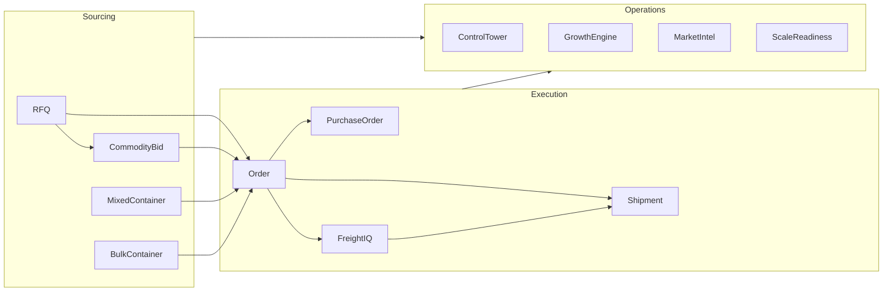
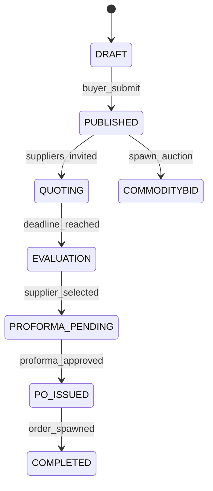

# DeMaxtore — Complete System Inventory

**Version:** 0.2.0  
**Document date:** 2026-06-15  
**Codebase:** [`/var/www/demaxtore/DemaxtoreSolitions-main`](/var/www/demaxtore/DemaxtoreSolitions-main)  
**Architecture:** Workspace-centric B2B sourcing & import operating platform

---

## Platform Summary

| Attribute | Value |
|-----------|-------|
| **Stack** | React 18 + Vite + TypeScript (FE); Express 4 + Prisma 5 + PostgreSQL 16 (BE) |
| **Monorepo** | Yarn workspaces: `apps/backend`, `apps/frontend`, `apps/e2e`, `packages/contracts` |
| **Data store** | PostgreSQL (~80 Prisma models); local filesystem for uploads (`STORAGE_DIR`) |
| **Auth** | JWT access (15 min) + httpOnly refresh cookie (7 days, rotation); bcrypt |
| **Realtime** | Socket.io (JWT handshake, workspace rooms, participant ACL) |
| **Global roles** | `BUYER`, `SUPPLIER`, `ADMIN` |
| **Workspace roles** | `OWNER`, `COUNTERPARTY`, `OPERATOR`, `OBSERVER` |
| **API prefix** | `/api` — composed in [`apps/backend/src/routes.ts`](apps/backend/src/routes.ts) |
| **Overall completion** | Backend ~82%, Frontend ~86%, Platform ~84% |

---

## Module 1: Authentication & Identity

### 1. Module Name
**Auth**

### 2. Purpose
User authentication, session management, password reset, and identity resolution for all platform access.

### 3. Collections (PostgreSQL Models)
- `User`, `Organisation`, `RefreshToken`, `PasswordResetToken`, `AccountOwnership`

### 4. APIs
| Method | Endpoint | Access |
|--------|----------|--------|
| POST | `/api/auth/login` | Public |
| POST | `/api/auth/refresh` | Cookie-based |
| POST | `/api/auth/logout` | Authenticated |
| POST | `/api/auth/forgot-password` | Public |
| POST | `/api/auth/reset-password` | Public (token) |
| GET | `/api/auth/me` | Authenticated |

### 5. Frontend Screens
| Screen | Route | Roles |
|--------|-------|-------|
| Login | `/login` | Public |
| Forgot Password | `/forgot-password` | Public |
| Reset Password | **Not routed** (API exists) | Public |

### 6. User Roles
- **Public:** login, forgot/reset password
- **All authenticated:** `/me`, logout
- No role-specific auth screens

### 7. Workflow
1. User submits credentials → bcrypt verify → access JWT + refresh cookie issued
2. Brute-force lock on repeated failures ([`bruteforce.ts`](apps/backend/src/modules/auth/bruteforce.ts))
3. 401 on expired access → silent refresh via axios interceptor → retry
4. Forgot password → email token → reset password form (backend complete; FE page missing)

### 8. Dependencies
- **Backend:** `messaging` (reset emails), rate-limit middleware
- **Frontend:** Zustand `auth.store`, axios client ([`lib/api.ts`](apps/frontend/src/lib/api.ts))
- **Shared:** `@dmx/contracts/auth` (Role enum, JWT payload types)

### 9. Current Completion %
**85%** — Full backend auth flow; missing reset-password UI page/route

### 10. Future Improvements
- Add `/reset-password` page and route
- Self-service signup / invite flow (documented operational debt — no registration API today)
- MFA / SSO for enterprise buyers
- Org-level user management admin UI

---

## Module 2: Health & Infrastructure

### 1. Module Name
**Health / System Operations**

### 2. Purpose
Liveness probes, job registry monitoring, storage/backup verification, and enterprise readiness dashboards for platform operators.

### 3. Collections
- `JobExecution`, `BackupVerificationRecord`
- Reads scheduler state, storage metrics (no dedicated storage model)

### 4. APIs
| Method | Endpoint | Access |
|--------|----------|--------|
| GET | `/api/healthz/` | Public |
| GET | `/api/system/health` | ADMIN |
| GET | `/api/system/jobs/history`, `/failed`, `/stuck-running` | ADMIN |
| POST | `/api/system/reconcile-stale` | ADMIN |
| GET | `/api/system/schedulers`, `/storage`, `/backup`, `/insights` | ADMIN |
| POST | `/api/system/backup/verify` | ADMIN |
| GET | `/api/system/*/export` (CSV) | ADMIN |

### 5. Frontend Screens
| Screen | Route | Roles |
|--------|-------|-------|
| System Operations | `/operations/system` | ADMIN |
| Not Found | `*` | All authenticated |

### 6. User Roles
- **Public:** healthz probe only
- **ADMIN:** full system operations dashboard

### 7. Workflow
1. Nginx/load balancer hits `/api/healthz` for liveness
2. Admin views job history, failed/stuck jobs, scheduler status
3. Stale job reconciler runs on schedule; admin can trigger manual reconcile
4. Backup verification records persisted after checks

### 8. Dependencies
- All background schedulers registered in [`job.registry.ts`](apps/backend/src/modules/jobs/job.registry.ts)
- `messaging` (email health status)
- Prisma connection pool

### 9. Current Completion %
**Health: 100%** | **System ops: 78%**

### 10. Future Improvements
- PgBouncer integration dashboard for multi-instance deployments
- S3/shared storage health (currently local FS only)
- Alerting integration (PagerDuty/Slack) for failed jobs
- Automated backup restore drills

---

## Module 3: Notifications

### 1. Module Name
**Notifications**

### 2. Purpose
In-app notification inbox with unread counts, read tracking, and realtime push via Socket.io.

### 3. Collections
- `Notification`

### 4. APIs
| Method | Endpoint | Access |
|--------|----------|--------|
| GET | `/api/notifications/` | Authenticated (user-scoped) |
| GET | `/api/notifications/unread-count` | Authenticated |
| POST | `/api/notifications/read-all` | Authenticated |
| POST | `/api/notifications/:id/read` | Authenticated |

### 5. Frontend Screens
| Screen | Route | Roles |
|--------|-------|-------|
| Notifications | `/notifications` | BUYER, SUPPLIER, ADMIN |
| Notification Drawer | App shell header | All authenticated |

### 6. User Roles
All authenticated users see only their own notifications.

### 7. Workflow
1. FSM side-effects across RFQ/CB/Order/Shipment/etc. create `Notification` records
2. `socketBus` pushes to `user:{id}` and `role:{ROLE}` rooms
3. User opens drawer or `/notifications` → mark read → deep link to workspace

### 8. Dependencies
- All workspace modules (event emitters)
- Socket.io realtime
- `messaging` (critical notification email fallback)

### 9. Current Completion %
**90%**

### 10. Future Improvements
- Notification preference center (email vs in-app per event type)
- Push notifications (mobile/web push)
- Digest/batch emails for low-priority events

---

## Module 4: RFQ (Request for Quotation)

### 1. Module Name
**RFQ** (includes Quotations, Attachments, Supplier Activity sub-modules)

### 2. Purpose
Core B2B sourcing workspace — buyer creates RFQ, suppliers quote, buyer evaluates, proforma/PO issued, order spawned. Reference FSM implementation for all workspace types.

### 3. Collections
- `Workspace` (type=RFQ), `RfqDetails`, `RfqLineItem`, `RfqAttachment`
- `SupplierAssignment`, `Quotation`, `QuotationLineItem`
- `ClarificationThread`, `ClarificationMessage`, `ClarificationReadReceipt`
- `SupplierActivityLog`, `AuditLog`, `TimelineEvent`, `WorkspaceParticipant`

### 4. APIs
**Buyer/Supplier/Admin (`/api/rfq`):**
- `GET /`, `GET /:id`, `GET /:id/timeline`, `GET /:id/next-actions`
- Draft CRUD, publish, extend, cancel, evaluate, select supplier, issue PO
- ~25 FSM action endpoints (`POST /:id/actions/:action`)
- Clarifications CRUD, read receipts, attachments list
- Procurement strategy, spawned orders

**Nested routes:**
- `/api/rfq/:id/quotations` — GET, POST, PATCH, DELETE
- `/api/rfq/:id/attachments` — POST, GET
- `/api/rfq/:id/supplier-activity` — summary, detail, nudge

**Admin (`/api/admin/rfq`):**
- Queue, supplier lookup, run-scheduler-tick

### 5. Frontend Screens
| Screen | Route | Roles |
|--------|-------|-------|
| RFQ List | `/{role}/rfq` | BUYER, SUPPLIER, ADMIN |
| RFQ Create | `/buyer/rfq/new` | BUYER (catalog embed) |
| RFQ Workspace | `/workspace/rfq/:id` | Participant |
| Procurement Strategy | `/workspace/rfq/:id/procurement-strategy` | Participant |

### 6. User Roles
| Role | Capabilities |
|------|-------------|
| **BUYER** | Create draft, submit, evaluate quotes, approve proforma, request PO |
| **SUPPLIER** | View assigned RFQs, submit/revise/withdraw quotations, submit proforma |
| **ADMIN** | Queue triage, assign suppliers, publish, reject, add observers |
| **OPERATOR/OBSERVER** | Workspace participant actions per policy |

### 7. Workflow

1. Buyer creates RFQ (catalog embed or manual)
2. Admin assigns suppliers → RFQ published
3. Suppliers submit quotations; buyer evaluates via comparison matrix
4. Selected supplier submits proforma → SLA worker sends reminders
5. Buyer approves → PO issued → Order workspace spawned
6. Optional: spawn CommodityBid auction via procurement strategy

### 8. Dependencies
- `quotations`, `attachments`, `supplier-activity`, `order` (spawn)
- `commoditybid` (auction spawn), `messaging` (SLA emails)
- `onboarding`, `control-tower`, `workspace-communication`
- `@dmx/contracts` RFQ FSM

### 9. Current Completion %
**92%** — Mature FSM, scheduler, procurement strategy; clarification attachment upload TODO in FE

### 10. Future Improvements
- RFQ clarification attachment upload (FE TODO in `RfqClarificationPanel.tsx`)
- Bulk RFQ import from ERP
- AI-assisted supplier matching
- Template library for recurring RFQ specs

---

## Module 5: CommodityBid (Reverse Auction)

### 1. Module Name
**CommodityBid**

### 2. Purpose
Sealed-bid reverse auction workspace — lots, live bidding, winner selection, order handoff. Can be spawned from RFQ procurement strategy or created standalone.

### 3. Collections
- `CommodityBidDetails`, `CommodityBidLot`, `CommodityBidInvitation`
- `CommodityBidSubmission`, `CommodityBidBidEvent`, `CommodityBidAward`
- Shared: `Workspace`, `TimelineEvent`, `WorkspaceParticipant`

### 4. APIs
**Main (`/api/commoditybid`):**
- CRUD reads, auction-status, bid-feed, participation
- Supplier bids/awards, lot bids, ~10 FSM actions, spawn-orders

**Admin (`/api/admin/commoditybid`):**
- Queue, analytics, run-scheduler-tick

**Integrations (`/api/integrations/commoditybid/sso`):**
- JWT SSO bridge for external panel iframe

### 5. Frontend Screens
| Screen | Route | Roles |
|--------|-------|-------|
| Auction List | `/{role}/commoditybid` | BUYER, SUPPLIER, ADMIN |
| CommodityBid Panel (embed) | `/{role}/commoditybid/panel` | Respective role |
| Create Auction (embed) | `/buyer/commoditybid/new` | BUYER |
| CommodityBid Workspace | `/workspace/commoditybid/:id` | Participant |

### 6. User Roles
| Role | Capabilities |
|------|-------------|
| **BUYER** | Schedule auction, approve winner, spawn orders |
| **SUPPLIER** | Accept invitation, join, place sealed/live bids |
| **ADMIN** | Queue management, analytics, identity mapping |

### 7. Workflow
1. Auction created (embed panel or RFQ spawn) → lots defined → invitations sent
2. Scheduler transitions states (scheduled → live → closed)
3. `auction-engine.ts` manages sealed bids; `winner-engine.ts` selects winner
4. Buyer approves award → Order workspaces spawned per lot

### 8. Dependencies
- `order.spawn`, `rfq` (parent spawn)
- `integrations/commoditybid-sso`, `control-tower`
- External panel: `VITE_COMMODITYBID_PANEL_URL`, `WORKSPACE_BRIDGE_SECRET`

### 9. Current Completion %
**85%** — Strong in-app workspace; heavy reliance on external iframe panel

### 10. Future Improvements
- Native in-app auction creation (reduce iframe dependency)
- Multi-lot simultaneous bidding UX improvements
- Auction replay/analytics for buyers
- Mobile-optimized live bid feed

---

## Module 6: Order Execution

### 1. Module Name
**Order**

### 2. Purpose
Post-award order execution FSM — production tracking, inspection, freight handoff, delivery confirmation, disputes.

### 3. Collections
- `OrderWorkspace`, `OrderDocument`, `OrderStatusUpdate`
- Shared: `Workspace`, `TimelineEvent`, `WorkspaceParticipant`

### 4. APIs
| Method | Endpoint | Access |
|--------|----------|--------|
| GET | `/api/orders/`, `/:id`, `/:id/timeline`, `/:id/next-actions` | Participant |
| GET | `/api/orders/:id/documents`, `/status-updates`, `/spawned-shipments` | Participant |
| GET | `/api/orders/:id/purchase-order` | Participant |
| POST | `/api/orders/:id/actions/:action` | Participant (~18 FSM actions) |
| POST/GET | `/api/orders/:id/documents` | Participant (upload/download) |

### 5. Frontend Screens
| Screen | Route | Roles |
|--------|-------|-------|
| Orders List | `/{role}/orders` | BUYER, SUPPLIER, ADMIN |
| Order Workspace | `/workspace/order/:id` | Participant |

### 6. User Roles
BUYER and SUPPLIER as workspace participants (OWNER/COUNTERPARTY). ADMIN via ops dashboards, not dedicated order role gate.

### 7. Workflow
1. Spawned from RFQ, CommodityBid, Mixed Container, or Bulk Container
2. Production milestones tracked via status updates
3. Inspection → freight request initiated → shipment spawned
4. Trade documents checklist enforced
5. Delivery confirmed or dispute raised

### 8. Dependencies
- `purchase-order`, `shipment`, `freightiq`, `trade-documents`, `workspace-communication`
- Parent workspace handoff via `spawned_from_id`

### 9. Current Completion %
**88%**

### 10. Future Improvements
- Production milestone photo/video uploads
- ERP sync for order status
- Automated inspection scheduling integration
- Order-level profitability dashboard for buyers

---

## Module 7: Shipment & Tracking

### 1. Module Name
**Shipment** (+ **Tracking** service)

### 2. Purpose
Shipment workspace FSM — booking, container loading, vessel transit, customs, delivery, exception handling. Maritime tracking sync.

### 3. Collections
- `ShipmentWorkspace`, `ShipmentDocument`, `ShipmentStatusUpdate`, `ShipmentException`
- `ShipmentTrackingSnapshot`, `ShipmentTrackingEvent`

### 4. APIs
**Shipment (`/api/shipments`):**
- GET workspace, timeline, documents, exceptions, next-actions
- Tracking: GET, POST link-tracking, POST sync-tracking
- ~14 FSM actions

**Documents (`/api/shipments/:id/documents`):**
- POST upload, GET download

**Tracking:** Exposed via shipment routes (no standalone router)

### 5. Frontend Screens
| Screen | Route | Roles |
|--------|-------|-------|
| Shipments List | `/buyer/shipments`, `/supplier/shipments` | BUYER, SUPPLIER |
| Shipment Workspace | `/workspace/shipment/:id` | Participant |

### 6. User Roles
BUYER/SUPPLIER as participants. ADMIN monitors via Control Tower shipment tracking panel.

### 7. Workflow
1. Spawned from Order (or FreightIQ freight selection)
2. Booking confirmed → container loaded → vessel departed
3. Tracking linked (manual or `maritime_api` provider) → periodic sync scheduler
4. Customs cleared → delivered; exceptions raised for delays
5. Control Tower alerts on tracking delays

### 8. Dependencies
- `tracking` (scheduler + provider abstraction)
- `freightiq` (freight selection link), `trade-documents`, `control-tower`
- Env: `TRACKING_PROVIDER`, `TRACKING_API_KEY`

### 9. Current Completion %
**Shipment: 88%** | **Tracking: 75%** (manual mode complete; external API optional)

### 10. Future Improvements
- Production maritime API provider integration (beyond manual mode)
- Interactive vessel map with AIS data
- Predictive ETA using ML
- Customs broker portal integration

---

## Module 8: FreightIQ

### 1. Module Name
**FreightIQ**

### 2. Purpose
Freight RFQ on orders — forwarder communications, offer management, selection, margin/commercial analytics, revenue ledger.

### 3. Collections
- `FreightRequest`, `FreightOffer`, `FreightSelection`
- `ForwarderContact`, `FreightShipper`, `FreightRequestCommunication`
- `FreightRevenueLedger`, `FreightMarginPolicy`, `FreightCommercialSnapshot`

### 4. APIs
| Prefix | Endpoints | Access |
|--------|-----------|--------|
| `/api/freightiq` | ops overview, forwarders/shippers CRUD, order summary, email template, order/comm actions | ADMIN + order participants |
| `/api/freightiq/commercial` | metrics, report, offer margin | ADMIN |
| `/api/freightiq/commercial/analytics` | insight, forwarder scorecard, margin suggest/policies, CSV | ADMIN |
| `/api/integrations/freightiq/sso` | SSO bridge | Authenticated |

### 5. Frontend Screens
| Screen | Route | Roles |
|--------|-------|-------|
| FreightIQ Embed | `/{role}/freightiq` | BUYER, SUPPLIER |
| Freight RFQ Intake | `/admin/freightiq`, `/operations/freight-intake` | ADMIN |
| Freight Ops | `/operations/freight` | ADMIN |
| Freight Commercial | `/operations/freight-commercial` | ADMIN |
| Forwarders Directory | `/operations/forwarders` | ADMIN |
| Shippers Directory | `/operations/shippers` | ADMIN |

### 6. User Roles
| Role | Access |
|------|--------|
| **BUYER/SUPPLIER** | FreightIQ iframe embed, order-scoped freight actions |
| **ADMIN** | Full ops, commercial analytics, forwarder/shipper CRUD |

### 7. Workflow
1. Order reaches freight-ready state → FreightRequest created
2. Admin submits offers from forwarders via intake panel
3. Buyer selects offer → FreightSelection recorded → Shipment spawned
4. Commercial module tracks margin, revenue ledger, forwarder scorecards

### 8. Dependencies
- `order`, `shipment`, `integrations/freightiq-sso`
- `control-tower`, `growth-engine` (route intel)
- External: `FREIGHTIQ_PANEL_URL`, `FREIGHTIQ_API_URL`

### 9. Current Completion %
**80%** — Admin native UI mature; buyer/supplier experience iframe-dependent

### 10. Future Improvements
- Native buyer/supplier freight UI (reduce iframe dependency)
- Automated forwarder rate ingestion (API feeds)
- Dynamic margin optimization engine
- Multi-modal freight (air/rail) support

---

## Module 9: Purchase Order

### 1. Module Name
**Purchase Order**

### 2. Purpose
PO lifecycle management — issue, acknowledge, amendments, revisions, manual upload, close/cancel.

### 3. Collections
- `PurchaseOrder`, `PurchaseOrderLine`, `PurchaseOrderRevision`
- `PurchaseOrderAcknowledgement`, `PurchaseOrderAmendment`

### 4. APIs
| Method | Endpoint | Access |
|--------|----------|--------|
| GET | `/api/purchase-orders/dashboard` | ADMIN |
| GET | `/api/purchase-orders/:id` | Participant |
| POST | `/api/purchase-orders/:id/actions/:action` | Participant |
| GET | `/api/orders/:id/purchase-order` | Order participant |

**Actions:** `issue_po`, `acknowledge_po`, `request_amendment`, `approve_amendment`, `reject_amendment`, `close_po`, `cancel_po`

### 5. Frontend Screens
| Screen | Route | Roles |
|--------|-------|-------|
| PO List | `/buyer/purchase-orders`, `/supplier/purchase-orders` | BUYER, SUPPLIER |
| PO Workspace | `/workspace/po/:id` | Participant |
| PO Widget | Embedded in Control Tower | ADMIN |

### 6. User Roles
BUYER issues/approves amendments; SUPPLIER acknowledges; ADMIN dashboard overview.

### 7. Workflow
1. RFQ proforma approved → PO issued (syncs with RFQ FSM)
2. Supplier acknowledges PO
3. Amendment requests → buyer approval/rejection cycle
4. PO closed when order complete or cancelled

### 8. Dependencies
- `order`, `rfq` (issue_po sync), `portfolio`, `control-tower`
- Frontend: `jspdf` for PO PDF export

### 9. Current Completion %
**85%** — No dedicated admin PO list route (ops via Control Tower)

### 10. Future Improvements
- Admin PO list/search page
- ERP PO sync (SAP/Oracle)
- Digital signature on PO acknowledgements
- PO template customization per buyer org

---

## Module 10: Trade Documents

### 1. Module Name
**Trade Documents**

### 2. Purpose
Compliance document checklist for ORDER and SHIPMENT workspaces — request, upload, review, approve, reject, expire.

### 3. Collections
- `TradeDocument`, `DocumentRequirement`, `DocumentReview`

### 4. APIs
| Method | Endpoint | Access |
|--------|----------|--------|
| GET | `/api/trade-documents/:workspaceType/:workspaceId/summary` | Participant |
| POST | `/api/trade-documents/:workspaceType/:workspaceId/upload` | Participant |
| POST | `/api/trade-documents/:workspaceType/:workspaceId/actions/:action` | Participant |

### 5. Frontend Screens
| Screen | Route | Roles |
|--------|-------|-------|
| Trade Documents List | `/buyer/trade-documents`, `/supplier/trade-documents` | BUYER, SUPPLIER |
| Document panels | Embedded in Order/Shipment/RFQ workspaces | Participant |

### 6. User Roles
ORDER/SHIPMENT workspace participants per `documents.policy`.

### 7. Workflow
1. Document requirements auto-generated based on workspace type/state
2. Supplier uploads documents → buyer reviews
3. Approve/reject cycle; expired docs trigger Control Tower alerts

### 8. Dependencies
- `order`, `shipment`, `control-tower`, `portfolio`
- `lib/file-storage` for uploads

### 9. Current Completion %
**85%**

### 10. Future Improvements
- OCR/auto-extraction from uploaded docs
- Document expiry auto-renewal reminders
- Customs document pre-validation
- Blockchain document attestation

---

## Module 11: Workspace Communication

### 1. Module Name
**Workspace Communication**

### 2. Purpose
Threaded messaging, mentions, read receipts, and attachments per workspace across all workspace types.

### 3. Collections
- `WorkspaceConversation`, `WorkspaceMessage`, `WorkspaceMention`
- `WorkspaceReadReceipt`, `WorkspaceMessageAttachment`

### 4. APIs
| Method | Endpoint | Access |
|--------|----------|--------|
| GET | `/api/workspace-communication/:workspaceType/:workspaceId` | Participant |
| GET | `.../search`, `.../attachments` | Participant |
| POST | `.../actions/:action` | Participant |

### 5. Frontend Screens
| Screen | Route | Roles |
|--------|-------|-------|
| Messages List | `/buyer/messages`, `/supplier/messages` | BUYER, SUPPLIER |
| Communication Panel | Embedded in all workspace pages | Participant |

### 6. User Roles
RFQ, COMMODITYBID, ORDER, SHIPMENT, PO, FREIGHTIQ participants per visibility rules. No dedicated admin messages route.

### 7. Workflow
1. Conversation auto-created per workspace
2. Participants post messages with @mentions
3. Read receipts tracked; unread counts in Messages list and nav badge
4. Attachments stored via file-storage

### 8. Dependencies
- All workspace modules, `portfolio` (cross-workspace message list)

### 9. Current Completion %
**85%**

### 10. Future Improvements
- Admin cross-workspace message monitoring UI
- Message search across all workspaces
- Rich text / markdown formatting
- Translation for multi-language trade partners

---

## Module 12: Control Tower

### 1. Module Name
**Control Tower**

### 2. Purpose
Operations intelligence — SLA scans, alert management, KPIs, supplier/buyer performance, shipment tracking ops overview.

### 3. Collections
- `ControlTowerAlert`
- Aggregates reads from all trade modules

### 4. APIs
All `/api/control-tower/*` — **ADMIN only**
- `POST /scan`, `GET /overview`, `/dashboard`, `/alerts`, `/metrics`, `/sla`
- `GET /supplier-performance`, `/buyer-performance`, `/shipment-tracking`
- Alert resolve/dismiss actions

### 5. Frontend Screens
| Screen | Route | Roles |
|--------|-------|-------|
| Control Tower | `/operations` | ADMIN |

### 6. User Roles
**ADMIN** exclusively.

### 7. Workflow
1. Scheduler runs periodic scans across RFQ/CB/Order/Shipment/Freight/Docs/PO
2. `alert-engine.ts` creates/resolves `ControlTowerAlert` records
3. Admin views dashboard → resolves alerts → drills into source workspace
4. Realtime updates via Socket.io

### 8. Dependencies
- Virtually all trade modules + `scale-readiness`, `growth-engine`, `market-intelligence` alert hooks

### 9. Current Completion %
**88%**

### 10. Future Improvements
- Custom alert rules per buyer org
- SLA threshold configuration UI
- Automated remediation actions (auto-nudge suppliers)
- Executive alert digest emails

---

## Module 13: Onboarding & Learning

### 1. Module Name
**Onboarding**

### 2. Purpose
Guided onboarding, product tour, learning center, first-trade tracking, admin onboarding metrics.

### 3. Collections
- `UserOnboardingProgress`

### 4. APIs
| Method | Endpoint | Access |
|--------|----------|--------|
| GET | `/api/onboarding/progress`, `/tour`, `/learning` | Authenticated |
| POST | `/api/onboarding/tour/complete`, `/learning/open` | Authenticated |
| GET | `/api/onboarding/guidance/:workspaceType/:id` | Authenticated |
| GET | `/api/onboarding/admin/dashboard`, `/users`, `/export` | ADMIN |

### 5. Frontend Screens
| Screen | Route | Roles |
|--------|-------|-------|
| Learning Center | `/learning` | BUYER, SUPPLIER, ADMIN |
| Onboarding Dashboard | `/onboarding` | ADMIN |
| Product Tour | Global overlay in AppLayout | All authenticated |
| Trade Progress Bar | Embedded in workspaces | Participant |

### 6. User Roles
All users get tour/learning; ADMIN sees org-wide onboarding metrics.

### 7. Workflow
1. New user login → product tour triggered
2. Learning center content from `@dmx/contracts/onboarding`
3. Workspace guidance pulled from next-action engines
4. First-trade completion tracked in `UserOnboardingProgress`

### 8. Dependencies
- `@dmx/contracts/onboarding`, next-action engines from RFQ/order/etc.

### 9. Current Completion %
**90%**

### 10. Future Improvements
- Role-specific onboarding paths
- Video tutorials embedded in learning center
- Onboarding completion certificates
- Integration with CRM for new account setup

---

## Module 14: Mixed Container (SmartContainer)

### 1. Module Name
**Mixed Container** (+ **Mixed Container Catalog**)

### 2. Purpose
Smart mixed-container builder — pallet-based product lines, admin procurement quotes, buyer offer approval, supplier allocation, payment coordination, order spawn.

### 3. Collections
- `MixedContainerDetails`, `ContainerLine`
- `McProcurementQuote`, `McContainerOffer`, `McOfferLine`, `McRevisionRequest`
- `McSupplierAllocation`, `McSupplierProforma`, `McPaymentRecord`
- `McMasterOrder`, `McOrderLink`
- Catalog: `CatalogCategory`, `CatalogProduct`, `ProductPackingType`

### 4. APIs
| Prefix | Purpose | Access |
|--------|---------|--------|
| `/api/mixed-containers` | Buyer builder, offer actions, coordination, execution | BUYER |
| `/api/admin/mixed-containers` | KPIs, inbox, procurement, spawn orders | ADMIN |
| `/api/admin/mixed-containers/allocations` | Allocation, proformas, payments | ADMIN |
| `/api/mixed-container/catalog` | Categories, products (read) | BUYER/ADMIN |
| `/api/admin/mixed-container/catalog` | Full CRUD + image upload | ADMIN |

### 5. Frontend Screens
| Screen | Route | Roles |
|--------|-------|-------|
| MC Home | `/buyer/mixed-container` | BUYER |
| Catalog | `/buyer/mixed-container/catalog`, `.../:slug` | BUYER |
| My Requests / Builder | `/buyer/mixed-container/requests`, `.../:id` | BUYER |
| Offer Review | `/buyer/mixed-container/offers/:id` | BUYER |
| Coordination | `/buyer/mixed-container/coordination/:id` | BUYER |
| Execution | `/buyer/mixed-container/execution/:id` | BUYER |
| Admin Inbox/Procurement | `/admin/mixed-container`, `.../:id` | ADMIN |
| Admin Allocations | `/admin/mixed-container/allocations` | ADMIN |
| Catalog Admin | `/admin/mixed-container/catalog` | ADMIN |

### 6. User Roles
| Role | Capabilities |
|------|-------------|
| **BUYER** | Browse catalog, build container, approve offers, mark payments |
| **ADMIN** | Procurement quotes, offer creation, allocation, spawn supplier orders |
| **SUPPLIER** | No direct MC UI (receives spawned orders) |

### 7. Workflow
1. Buyer browses catalog → adds pallet lines → capacity meter validates
2. Request pricing → Admin procurement inbox
3. Admin creates procurement quotes → container offer
4. Buyer approves/revises → supplier allocation
5. Proforma + payment coordination (bank transfer, status tracking only)
6. Admin spawns per-supplier Order workspaces → execution bridge tracks progress

### 8. Dependencies
- `mixed-container-catalog`, `packing-type`, `order.spawn`, `control-tower`

### 9. Current Completion %
**85%** — Execution page shows empty state when orders not yet spawned

### 10. Future Improvements
- Real-time execution bridge status (reduce empty states)
- Container visualization (3D pallet layout)
- Multi-container batch requests
- Supplier-facing allocation confirmation portal

---

## Module 15: Bulk Container

### 1. Module Name
**Bulk Container** (+ **Bulk Container Catalog**)

### 2. Purpose
Bulk commodity container (MT-based) — spec lines, procurement, offers, allocation, payment coordination, execution bridge. Mirrors Mixed Container for weight-based commodities.

### 3. Collections
- `BulkContainerDetails`, `BulkContainerLine`
- `BcProcurementQuote`, `BcContainerOffer`, `BcOfferLine`, `BcRevisionRequest`
- `BcSupplierAllocation`, `BcSupplierProforma`, `BcPaymentRecord`
- `BcMasterOrder`, `BcOrderLink`
- Catalog: `BulkCatalogCategory`, `BulkCatalogProduct`, `BulkSpecTemplate`

### 4. APIs
| Prefix | Purpose | Access |
|--------|---------|--------|
| `/api/bulk-containers` | Buyer CRUD, offer actions, coordination, execution | BUYER |
| `/api/admin/bulk-container` | Procurement inbox, quotes, offers, spawn | ADMIN |
| `/api/admin/bulk-container/allocations` | Allocation, proformas, payments | ADMIN |
| `/api/bulk-container/catalog` | Categories, products (read) | Authenticated |
| `/api/admin/bulk-container/catalog` | Categories, products, spec-templates CRUD | ADMIN |

### 5. Frontend Screens
| Screen | Route | Roles |
|--------|-------|-------|
| BC Home | `/buyer/bulk-container` | BUYER |
| Catalog | `/buyer/bulk-container/catalog`, `.../:category` | BUYER |
| Builder / Requests | `/buyer/bulk-container/requests`, `.../:id` | BUYER |
| Offer / Coordination / Execution | `/buyer/bulk-container/offers|coordination|execution/:id` | BUYER |
| Admin Inbox / Procurement / Allocations / Catalog | `/admin/bulk-container/**` | ADMIN |

### 6. User Roles
Same pattern as Mixed Container: BUYER builds, ADMIN procures/allocates/spawns.

### 7. Workflow
Same as Mixed Container but with MT-based capacity (25 MT default), JSON spec templates per product, and locked packing type codes.

### 8. Dependencies
- `bulk-container-catalog`, `packing-type`, `order.spawn`, `@dmx/contracts/bulk-container-packing-locked`

### 9. Current Completion %
**85%**

### 10. Future Improvements
- Spec template versioning
- Quality certificate integration per bulk line
- Vessel charter integration for bulk shipments
- Commodity price index linking

---

## Module 16: Packing Types

### 1. Module Name
**Packing Types**

### 2. Purpose
Unified packing type catalog and product links for Mixed Container and Bulk Container standardization.

### 3. Collections
- `PackingType`, `ProductPackingType`

### 4. APIs
| Method | Endpoint | Access |
|--------|----------|--------|
| GET | `/api/packing-types/` | Authenticated |
| CRUD | `/api/admin/packing-types/` | ADMIN |
| POST | `/api/admin/packing-types/product-links`, `/assign` | ADMIN |

### 5. Frontend Screens
| Screen | Route | Roles |
|--------|-------|-------|
| Packing Types Admin | `/admin/packing-types` | ADMIN |

### 6. User Roles
Authenticated read; ADMIN write. Locked bulk codes protected by contract.

### 7. Workflow
1. Admin defines packing types (pallet, bag, drum, etc.)
2. Links assigned to catalog products
3. Container builders use packing types for capacity calculations

### 8. Dependencies
- MC/BC catalogs, `@dmx/contracts/bulk-container-packing-locked`

### 9. Current Completion %
**90%**

### 10. Future Improvements
- Packing type images/diagrams
- Auto-suggest packing based on product category
- Import packing catalog from industry standards (ISO)

---

## Module 17: Portfolio

### 1. Module Name
**Portfolio**

### 2. Purpose
Cross-workspace aggregated views for buyers and suppliers — POs, shipments, trade documents, messages.

### 3. Collections
Aggregates: `PurchaseOrder`, `ShipmentWorkspace`, `TradeDocument`, `WorkspaceMessage` (no dedicated portfolio model)

### 4. APIs
| Method | Endpoint | Access |
|--------|----------|--------|
| GET | `/api/portfolio/purchase-orders` | Authenticated (role-scoped) |
| GET | `/api/portfolio/shipments` | Authenticated |
| GET | `/api/portfolio/trade-documents` | Authenticated |
| GET | `/api/portfolio/messages` | Authenticated |

### 5. Frontend Screens
No dedicated portfolio page — powers list views in PO, Shipment, Trade Docs, Messages modules via [`portfolio.api.ts`](apps/frontend/src/features/navigation/portfolio.api.ts).

### 6. User Roles
BUYER sees buyer-scoped data; SUPPLIER sees supplier-scoped; filtering by participation in service layer.

### 7. Workflow
1. Frontend list pages call portfolio endpoints with pagination/filters
2. Service aggregates across workspace types for current user
3. Deep links navigate to individual workspace pages

### 8. Dependencies
- `purchase-order`, `shipment`, `trade-documents`, `workspace-communication`

### 9. Current Completion %
**75%** — Functional as list backend; no unified portfolio dashboard page

### 10. Future Improvements
- Unified cross-module portfolio dashboard
- Saved filters and views
- Export all portfolio data to CSV/Excel
- Portfolio analytics (spend by category, supplier)

---

## Module 18: Integrations

### 1. Module Name
**Integrations**

### 2. Purpose
External panel SSO bridges (CommodityBid, FreightIQ) and public catalog RFQ ingest from external product catalogs.

### 3. Collections
Creates RFQ `Workspace` records via ingest (no dedicated integration model)

### 4. APIs
| Method | Endpoint | Access |
|--------|----------|--------|
| GET | `/api/integrations/freightiq/status` | Authenticated |
| GET | `/api/integrations/commoditybid/sso` | Authenticated |
| GET | `/api/integrations/freightiq/sso` | Authenticated |
| GET | `/api/integrations/catalog-rfq/context` | BUYER/ADMIN |
| POST | `/api/public/catalog-rfq/ingest` | Token auth (`X-DeMaxtore-Catalog-RFQ-Token`) |

### 5. Frontend Screens
- CommodityBid panel iframe (SSO)
- FreightIQ panel iframe (SSO)
- RFQ Create catalog embed (`/buyer/rfq/new`)

### 6. User Roles
SSO: authenticated users; Catalog ingest: external system with token; Context: BUYER/ADMIN.

### 7. Workflow
1. User opens embed → backend generates short-lived JWT with workspace bridge secret
2. External panel validates JWT → renders in iframe
3. Catalog RFQ: external catalog POSTs product selection → RFQ workspace created

### 8. Dependencies
- `rfq`, `auth/jwt`
- Env: `WORKSPACE_BRIDGE_SECRET`, `CATALOG_RFQ_INGEST_TOKEN`, panel URLs

### 9. Current Completion %
**70%** — Bridges depend on external panel deployment; ingest disabled without token config

### 10. Future Improvements
- Webhook callbacks from external panels
- ERP integration hub (SAP, Oracle, NetSuite)
- API key management UI for external integrators
- Integration health monitoring dashboard

---

## Module 19: Telemetry

### 1. Module Name
**Telemetry**

### 2. Purpose
Fire-and-forget client event capture for product analytics (workspace actions, navigation, errors).

### 3. Collections
- `TelemetryEvent` (schema comment: "no dashboard yet")

### 4. APIs
| Method | Endpoint | Access |
|--------|----------|--------|
| POST | `/api/telemetry` | Authenticated (202 Accepted, async persist) |

### 5. Frontend Screens
No UI — `useTelemetry` hook in workspace pages posts events silently.

### 6. User Roles
All authenticated users (events attributed to user ID).

### 7. Workflow
1. Frontend hook captures event → POST to `/api/telemetry`
2. Backend async-persists to `TelemetryEvent`
3. No admin dashboard or analytics API yet

### 8. Dependencies
None downstream (potential future use by Growth Engine)

### 9. Current Completion %
**40%** — Capture only; no dashboard or analytics

### 10. Future Improvements
- Admin telemetry dashboard
- Funnel visualization from captured events
- Session replay integration
- Privacy/consent management for analytics

---

## Module 20: Scale Readiness (Executive Operations)

### 1. Module Name
**Scale Readiness**

### 2. Purpose
Enterprise scale ops — buyer/supplier health, account ownership, pipeline forecast, workload, executive dashboard.

### 3. Collections
Reads: `Organisation`, `AccountOwnership`, workspaces, `UserOnboardingProgress`

### 4. APIs
All `/api/scale/*` — **ADMIN only**
- Portfolio buyers/suppliers, account assign
- Pipeline health, forecast, workload, executive summary, CSV export

### 5. Frontend Screens
| Screen | Route | Roles |
|--------|-------|-------|
| Executive Operations | `/operations/executive` | ADMIN |

### 6. User Roles
**ADMIN** exclusively.

### 7. Workflow
1. Admin views executive KPIs, revenue forecast (30/60/90d)
2. Assigns account ownership to ops team members
3. Monitors buyer/supplier health scores and pipeline readiness

### 8. Dependencies
- `control-tower` (scale alerts), organisations/users

### 9. Current Completion %
**75%**

### 10. Future Improvements
- Account manager workload balancing automation
- Churn prediction models
- Custom executive report builder
- Multi-currency revenue forecasting

---

## Module 21: Growth Engine

### 1. Module Name
**Growth Engine**

### 2. Purpose
Growth analytics — commercial funnel, conversion rates, dropoffs, category/route intelligence, repeat customers, lost opportunities.

### 3. Collections
Computed aggregates across workspaces, telemetry, onboarding (no dedicated growth models)

### 4. APIs
All `/api/growth/*` — **ADMIN only**
- Funnel, conversion, dropoffs, insights, buyer activation
- Supplier performance, categories, routes, procurement strategy
- Repeat customers, lost opportunities, CSV export

### 5. Frontend Screens
| Screen | Route | Roles |
|--------|-------|-------|
| Growth Intelligence | `/operations/growth` | ADMIN |

### 6. User Roles
**ADMIN** exclusively.

### 7. Workflow
1. Admin views funnel stages (RFQ → Quote → PO → Order → Shipment)
2. Identifies conversion leaks and dropoff points
3. Category/route intel informs procurement strategy

### 8. Dependencies
- `control-tower`, `rfq`, `onboarding`, `freightiq`

### 9. Current Completion %
**75%** — Functional tables; less polished than command centers

### 10. Future Improvements
- Interactive funnel visualizations (charts vs tables)
- A/B test tracking for onboarding flows
- Cohort analysis
- Automated growth recommendations

---

## Module 22: Market Intelligence

### 1. Module Name
**Market Intelligence**

### 2. Purpose
Market trends, category analysis, route opportunities, supply gaps, buyer/forwarder opportunity identification.

### 3. Collections
Computed aggregates; catalog product data from MC/BC

### 4. APIs
All `/api/market/*` — **ADMIN only**
- Trends, categories, routes, countries, opportunities
- Recommendations, insights, buyer/forwarder opportunities, supply-gaps, CSV

### 5. Frontend Screens
| Screen | Route | Roles |
|--------|-------|-------|
| Market Intelligence | `/operations/market-intelligence` | ADMIN |

### 6. User Roles
**ADMIN** exclusively.

### 7. Workflow
1. Admin views top opportunities and category trends
2. Supply gap analysis identifies underserved categories
3. Recommendations inform sales/procurement strategy

### 8. Dependencies
- Catalog data, workspace history, `control-tower`

### 9. Current Completion %
**75%**

### 10. Future Improvements
- External market data feeds (commodity indices)
- Predictive demand forecasting
- Competitor pricing intelligence
- Geographic heat maps

---

## Module 23: Dashboard (Command Centers)

### 1. Module Name
**Dashboard**

### 2. Purpose
Role-specific command centers aggregating KPIs, action inboxes, active trades, and quick navigation for each user type.

### 3. Collections
No dedicated models — aggregates from all workspace modules client-side

### 4. APIs
No dedicated dashboard API — batch calls to RFQ, Order, CB, PO, Shipment, Docs, Comms, Onboarding APIs

### 5. Frontend Screens
| Screen | Route | Roles |
|--------|-------|-------|
| Buyer Command Center | `/buyer/dashboard` | BUYER |
| Supplier Command Center | `/supplier/dashboard` | SUPPLIER |
| Admin/Operations Command Center | `/admin/dashboard` | ADMIN |

### 6. User Roles
One dashboard per global role; root `/` redirects to role dashboard.

### 7. Workflow
1. Login → redirect to role dashboard
2. KPI cards, action inbox, active items loaded via parallel API batch
3. Quick actions from nav link to create RFQ, bid, container, etc.
4. Realtime updates refresh key widgets

### 8. Dependencies
- All feature modules (client-side aggregation in `buyer-command-center.ts`, etc.)
- Socket.io for live updates
- `@/routes/navigation.ts` for quick actions

### 9. Current Completion %
**90%** — Rich, tested command centers with 34 components

### 10. Future Improvements
- Customizable dashboard widgets per user
- Drag-and-drop layout
- Saved dashboard views
- Mobile-optimized command center

---

## Module 24: Messaging (Email Service)

### 1. Module Name
**Messaging**

### 2. Purpose
Pluggable email delivery — proforma SLA reminders, password reset, critical notification fallback.

### 3. Collections
None (uses workspace/user data at send time)

### 4. APIs
No HTTP routes — internal service only

**Providers:** `console` (default), `resend`, `smtp` via `EMAIL_PROVIDER` env

### 5. Frontend Screens
None — backend-only service

### 6. User Roles
N/A (system service)

### 7. Workflow
1. FSM side-effects or SLA worker trigger email send
2. Provider selected by env → template rendered → delivered or logged
3. System health reports "SMTP incomplete" when misconfigured

### 8. Dependencies
- Used by `sla-worker`, RFQ/CB notification side-effects, auth password reset

### 9. Current Completion %
**80%** — Code complete; production delivery deferred (operational debt)

### 10. Future Improvements
- Activate Resend/SMTP in production (documented debt)
- Email template management UI
- Delivery tracking and bounce handling
- Multi-language email templates

---

## Cross-Cutting Infrastructure

| Component | Location | Purpose |
|-----------|----------|---------|
| **Workspace ACL** | [`workspace/workspace.policy.ts`](apps/backend/src/modules/workspace/workspace.policy.ts) | Unified access for Socket.io + shared checks |
| **Idempotency** | [`middleware/idempotency.ts`](apps/backend/src/middleware/idempotency.ts) | Mutation dedup via `IdempotencyKey` |
| **File Storage** | [`lib/file-storage.ts`](apps/backend/src/lib/file-storage.ts) | Local disk uploads |
| **Contracts Package** | [`packages/contracts`](packages/contracts) | FSMs, Zod schemas, DTOs, socket events |
| **Schedulers** | Various `*.scheduler.ts` | RFQ, CB, Control Tower, Tracking, SLA |
| **State Guard** | `prisma/migrations/state-guard-trigger.sql` | DB-level FSM invariants |

---

## Platform-Wide Gaps & Roadmap

| Priority | Gap | Affected Modules |
|----------|-----|------------------|
| **High** | Production email config (Resend/SMTP) | Messaging, Auth |
| **High** | Reset password UI page | Auth |
| **High** | Self-service signup / invite flow | Auth |
| **Medium** | Telemetry analytics dashboard | Telemetry, Growth |
| **Medium** | S3/shared storage for multi-instance | Attachments, Trade Docs, File Storage |
| **Medium** | Reduce iframe dependency (CB, FreightIQ) | Integrations, CommodityBid, FreightIQ |
| **Medium** | Maritime tracking API production config | Tracking, Shipment |
| **Low** | Admin analytics visualization polish | Growth, Market, Scale, System |
| **Low** | Expanded unit test coverage (8 test files today) | All backend modules |
| **Low** | Payment gateway (currently bank-transfer coordination only) | MC, BC |

---

## Test Coverage Signal

- **37 Playwright E2E specs** in [`apps/e2e/tests/`](apps/e2e/tests/) covering auth, RFQ, CommodityBid, orders, shipments, POs, freight, control tower, containers, onboarding, growth, market
- **8 backend unit test files** (hardening, auction, workspace policy)
- **CI pipeline:** typecheck, unit tests, Prisma migrate+seed, Playwright on Postgres 16

---

## Key File References

| Resource | Path |
|----------|------|
| API router composition | [`apps/backend/src/routes.ts`](apps/backend/src/routes.ts) |
| Prisma schema (~80 models) | [`apps/backend/prisma/schema.prisma`](apps/backend/prisma/schema.prisma) |
| Frontend routes | [`apps/frontend/src/routes/index.tsx`](apps/frontend/src/routes/index.tsx) |
| Navigation IA | [`apps/frontend/src/routes/navigation.ts`](apps/frontend/src/routes/navigation.ts) |
| Role nav matrix | [`docs/navigation-role-matrix.md`](docs/navigation-role-matrix.md) |
| Operational debt | [`docs/accepted-operational-debt.md`](docs/accepted-operational-debt.md) |
| Architecture docs index | [`docs/README.md`](docs/README.md) |
| System inventory (this document) | [`docs/system-inventory.md`](docs/system-inventory.md) |
| Flexport gap analysis | [`docs/flexport-gap-analysis.md`](docs/flexport-gap-analysis.md) |
